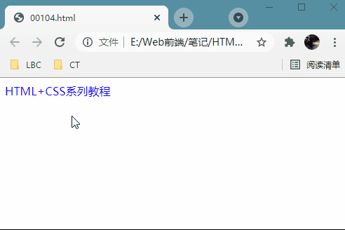

# 001 简介

视频序号002-010

**目录**
- [001 简介](#001-简介)
- [1. 什么是HTML和CSS](#1-什么是html和css)
- [2. web浏览器](#2-web浏览器)
- [3. 开发网站](#3-开发网站)
- [4. 三大核心技术](#4-三大核心技术)
- [5. 基本结构](#5-基本结构)
- [6. 初始代码](#6-初始代码)
- [总结](#总结)


***

# 1. 什么是HTML和CSS

**HTML 是用来描述网页的一种语言。**

- HTML 指的是超文本标记语言 (**H**yper **T**ext **M**arkup **L**anguage)
- HTML 不是一种编程语言，而是一种**标记语言** (markup language)
- 标记语言是一套**标记标签** (markup tag)
- HTML 使用**标记标签**来描述网页

**CSS 概述**

- CSS 指层叠样式表 (*C*ascading *S*tyle *S*heets)
- 样式定义**如何显示** HTML 元素
- 样式通常存储在**样式表**中
- 把样式添加到 HTML 4.0 中，是为了**解决内容与表现分离的问题**
- **外部样式表**可以极大提高工作效率
- 外部样式表通常存储在 **CSS 文件**中
- 多个样式定义可**层叠**为一

```
<!DOCTYPE html>
<html lang="en">
<head>
    <meta charset="UTF-8">
    <meta name="viewport" content="width=device-width, initial-scale=1.0">
    <title>Document</title>
</head>
<body>
    hello world
</body>
</html>
```

**运行结果**：
hello world

[00101.html](00101.html) 


# 2. web浏览器

谷歌浏览器(Google Chrome)是一款可让您更快速、轻松且安全地使用网络的浏览器。

查看统计份额：https://tongji.baidu.com/research/site

五大浏览器：IE, Opera, Safari, Firefox, Chrome

IE:Trident

Opera:最初是自己的Presto内核，后来是Webkit，现在是Blink内核

Safari:Webkit内核

Firefox:Gecko

Chrome:以前是Webkit内核，现在是Blink内核；也称为Chromium


# 3. 开发网站

UI设计师 : 设计稿
web前端开发工程师(H5开发)
设计稿 -> 代码
数据库里的数据 -> 显示到页面
HTML + CSS
HTML : 结构
CSS : 样式


# 4. 三大核心技术

* HTML：结构
* CSS：样式
* JavaScript：行为

示例：

```
<style>
    div{
        color: red;
        font-style: italic;
    }
</style>
<div>HTML+CSS系列教程</div>

<script>
    let div = document.querySelector('div');
    let timer = null;
    let flag = true;
    div.onmouseover = function(){
        timer = setInterval(() => {
            if(flag){
                div.style.color = 'blue';
                div.style.fontStyle = 'normal';
            }else{
                div.style.color = 'red';
                div.style.fontStyle = 'italic';
            }
            flag = !flag;
        }, 100);
    };
    div.onmouseout = function(){
        clearInterval(timer);
    };
</script>
```

鼠标移入HTML+CSS一行会有动画重复次数的竖斜和变色效果。

实例： [00104.html](00104.html) 




# 5. 基本结构

HTML：超文本 标记 语言

超文本：文本内容 + 非文本内容 ( 图片、视频、音频等 )

标记：<单词>

语言：编程语言

标记也叫做标签：``<header>`` `` <footer>``

写法分成两种：

* 单标签   ``<header>``

* 双标签  `` <header></header>``

创建标签的快捷键：单词 + tab键 -> <单词>

标签是可以上下排列，也可以组合嵌套。

HTML常见标签：http://www.html5star.com/manual/html5label-meaning/

本地链接： [HTML5 元素标签含义大全(元素周期表)—HTML5星空.html](HTML5 元素标签含义大全(元素周期表)—HTML5星空.html) 

标签的属性：来修饰标签的，设置当前标签的一些功能。

<标签 属性="值" 属性2="值2">

下面是一个可视化的HTML页面结构：


**==注意==**

* 只有 body 区域（白色部分）才会在浏览器中显示。


# 6. 初始代码

每个.html文件都有的代码叫做初始代码 ， 要复合html文件的规范写法。

! + tab键 : 快速的创建html的初始代码

``<!DOCTYPE html>``  文档声明 : 告诉浏览器这是一个html文件

``<html lang="en">`` html文件的最外层标签：包裹着所有html标签代码 lang="en"表示是一个英文网站, lang="zh-CN"表示一个中文网站

```
<head>
    <meta charset="UTF-8">  元信息：是编写网页中的一些辅助信息 charset="UTF-8"国际编码，让网页不出现乱码的情况
    <title>Document</title> 设置网页的标题
</head>
```

```
<body>
	hello world
	<!-- 显示网页内容的区域 -->
</body>
</html>
```


# 总结

上网查下HTML的历史、版本。预习一下HTML5。