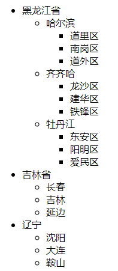
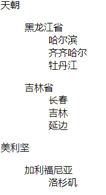

# 009 列表

视频序号018-021

目录
- [009 列表](#009-列表)
- [1. 有序列表](#1-有序列表)
- [2. 无序列表](#2-无序列表)
- [3. 定义列表](#3-定义列表)
- [4. 嵌套列表](#4-嵌套列表)
- [总结](#总结)


***

# 1. 有序列表

ol 标签是最外层容器。

li 标签是列表项。

```
<ol>
	<li>..</li>
	<li>..</li>
	.
	.
	<li>..</li>
</ol>
```

示例：

```
    <ol>
        <li>片手</li>
        <li>双刀</li>
        <li>大剑</li>
        <li>太刀</li>
        <li>轻弩</li>
        <li>重弩</li>
    </ol>
```

输出结果：

1. 片手
2. 双刀
3. 大剑
4. 太刀
5. 轻弩
6. 重弩

实例： [00901youxu01.html](00901youxu01.html) 


type 属性：改变前面标记的样式（一般都是用CSS去设定）。

不使用 type 属性默认为数字，即1.2.3.4.5.6。

示例：

```
    <ol type="A">
        <li>贼龙</li>
        <li>狗龙</li>
        <li>速龙</li>
    </ol>

    <ol type="i">
        <li>贼龙</li>
        <li>狗龙</li>
        <li>速龙</li>
    </ol>
```

运行结果：

A.贼龙

B.狗龙

C.速龙


i.贼龙

ii.狗龙

iii.速龙

实例： [00901youxu02.html](00901youxu02.html) 

| 值   | 描述                                           |
| :--- | :--------------------------------------------- |
| 1    | 默认值。数字有序列表。（1、2、3、4）           |
| a    | 按字母顺序排列的有序列表，小写。（a、b、c、d） |
| A    | 按字母顺序排列的有序列表，大写。（A、B、C、D） |
| i    | 罗马字母，小写。（i, ii, iii, iv）             |
| I    | 罗马字母，大写。（I, II, III, IV）             |


一般不使用 type 属性，用 CSS 来设定。

```
<ul style="list-style-type:upper-roman">
   <li>HTML</li>
   <li>XHTML</li>
   <li>CSS</li>
</ul>

<ul style="list-style-type:lower-alpha">
   <li>HTML</li>
   <li>XHTML</li>
   <li>CSS</li>
</ul>
```

参考网上的：https://www.w3school.com.cn/cssref/pr_list-style-type.asp


# 2. 无序列表

ul 标签是最外层的容器。

li 标签是列表项。

示例：

```
    <ul>
        <li>雄火龙</li>
        <li>雌火龙</li>
        <li>樱火龙</li>
        <li>苍火龙</li>
    </ul>
```

运行结果：

* 雄火龙
* 雌火龙
* 樱火龙
* 苍火龙

实例： [00902wuxu01.html](00902wuxu01.html) 


type 属性：改变前面标记的样式（一般都是用CSS去控制）。

| 值     | 描述             |
| :----- | :--------------- |
| disc   | 默认值。实心圆。 |
| circle | 空心圆。         |
| square | 实心方块。       |

示例：

```
    <ul type="circle">
        <li>雄火龙</li>
        <li>雌火龙</li>
        <li>樱火龙</li>
        <li>苍火龙</li>
    </ul>
```

运行结果：每行的前面标记样式为空心圆。

实例： [00902wuxu02.html](00902wuxu02.html) 


使用 CSS 语法示例：

```
<style>
    a{
        font-family: "微软雅黑";
        text-decoration: none;
        color: #3C3C3C;
    }
    a:hover{
        color: #FF5151;
        /* 鼠标划入时显示的效果 */
    }
    ul{
        color: red;
        /* 圆心变为红色 */
    }
</style>

<body>
<ul>
    <li><a href=""><strong>6月底前支付房租有压力 可申请多提一次住房公积金</strong></a></li>
    <li><a href="">2000元变10万元，这一步没做，企业遭“加码罚款”</a></li>
    <li><a href="">白云机场第二高速南段拟开始拆卸工程，2021年通车</a></li>
    <li><a href="">机构宣称提供代孕服务 卫生监督部门：公司已被查封</a></li>
    <li><a href="">多区取消小学新生面谈 家长再也不用担心“毛坯娃”</a></li>
</ul>
```

实例： [00902wuxu03.html](00902wuxu03.html) 


更多的样式：https://www.w3school.com.cn/cssref/pr_list-style-type.asp


# 3. 定义列表

自定义列表不仅仅是一列项目，而是项目及其注释的组合。

自定义列表以 dl 标签开始。每个自定义列表项以 dt 开始。每个自定义列表项的定义以 dd 开始。

dl：定义列表

dt：定义专业术语或名词（标题）

dd：对名词进行解释和描述（列表项）

示例：

```
    <dl>
        <dt>HTML</dt>
        <dd>超文本标记语言</dd>
        <dt>CSS</dt>
        <dd>层叠样式表</dd>
        <dt>JavaScript</dt>
        <dd>网页脚本语言</dd>
        <dd>jQuery</dd>
    </dl>
```

运行结果：

HTML

​		超文本标记语言

CSS

​		层叠样式表

JavaScript

​		网页脚本语言

​		jQuery

实例： [00903diyi.html](00903diyi.html) 


# 4. 嵌套列表

列表之间可以互相嵌套形成多层级列表。

示例1：

```
<ul>
        <li>
            黑龙江省
            <ul>
                <li>哈尔滨
                    <ul>
                        <li>道里区</li>
                        <li>南岗区</li>
                        <li>道外区</li>
                    </ul>
                </li>
                <li>齐齐哈
                    <ul>
                        <li>龙沙区</li>
                        <li>建华区</li>
                        <li>铁锋区</li>
                    </ul>
                </li>
                <li>牡丹江
                    <ul>
                        <li>东安区</li>
                        <li>阳明区</li>
                        <li>爱民区</li>
                    </ul>
                </li>
            </ul>
        </li>
        <li>
            吉林省
            <ul>
                <li>长春</li>
                <li>吉林</li>
                <li>延边</li>
            </ul>
        </li>
        <li>
            辽宁
            <ul>
                <lI>沈阳</lI>
                <lI>大连</lI>
                <lI>鞍山</lI>
            </ul>
        </li>
    </ul>
```

运行结果：



实例： [00904qiantao01.html](00904qiantao01.html) 


示例2：

```
    <dl>
        <dt>天朝</dt>
        <dd>
            <dl>
                <dt>黑龙江省</dt>
                <dd>哈尔滨</dd>
                <dd>齐齐哈尔</dd>
                <dd>牡丹江</dd>
            </dl>
            <dl>
                <dt>吉林省</dt>
                <dd>长春</dd>
                <dd>吉林</dd>
                <dd>延边</dd>
            </dl>
        </dd>
        <dt>美利坚</dt>
        <dd>
            <dl>
                <dt>加利福尼亚</dt>
                <dd>洛杉矶</dd>
            </dl>
        </dd>
    </dl>
```

运行结果：



实例： [00904qiantao02.html](00904qiantao02.html) 


# 总结

ul是unordered lists的缩写 (无序列表)

li是list item的缩写 （列表项目）

ol是ordered lists的缩写（有序列表）

dl是definition lists的英文缩写 (自定义列表)

dt是definition term的缩写 (自定义列表组)

dd是definition description的缩写（自定义列表描述）

nl是navigation lists的英文缩写 （导航列表）

tr是table row的缩写 （表格中的一行）

th是table header cell的缩写 （表格中的表头）

td是table data cell的缩写 （表格中的一个单元格）