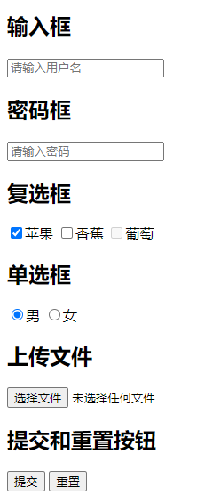
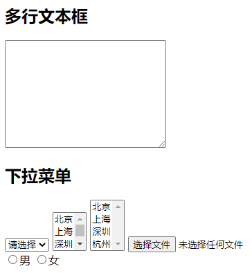
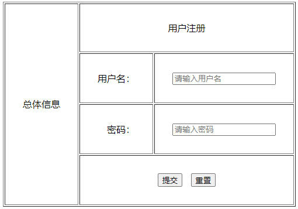

# 011 表单

视频序号024-026

目录
- [011 表单](#011-表单)
- [1. 表单标签 input](#1-表单标签-input)
- [2. 表单相关标签及属性](#2-表单相关标签及属性)
- [3. 表单案例](#3-表单案例)
- [总结](#总结)


***

# 1. 表单标签 input

表单是一个包含表单元素的区域。

表单元素是允许用户在表单中输入内容,比如：文本域(textarea)、下拉列表、单选框(radio-buttons)、复选框(checkboxes)等等。

表单使用表单标签 form 来设置：

```
<form>
.
input 元素
.
</form>
```


input：标签用于搜集用户信息，根据不同的type属性值，展示不同的控件，如输入框、密码框、复选框等。

| **type**属性 | **含义**         |
| ------------ | ---------------- |
| **text**     | 普通的文本输入框 |
| **password** | 密码输入框       |
| **checkbox** | 复选框           |
| **radio**    | 单选框           |
| **file**     | 上传文件         |
| **submit**   | 提交按钮         |
| **reset**    | 重置按钮         |

示例：

```
    <form action="http://www.baidu.com">
        <h2>输入框</h2>
        <input type="text" placeholder="请输入用户名"> <!-- placeholder预览XXX -->
        <h2>密码框</h2>
        <input type="password" placeholder="请输入密码">
        <h2>复选框</h2>
        <input type="checkbox" checked="checked">苹果 <!-- checked="checked设置默认打勾 -->
        <input type="checkbox">香蕉
        <input type="checkbox" disabled>葡萄 <!-- disabled设置无法打勾 -->
        <h2>单选框</h2>
        <input type="radio" name="gender" checked="checked">男 <!-- 要设置name属性才能单选 -->
        <input type="radio" name="gender">女
        <h2>上传文件</h2>
        <input type="file">
        <h2>提交和重置按钮</h2>
        <input type="submit">
        <input type="reset">
    </form>
```

运行结果：



实例： [01101biaoqian01.html](01101biaoqian01.html) 


# 2. 表单相关标签及属性

textarea：多行文本

select、option：下拉菜单

label：辅助表单

form、input、textarea、select、label ..

input(单标签)标签有一个type属性，决定是什么控件。

还有一些常见的属性： checked、disabled、name、for ...


**select属性**

| 属性                                                         | 值        | 描述                                               |
| :----------------------------------------------------------- | :-------- | :------------------------------------------------- |
| [autofocus](https://www.w3cschool.cn/htmltags/att-select-autofocus.html)New | autofocus | 规定在页面加载时下拉列表自动获得焦点。             |
| [disabled](https://www.w3cschool.cn/htmltags/att-select-disabled.html) | disabled  | 当该属性为 true 时，会禁用下拉列表。               |
| [form](https://www.w3cschool.cn/htmltags/att-select-form.html)New | *form_id* | 定义 select 字段所属的一个或多个表单。             |
| [multiple](https://www.w3cschool.cn/htmltags/att-select-multiple.html) | multiple  | 当该属性为 true 时，可选择多个选项。               |
| [name](https://www.w3cschool.cn/htmltags/att-select-name.html) | *name*    | 定义下拉列表的名称。                               |
| [required](https://www.w3cschool.cn/htmltags/att-select-required.html)New | required  | 规定用户在提交表单前必须选择一个下拉列表中的选项。 |
| [size](https://www.w3cschool.cn/htmltags/att-select-size.html) | *number*  | 规定下拉列表中可见选项的数目。                     |

**option属性**

| 属性                                                         | 值       | 描述                                             |
| :----------------------------------------------------------- | :------- | :----------------------------------------------- |
| [disabled](https://www.w3cschool.cn/htmltags/att-option-disabled.html) | disabled | 规定此选项应在首次加载时被禁用。                 |
| [label](https://www.w3cschool.cn/htmltags/att-option-label.html) | text     | 定义当使用 <optgroup> 时所使用的标注。           |
| [selected](https://www.w3cschool.cn/htmltags/att-option-selected.html) | selected | 规定选项（在首次显示在列表中时）表现为选中状态。 |
| [value](https://www.w3cschool.cn/htmltags/att-option-value.html) | text     | 定义送往服务器的选项值。                         |

示例：

```
<form action="http://www.baidu.com">
	<h2>多行文本框</h2>

    <textarea name="" id="" cols="30" rows="10"></textarea>

	<h2>下拉菜单</h2>

	<select name="" id="" >
            <option value="" selected disabled>请选择</option>
            <option value="">北京</option>
            <option value="">上海</option>
            <option value="">深圳</option>
            <option value="">杭州</option>
            <!-- selected设置为默认显示 -->
    </select>

    <select name="" id="" size="3">
            <option value="">北京</option>
            <option value="">上海</option>
            <option value="">深圳</option>
            <option value="">杭州</option>
            <!-- size为显示多少个 -->
    </select>

    <select name="" id="" multiple>
            <option value="">北京</option>
            <option value="">上海</option>
            <option value="">深圳</option>
            <option value="">杭州</option>
            <!--multiple 可选择多个选项 Ctrl+左键 -->
    </select>
        
        <input type="file" multiple>
    </br>
        <input type="radio" name="gender" id="man"><label for="man">男</label>
        <input type="radio" name="gender" id="woman"><label for="woman">女</label>
    </form>
```

运行结果：



实例： [01102biqoqian01.html](01102biqoqian01.html) 


**输入限制：**

| 属性      | 描述                               |
| :-------- | :--------------------------------- |
| disabled  | 规定输入字段应该被禁用。           |
| max       | 规定输入字段的最大值。             |
| maxlength | 规定输入字段的最大字符数。         |
| min       | 规定输入字段的最小值。             |
| pattern   | 规定通过其检查输入值的正则表达式。 |
| readonly  | 规定输入字段为只读（无法修改）。   |
| required  | 规定输入字段是必需的（必需填写）。 |
| size      | 规定输入字段的宽度（以字符计）。   |
| step      | 规定输入字段的合法数字间隔。       |
| value     | 规定输入字段的默认值。             |


练习： [test.html](test.html) 


# 3. 表单案例

```
    <form action="" method="http;//www.abc.com">
        <table border="1" cellpadding="30px">
            <tr>
                <td rowspan="4">总体信息</td>
                <td colspan="2" align="center">用户注册</td>
            </tr>
            <tr>
                <td align="right">用户名：</td>
                <td>
                    <input type="text" name="user" placeholder="请输入用户名">
                </td>
            </tr>
            <tr>
                <td align="right">密码：</td>
                <td>
                    <input type="password" name="pwd" placeholder="请输入密码">
                </td>
            </tr>
            <tr>
                <td colspan="2" align="center">
                    <input type="submit" value="提交">
                    &nbsp;
                    <input type="reset" value="重置">
                </td>
            </tr>
        </table>
    </form>
```

运行结果：



实例： [01103biaodan01.html](01103biaodan01.html) 


# 总结

new 为 HTML5 新标签

| 标签         | 描述                                         |
| :----------- | :------------------------------------------- |
| form         | 定义供用户输入的表单                         |
| input        | 定义输入域                                   |
| textarea     | 定义文本域 (一个多行的输入控件)              |
| label        | 定义了 <input> 元素的标签，一般为输入标题    |
| fieldset     | 定义了一组相关的表单元素，并使用外框包含起来 |
| legend       | 定义了 <fieldset> 元素的标题                 |
| select       | 定义了下拉选项列表                           |
| optgroup     | 定义选项组                                   |
| option       | 定义下拉列表中的选项                         |
| button       | 定义一个点击按钮                             |
| datalist new | 指定一个预先定义的输入控件选项列表           |
| keygen new   | 定义了表单的密钥对生成器字段                 |
| output new   | 定义一个计算结果                             |