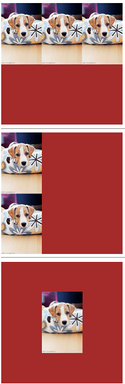

# 016 背景bakcground

视频序号032 033

目录

- [016 背景bakcground](#016-背景bakcground)
- [1. 背景样式](#1-背景样式)
  - [1.1颜色](#11颜色)
  - [1.2图片](#12图片)
  - [1.3平铺方式](#13平铺方式)
  - [1.4图片位置](#14图片位置)
  - [1.5移动方式](#15移动方式)
- [2. 背景视觉差效果](#2-背景视觉差效果)
- [3. 总结](#3-总结)

***

# 1. 背景样式

## 1.1颜色

background-color：背景颜色

## 1.2图片

background-image：背景图片

url(背景地址) 默认：会水平垂直都铺满背景图

## 1.3平铺方式

background-repeat：背景图片的平铺方式

 repeat-x   x轴平铺  

repeat-y   y轴平铺

repeat ( x , y 都进行平铺，默认值 )

no-repeat  都不平铺

## 1.4图片位置

background-position：背景图片的位置

x y : number(px、%) | 单词

x : left、center、right

y : top、center、bottom

## 1.5移动方式

background-attachment：背景图随滚动条的移动方式

scroll : 默认值  ( 背景位置是按照当前元素进行偏移的 )

fixed ( 背景位置是按照浏览器进行偏移的 )

示例：

```
    <style>
        .d1{
            width: 300px;
            height: 300px;
            background-color: brown;
            background-image: url('./img/dog.jpg');
            background-repeat: repeat-x;
        }
        .d2{
            width: 300px;
            height: 300px;
            background-color: brown;
            background-image: url('./img/dog.jpg');
            background-repeat: repeat-y;
        }
        .d3{
            width: 300px;
            height: 300px;
            background-color: brown;
            background-image: url('./img/dog.jpg');
            background-repeat: no-repeat;
            /* background-position: 110px 50px; */
            background-position: 50% 50%;
        }
    </style>
    
<body>
    <div class="d1"></div><hr>
    <div class="d2"></div><hr>
    <div class="d3"></div><hr>
</body>
```

运行结果：



实例： [01601background01.html](01601background01.html) 

示例：

```
    <style>
        body{
            margin: 0;
            height: 2000px;
        }
        .d1{
            width: 1440px;
            height: 800px;
            background-color: brown;
            background-image: url('./img/dog.jpg');
            background-repeat: no-repeat;
            background-position: 50% 20%;
            background-attachment: fixed;
        }
    </style>
```

窗口水平放大缩小试试效果。

实例： [01601background02.html](01601background02.html) 


# 2. 背景视觉差效果

参考网站：http://www.divups.com/

设置元素高度，然后采用background-attachment: fixed;

```
     <style>
        #div1{
            width: 1400px;
            height: 800px;
            background-image: url(./img/1.jpg);
            background-attachment: fixed;
            
        }
        #div2{
            width: 1400px;
            height: 800px;
            background-image: url(./img/2.jpg);
            background-attachment: fixed;
        }
        #div3{
            width: 1400px;
            height: 800px;
            background-image: url(./img/3.jpg);
            /* background-attachment: fixed; */
        }
    </style>
    
<body>
    <div id="div1"></div>
    <div id="div2"></div>
    <div id="div3"></div>
</body>
```

滚动窗口上下试试效果。

实例： 

 [01602background01.html](01602background01.html) （有带表格）

 [01602background02.html](01602background02.html) 


# 3. 总结

| 值                                                           | 说明                                             | CSS  |
| :----------------------------------------------------------- | :----------------------------------------------- | :--- |
| *[background-color](https://www.w3cschool.cn/cssref/pr-background-color.html)* | 指定要使用的背景颜色                             | 1    |
| *[background-position](https://www.w3cschool.cn/cssref/pr-background-position.html)* | 指定背景图像的位置                               | 1    |
| *[background-size](https://www.w3cschool.cn/cssref/css3-pr-background-size.html)* | 指定背景图片的大小                               | 3    |
| *[background-repeat](https://www.w3cschool.cn/cssref/pr-background-repeat.html)* | 指定如何重复背景图像                             | 1    |
| *[background-origin](https://www.w3cschool.cn/cssref/css3-pr-background-origin.html)* | 指定背景图像的定位区域                           | 3    |
| *[background-clip](https://www.w3cschool.cn/cssref/css3-pr-background-clip.html)* | 指定背景图像的绘画区域                           | 3    |
| *[background-attachment](https://www.w3cschool.cn/cssref/pr-background-attachment.html)* | 设置背景图像是否固定或者随着页面的其余部分滚动。 | 1    |
| *[background-image](https://www.w3cschool.cn/cssref/pr-background-image.html)* | 指定要使用的一个或多个背景图像                   | 1    |