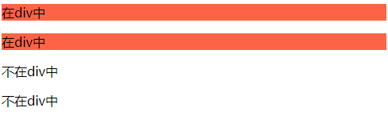
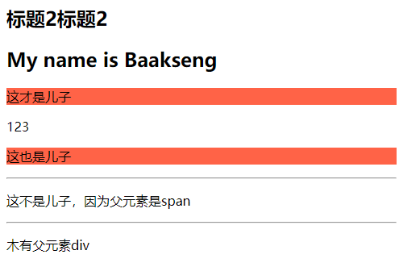
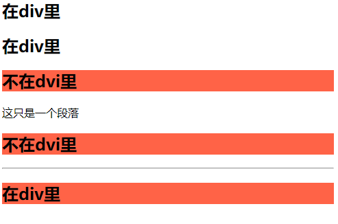

# 024 层次选择器

视频序号047

目录
- [024 层次选择器](#024-层次选择器)
- [1.后代 M N {...}](#1后代-m-n-)
- [2.父子 M > N {...}](#2父子-m--n-)
- [3. 兄弟  M ~ N { }](#3-兄弟--m--n--)
- [4. 相邻  M + N { }](#4-相邻--m--n--)
- [总结](#总结)


***

# 1.后代 M N {...}

后代选取器匹配所有指定元素的后代元素。

示例：

```
    <style>
        div p{
            background: tomato;
        }
    </style>
    
<body>
    <div>
        <p>在div中</p>
        <p>在div中</p>
    </div>
    <p>不在div中</p>
    <p>不在div中</p>
</body>
```

运行结果：



实例： 

[02401houdai01.html](02401houdai01.html) 


# 2.父子 M > N {...}

与后代选择器相比，子元素选择器（Child selectors）只能选择作为某元素子元素的元素。

示例：

```
    <style>
        div>p{
            background: tomato;
        }
    </style>
    
<body>
    <h2>标题2标题2</h2>
    <div>
        <h2>My name is Baakseng</h2>
        <p>这才是儿子</p>
        <span>123</span>
        <p>这也是儿子</p>
    </div>
    <hr>
    <div>
        <span>
            <p>这不是儿子，因为父元素是span</p>
        </span>
    </div>
    <hr>
    <p>木有父元素div</p>
</body>
```

运行结果：



实例：

 [02402fuzi01.html](02402fuzi01.html) 

 [02402fuzi02.html](02402fuzi02.html) 


# 3. 兄弟  M ~ N { }  

当前M下面的所有兄弟N标签。

普通兄弟选择器选取所有指定元素的相邻兄弟元素。

示例：

```
    <style>
        div ~ h2{
            background: tomato;
        }
    </style>
   
<body>
    <div>
        <h2>在div里</h2>
        <h2>在div里</h2>
    </div>
    <h2>不在dvi里</h2>
    <p>这只是一个段落</p>
    <h2>不在dvi里</h2>
    <hr>

    <div>
        <div></div>
        <h2>在div里</h2>
    </div>
</body>
```

运行结果：



实例：

 [02403xiongdi01.html](02403xiongdi01.html) 

 [02403xiongdi02.html](02403xiongdi02.html) 


# 4. 相邻  M + N { }  

当前M下面相邻的N标签。

相邻兄弟选择器（Adjacent sibling selector）可选择紧接在另一元素后的元素，且二者有相同父元素。

如果需要选择紧接在另一个元素后的元素，而且二者有相同的父元素，可以使用相邻兄弟选择器（Adjacent sibling selector）。

示例：

```
    <style>
        div + h2{
            background: tomato;
        }
    </style>
    
<body>
    <h2>可惜这不是兄弟，前面木有div</h2>
    <div>div</div>
    <p>这是一个段落</p>
    <h2>这是标题2，但是前面隔着P标签，无法使用css</h2>
    <div>div</div>
    <h2>我才是相邻兄弟，因为前面紧邻div</h2>
    <hr>
    <div>div
        <h2>这是标题2，在div里</h2>
    </div>
    <h2>我也才是相邻兄弟</h2>
</body>
```

实例：

 [02404xianglin01.html](02404xianglin01.html) 

 [02404xianglin02.html](02404xianglin02.html) 


# 总结

<a href="CSS选择器里不同的符号.md">CSS选择器里不同的符号</a>

