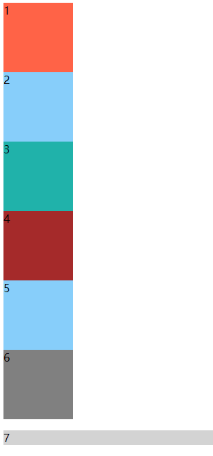
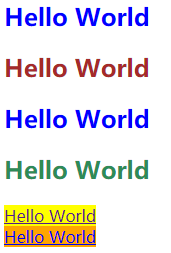

# 025 属性选择器

视频序号048

目录
- [025 属性选择器](#025-属性选择器)
- [1. 指定选择器名称](#1-指定选择器名称)
- [2.指定属性值](#2指定属性值)


***

# 1. 指定选择器名称

| 选择器          | 说明                                           |
| --------------- | ---------------------------------------------- |
| M[attr]         | M元素选择指定为attr属性的集合                  |
| M[attr=value]   | M元素选择指定为attr属性和value值的集合         |
| M[attr*=value]  | M元素选择指定为attr属性并且包含值为value的集合 |
| M[attr^=value]  | M元素选择指定为attr属性并且起始值为value的集合 |
| M[attr$=value]  | M元素选择指定为attr属性并且结束值为value的集合 |
| M[attr1[attr2]] | M元素选择满足多个属性的集合                    |

M[attr] {}

= : 完全匹配

*= : 部分匹配

^= : 起始匹配

$= : 结束匹配

[ ] [ ] [ ] : 组合匹配

示例：

```
 <style>
        div{
            width: 100px;
            height: 100px;
            background: tomato;
        }
        div[class]{
            background: lightskyblue;
        }
        div[class*="rch"]{
            background: lightsalmon;
            /* sea rch button*/
        }
        div[class^="s"]{
            background: lightseagreen;
            /* s earchbutton */
        }
        div[class$="on"]{
            background: brown;
            /* searchbutt on */
        }
        [id]{
            background: gray;
        }
        p[id]{
            background: lightgray;
        }
    
<body>
    <div>1</div>
    <div class="box">2</div>
    <div class="search">3</div>
    <div class="searchbutton">4</div>
    <div class="123">5</div>
    <div id="123">6</div>
    <p id="123">7</p>
</body>
```

运行结果：



实例： [02501shuxing01.html](02501shuxing01.html) 


# 2.指定属性值

| 选择器               | 描述                                                         |
| :------------------- | :----------------------------------------------------------- |
| [attribute]          | 用于选取带有指定**属性**的元素。                             |
| [attribute=value]    | 用于选取带有指定属性和值的元素。                             |
| [attribute~=value]   | 用于选取属性值中包含指定词汇的元素。                         |
| [attribute\|= value] | 用于选取带有以指定值开头的属性值的元素，该值必须是整个单词。 |
| [attribute^=value]   | 匹配属性值以指定值开头的每个元素。                           |
| [attribute$=value]   | 匹配属性值以指定值结尾的每个元素。                           |
| [attribute*=value]   | 匹配属性值中包含指定值的每个元素。                           |

示例：

```
    <style>
        [title] {
            color: blue;
        }
        [title = w3c]{
            color: brown;
        }
        [title~="gamer"]{
            color: seagreen;
        }
        a[target=_blank]{
            background: yellow;
        }
        a[href *= "taobao"]{
            background: orange;
        }
    </style>
<body>
    <h2 title="helloworld">Hello World</h2>
    <h2 title="w3c">Hello World</h2>
    <h2 title="gamerwow12">Hello World</h2> <!-- 只能单词gamer才能显示seargreen颜色 -->
    <h2 title="RO gamer">Hello World</h2>
    <a href="http://www.baidu.com" target=_blank>Hello World</a>
    <br>
    <a href="http://www.taobao.com">Hello World</a>
</body>
```

运行结果：



实例： [02502shuxing01.html](02502shuxing01.html) 