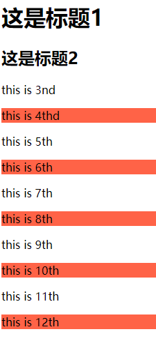

# 026 伪类

视频序号049-051

目录
- [026 伪类](#026-伪类)
- [1. anchor伪类（一般用于链接）](#1-anchor伪类一般用于链接)
- [2. :before 和 :after伪类](#2-before-和-after伪类)
- [3. 其它伪类](#3-其它伪类)
- [4. 结构伪类选择器](#4-结构伪类选择器)
  - [4.1 nth-of-type()](#41-nth-of-type)
  - [4.2 nth-child()](#42-nth-child)
  - [4.3 first-of-type](#43-first-of-type)
  - [4.4 last-of-type](#44-last-of-type)
  - [4.5 only-of-type](#45-only-of-type)
  - [4.6 only-child](#46-only-child)


***

# 1. anchor伪类（一般用于链接）

在支持 CSS 的浏览器中，链接的不同状态都可以以不同的方式显示。

M:伪类{}

:link       访问前的样式    ( 只能添加给a标签 )

:visited    访问后的样式    ( 只能添加给a标签 )

:hover      鼠标移入时的样式  (可以添加给所有的标签)

:active     鼠标按下时的样式  (可以添加给所有的标签)

**==注意==：**

* 如果四个伪类都生效，一定要注意顺序：L V H A。

一般网站只这样去设置：a{ }   a:hover{}

示例：

```
    <style>
        hr{
            background: lightgray;
            height: 1px;
            border: none;
        }
        div{
            width: 300px;
            height: 300px;
            background: tomato;
        }
        /* 默认样式 */

        div:hover{
            background: lightskyblue;
        }
        /* 鼠标移入时的样式 */
        
        div:active{
            width: 290px;
            height: 290px;
            background: lightseagreen;
            border: 5px solid seagreen;
        }
        /* 鼠标按下时的样式 */

        a:link{
            
            color: tomato;
            text-decoration: none;
        }
        a:visited{
            color: gray;
        }
        a:hover{
            font-size: 18px;
            color: red;
        }
        a:active{
            color: darkblue;
        }
    </style>

<body>
    <div></div>
    <hr>
    <a href="#6676">这是一个链接一个链接</a>
</body>
```

实例： [02601pseudo01.html](02601pseudo01.html) 


伪类与CSS类可配合使用

```
a.red:visited {color:#FF0000;}
 
<a class="red" href="css-syntax.html">CSS 语法</a>
```

如果链接已被访问，它会显示为红色。


# 2. :before 和 :after伪类

:before 选择器向选定的元素前插入内容。

示例：

```
    <style>
        .tupian{
            width: 100px;
            height: 100px;
            background: url('./img/dog.jpg');
            color: #ffffff;
            position: relative;
        }
        .tupian::before{
            content: " ";
            display: block;
            position: absolute;
            left: 0;
            width: 100px;
            height: 5px;
            background: tomato;
        }
    </style>
    
<body>
    <div>
        <div class="tupian">hello</div>
    </div>
</body>
```

运行结果：


实例： [02602pseudo01.html](02602pseudo01.html) 


:after 选择器向选定的元素之后插入内容。

示例：

```
    <style>
        .tupian:after{
            content: '  world';
            color: white;
            position: absolute;/*用这属性才能显示图片具体尺寸*/
            width: 100px;
            height: 100px;
            background: url('./img/dog.jpg');
        }
    </style>

<body>
    <div class="tupian">hello</div>
</body>
```

运行结果：


实例： [02602pseudo02.html](02602pseudo02.html) 

content 属性就是文本内容。


# 3. 其它伪类

:checked、:disabled 、:focus 都是针对表单元素的 

:checked 选择器匹配每个已被选中的 input 元素（只用于单选按钮和复选框）。

:disabled 选择器匹配每个被禁用的元素（大多用在表单元素上）。

:focus 选择器用于选取获得焦点的元素。接受键盘事件或其他用户输入的元素都允许 :focus 选择器。

示例：

```
    <style>
        hr{
            background: lightgray;
            height: 1px;
            border: none;
        }
        .box1:checked{
            width: 100px;
            height: 100px;

        }
        .box2:disabled{
            width: 100px;
            height: 100px;
        }
        .box3:focus{
            height: 30px;
            background: tomato;
            border: 2px solid yellow;
            box-shadow: 5px 5px 10px gray;
            /* 点击内容框样式有变化 */
        } 
    </style>

<body>
    <p>box1</p>
    <input class="box1" type="checkbox">
    <input class="box1" type="checkbox" checked>
    <input class="box1" type="checkbox">
    <hr>
    <p>box2</p>
    <input class="box2" type="checkbox">
    <input class="box2" type="checkbox" checked>
    <input class="box2" type="checkbox" disabled><span>右边的打勾不了-_,-</span>
    <hr>
    <p>box3</p>
    <span>用户名：</span><input class="box3" type="text">
    <br>
    <span> 密码：  </span>&nbsp;&nbsp;<input class="box3" type="password">
</body>
```

试试点击已设置的控件效果。

实例： [02603pseudo01.html](02603pseudo01.html) 


# 4. 结构伪类选择器

## 4.1 nth-of-type() 

nth-of-type() 选择器匹配属于父元素的特定类型的第 N 个子元素的每个元素.*n* 可以是数字、关键词或公式。

按照类型来计算，如果是class那么碰到不同类型的，单独一类，符合条件的选中。

匹配同类型中的第n个同级兄弟元素。参数是元素的索引。索引从1开始。

示例：

```
    <style>
        p:nth-of-type(3){
            background: tomato;
        }
    </style>

<body>
    <h1>这是标题1</h1>
    <p>This is 1st</p>
    <p>This is 2nd</p>
    <p>This is 3rd</p>
    <p>This is 4th</p>
    <p>This is 5th</p>
    <p>This is 6th</p>
    <p>This is 7th</p>
    <p>This is 8th</p>
    <p>This is 9th</p>
</body>
```

运行结果：


实例： [02604pseudo01.html](02604pseudo01.html) 


## 4.2 nth-child()

nth-child() 选择器匹配属于其父元素的第 N 个子元素，不论元素的类型。n 可以是数字、关键词或公式。

按照个数来算。

示例：

```
    <style>
        p:nth-child(2n){
            background: tomato;
        }
    </style>

<body>
    <h1>这是标题1</h1>
    <h2>这是标题2</h2>
    <p>this is 3nd</p>
    <p>this is 4thd</p>
    <p>this is 5th</p>
    <p>this is 6th</p>
    <p>this is 7th</p>
    <p>this is 8th</p>
    <p>this is 9th</p>
    <p>this is 10th</p>
    <p>this is 11th</p>
    <p>this is 12th</p>
</body>
```

运行结果：



实例： [02604pseudo02.html](02604pseudo02.html) 


角标是从1开始的，1表示第一项，2表示第二项 | n值 表示从0到无穷大


详解：

* https://blog.csdn.net/zhanglianglily/article/details/89472331

  本地链接：

   [：nth-of-type（n）和：nth-child（n）的基友关系_zhanglianglily的博客-CSDN博客.html](：nth-of-type（n）和：nth-child（n）的基友关系_zhanglianglily的博客-CSDN博客.html) 

* https://www.cnblogs.com/pssp/p/5991029.html

  本地链接：

   [彻底理解nth-child和nth-of-type的区别。 - 追梦子 - 博客园.html](彻底理解nth-child和nth-of-type的区别。 - 追梦子 - 博客园.html) 


练习： [test.html](test.html) 


## 4.3 first-of-type

选择属于其父元素的首个元素的每个元素。

**提示:** 等同于 :nth-of-type(1)。


## 4.4 last-of-type

选择属于其父元素的最后元素的每个元素。

**提示:** 和:nth-last-of-type(1)是一个意思。


## 4.5 only-of-type

选择属于其父元素唯一的元素的每个元素。

意思就是没有兄弟的元素。

示例：

```
    <style>
        p:only-of-type{
            background: tomato;
        }
    </style>

<body>
    <div>
        <p>这是一个段落</p>
        <p>这是一个段落</p>
    </div>
    <hr>
    <div>
        <h2>这是标题2</h2>
        <p>这是一个段落</p>
    </div>
</body>
```

运行结果：


第一个 div 有两个 p，不符合。

第二个 div 仅一个p，符合。

实例： [02604pseudo03.html](02604pseudo03.html) 


## 4.6 only-child

选择器匹配属于父元素中唯一子元素的元素。

就是一个父元素里仅一个子元素。

示例：

```
    <style>
        p:only-child{
            background: tomato;
        }
    </style>
</head>
<body>
    <div>
        <p>这是一个段落</p>
    </div>
    <hr>
    <div>
        <h2>这是标题2</h2>
        <p>这是一个段落</p>
    </div>
</body>
```

运行结果：


第一个 div 里有一个子元素，符合。

第二个 div 里有两个子元素，不符合。

实例： [02604pseudo04.html](02604pseudo04.html) 

**==注意==**

* **注意:** Internet Explorer 8以及更早版本的浏览器不支持 :only-child选择器.