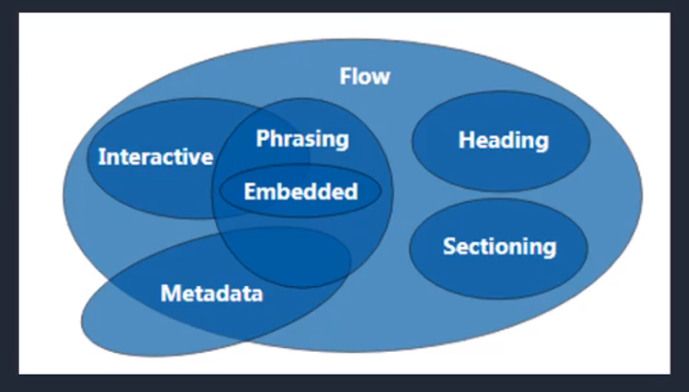

# 031 标签的分类

视频序号062-064

目录
- [031 标签的分类](#031-标签的分类)
- [1. 按类型划分](#1-按类型划分)
  - [1.1块标签 block](#11块标签-block)
  - [1.2内联标签 inline](#12内联标签-inline)
  - [1.3内联块 inline-block](#13内联块-inline-block)
  - [1.4建议与示例](#14建议与示例)
- [2. 按内容划分](#2-按内容划分)
- [3. 按显示划分](#3-按显示划分)
  - [3.1替换元素](#31替换元素)
  - [3.2非替换元素](#32非替换元素)


***

# 1. 按类型划分

## 1.1块标签 block

div p ul li h1.....

**==注意==**

* 这些标签独占一行的！！！

支持所有样式

不写宽的时候，跟父元素的宽相同

所占区域是一个矩形


## 1.2内联标签 inline

span a em strong img...

挨在一起的

有些样式不支持，例如：width、height、margin、padding

不写宽的时候，宽度由内容决定

所占的区域不一定是矩形

内联标签之间会有空隙，**原因：换行产生的!!**


## 1.3内联块 inline-block

input、select...

挨在一起，但是支持宽高


## 1.4建议与示例

布局一般用块标签，修饰文本一般用内联标签。

示例：

```
    <style>
        span{
            width: 500px;
            height: 500px;
            background: lightseagreen;
        }
        .box1{
            width: 200px;
            height: 200px;
            background: seagreen;
            border: 5px dotted darkgreen;
            box-sizing: border-box;
        }
        .input{
            height: 50px;
            width: 100px;
            background: lightgray;
        }
        .input:focus{
            background: red;
        }
    </style>

<body>
    <div>block</div>
    <span>inline</span>
    <span>inline</span>
    <div>block</div>
    <span>inline</span>
    <span>inline</span>
    <input type="text">
    <hr>
    <div class="box1"></div>
    <div class="box1"></div>
    <div class="box1"></div>
    <hr>
    <span>inline1</span><span>inline1</span><span>inline1</span>
    <span>inline1</span>
    <!-- 换行会有空隙 -->
    <input type="text" class="input">
</body>
```

实例： [03101biqoqian01.html](03101biqoqian01.html) 


# 2. 按内容划分

Flow 流内容 文档流

Metadata 元数据 

Sectioning 分区 区块

Heading 标题

Phrasing 措辞 语句 短语

Embedded 嵌入的 内嵌

Interactive 互动的 

划分图示：



详解：

*  https://www.w3.org/TR/html5/dom.html
*  [HTML所有元素的分类 - _水月_ - 博客园.html](HTML所有元素的分类 - _水月_ - 博客园.html) （此为本地链接）


# 3. 按显示划分

## 3.1替换元素

浏览器根据元素的标签和属性，来决定元素的具体显示内容。

img、input ...

## 3.2非替换元素

将内容直接告诉浏览器，将其显示出来。

div、h1、p ...
