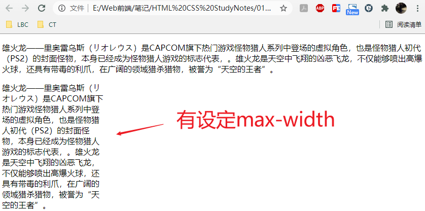
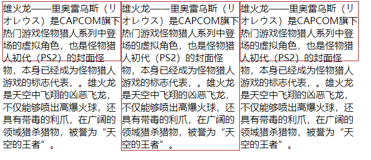
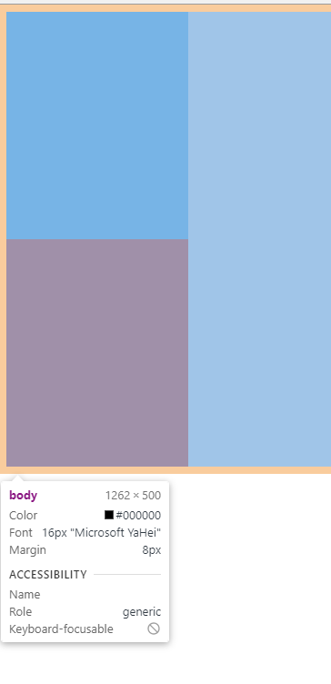

# 037 最大最小宽高

视频序号069

目录
- [037 最大最小宽高](#037-最大最小宽高)
- [1. 示例](#1-示例)
- [2. %单位](#2-单位)
- [3. 窗口水平绽放练习](#3-窗口水平绽放练习)


***

* min-width：属性设置元素的最小宽度。

* max-width：属性设置元素的最大宽度。
* min-height：属性设置元素的最低高度。
* max-height：属性设置元素的最大高度。

**==注意==**

* 以上所有属性不包括填充，边框，或页边距！

# 1. 示例

```
        .p1{
            max-width: 200px;
        }
```

```
    <p>雄火龙——里奥雷乌斯（リオレウス）是CAPCOM旗下热门游戏怪物猎人系列中登场的虚拟角色，也是怪物猎人初代（PS2）的封面怪物，本身已经成为怪物猎人游戏的标志代表，。雄火龙是天空中飞翔的凶恶飞龙，不仅能够喷出高爆火球，还具有带毒的利爪，在广阔的领域猎杀猎物，被誉为“天空的王者”。</p>
    <p class="p1">雄火龙——里奥雷乌斯（リオレウス）是CAPCOM旗下热门游戏怪物猎人系列中登场的虚拟角色，也是怪物猎人初代（PS2）的封面怪物，本身已经成为怪物猎人游戏的标志代表，。雄火龙是天空中飞翔的凶恶飞龙，不仅能够喷出高爆火球，还具有带毒的利爪，在广阔的领域猎杀猎物，被誉为“天空的王者”。</p>
```

**运行结果：**



测试三个不同高度：height、min-height、max-height

```
        .box1{
            width: 200px;
            height: 100px;
            border: 1px solid brown;
            float: left;
            /* display: none; */
        }
        .box2{
            width: 200px;
            min-height: 100px;
            border: 1px solid brown;
            float: left;
        }
        .box3{
            width: 200px;
            max-height: 100px;
            border: 1px solid brown;
            float: left;
        }
```

```
    <div class="box1">
        雄火龙——里奥雷乌斯（リオレウス）是CAPCOM旗下热门游戏怪物猎人系列中登场的虚拟角色，也是怪物猎人初代（PS2）的封面怪物，本身已经成为怪物猎人游戏的标志代表，。雄火龙是天空中飞翔的凶恶飞龙，不仅能够喷出高爆火球，还具有带毒的利爪，在广阔的领域猎杀猎物，被誉为“天空的王者”。
    </div>
    <div class="box2">
        雄火龙——里奥雷乌斯（リオレウス）是CAPCOM旗下热门游戏怪物猎人系列中登场的虚拟角色，也是怪物猎人初代（PS2）的封面怪物，本身已经成为怪物猎人游戏的标志代表，。雄火龙是天空中飞翔的凶恶飞龙，不仅能够喷出高爆火球，还具有带毒的利爪，在广阔的领域猎杀猎物，被誉为“天空的王者”。
    </div>
    <div class="box3">
        雄火龙——里奥雷乌斯（リオレウス）是CAPCOM旗下热门游戏怪物猎人系列中登场的虚拟角色，也是怪物猎人初代（PS2）的封面怪物，本身已经成为怪物猎人游戏的标志代表，。雄火龙是天空中飞翔的凶恶飞龙，不仅能够喷出高爆火球，还具有带毒的利爪，在广阔的领域猎杀猎物，被誉为“天空的王者”。
    </div>
```

**运行结果：**



实例： [03701minmax01.html](03701minmax01.html) 


# 2. %单位

换算方法：以父容器的大小进行换算。

一个容器怎么适应屏幕的高 : 容器加height:100%;   body:100%;  html:100%;

方法：

```
html,body{ height:100%;}

.contrainer{ height:100%;}
```


示例：

```
    <style>
        body{
            height: 500px;
        }
        .box1{
            width: 200px;
            /* height: 200px; */
            height: 100%;
            background: tomato;

            
        }
        .box2{
            width: 100%;
            height: 50%;
            background: lightskyblue;

        }
    </style>

<body>
    <div class="box1">
        <div class="box2"></div>
    </div>
</body>
```



实例： [03702minmax01.html](03702minmax01.html) 


# 3. 窗口水平绽放练习

```
    <style>
        div{
            max-width: 500px;
            min-height: 200px;
            background: url(./img/01.jpg);
            background-size: 100% 100%;
        }
    </style>
</head>
<body>
    <div></div>
</body>
```

窗口水平缩放试效果。

练习： [03703test01.html](03703test01.html) 