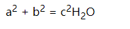
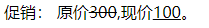

# 105 文本格式化

视频序号012

目录
- [105 文本格式化](#105-文本格式化)
- [1. 粗体斜体](#1-粗体斜体)
- [2. 上下标](#2-上下标)
- [3. 删除文本和插入文本](#3-删除文本和插入文本)


***

# 1. 粗体斜体

```
    <b>粗体</b>
    <i>斜体</i>
```

实例： [10501bold-italic01.html](10501bold-italic01.html) 

```
    <strong>粗体</strong>
    <em>斜体</em>
```

实例：  [10501bold-italic02.html](10501bold-italic02.html) 

通常标签 strong 替换加粗标签 b 来使用, em 替换 i 标签使用。

**区别：**

* b 与 i 标签定义粗体和斜体文本。
* strong 或 em 则呈现文本的重要性，所以要突出显示。


# 2. 上下标

上标：``<sup></sup>``

下标：``<sub></sub>``

示例：

```
a<sup>2</sup> + b<sup>2</sup> = c<sup>2</sup>H<sub>2</sub>O
```

运行结果：

a<sup>2</sup> + b<sup>2</sup> = c<sup>2</sup>H<sub>2</sub>O



实例：   [10502sup-sub01.html](10502sup-sub01.html) 


# 3. 删除文本和插入文本

删除文本： ``<del></del>``

插入文本：``<ins></ins>``

注：一般情况下，删除文本都是和插入文本配合使用的。

示例：

```
促销： 原价<del>300</del>,现价<ins>100</ins>。
```

运行结果：

促销： 原价<del>300</del>,现价<ins>100</ins>。



实例：  [10503del-ins01.html](10503del-ins01.html) 