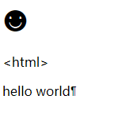

# 108 特殊符号

视频序号017

***

编写一些文本时，经常会遇到输入法无法输入的字符，如®（注册商标）、©（版权符）等，还有往一段文字中加入多个空格时，页面并不会解析出多个空格。这些无法输入和空格字符都是特殊字符，在HTML中，为这些特殊字符准备了专门的代码。

| **特殊字符** | **含义** | **特殊字符代码** |
| ------------ | -------- | ---------------- |
|              | 空格符   | &nbsp；          |
| **©**        | 版权     | &copy;           |
| **®**        | 注册商标 | &reg；           |
| **<**        | 小于号   | &lt；            |
| **>**        | 大于号   | &gt;             |
| **&**        | 和号     | &amp；           |
| **¥**        | 人民币   | &yen;            |
| **°**        | 摄氏度   | &deg；           |

示例：

```
    <h1>&#9787;</h1>
    <p>&lt;html&gt;</p>
    <p>hello&nbsp;world¶</p>
```

运行结果：



实例：  [10801symbol01.html](10801symbol01.html) 


更多的可以查询网上的特殊符号