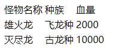
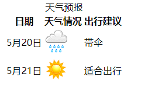
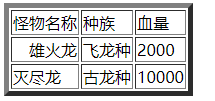
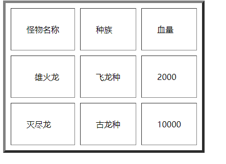
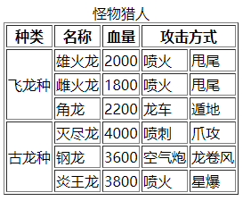
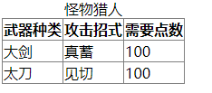

# 110 表格

视频序号022 023

目录
- [110 表格](#110-表格)
- [1. 表格标签](#1-表格标签)
  - [1.1 常见的标签](#11-常见的标签)
  - [1.2 标题和表头](#12-标题和表头)
  - [1.3 语义化标签](#13-语义化标签)
- [2. 表格属性](#2-表格属性)
  - [2.1 边框、水平和垂直](#21-边框水平和垂直)
  - [2.2 单元格空间](#22-单元格空间)
  - [2.3 合并行或列](#23-合并行或列)
  - [2.4 边框线](#24-边框线)
- [3. 快捷键](#3-快捷键)


***

# 1. 表格标签

## 1.1 常见的标签

一个表格：<table>...</table>。

一个行：<tr>...</tr>。

一个单元格：<td>...</td>。

示例：

```
<body>
    <table>
        <tr>
            <td>怪物名称</td>
            <td>种族</td>
            <td>血量</td>
        </tr>
        <tr>
            <td>雄火龙</td>
            <td>飞龙种</td>
            <td>2000</td>
        </tr>
        <tr>
            <td>灭尽龙</td>
            <td>古龙种</td>
            <td>10000</td>
        </tr>
    </table>
</body>
```

结果显示：



实例：  [11001biaoqian01.html](11001biaoqian01.html) 


## 1.2 标题和表头

标题：<caption>...</caption> 表格上的一个标题

表头：<th>...</th> 页面上以加粗显示

示例：

```
    <table>
        <caption>天气预报</caption>
        <tr>
            <th>日期</th>
            <th>天气情况</th>
            <th>出行建议</th>
        </tr>
        <tr>
            <td>5月20日</td>
            <td></td>
            <td>带伞</td>
        </tr>
        <tr>
            <td>5月21日</td>
            <td></td>
            <td>适合出行</td>
        </tr>
    </table>
```

运行结果：



标题为天气预报。

加粗的部分（日期 天气情况 出行建议）是表头。

实例：  [11001biaoqian02.html](11001biaoqian02.html) 


补充：表头不止可以以 **行** 显示，也可以当 **列** 显示。

示例：

```
<tr>
	<th>姓名</th>
	<td>黎柏成</td>
</tr>
<tr>
	<th>年龄</th>
	<td>18</td>
</tr>
```


## 1.3 语义化标签

标题页眉：<thead>...</thead>。

标题主体：<tbody>...<tbody>。

标题页脚：<tfoot>...<tfoot>。

**==注意==**

* 在一个 table 中， tbody 可以出现多次，但 thead 和 tfoot 只能出现一次。


示例：

```
    <table>
        <caption>天气预报</caption>
        <thead>
            <tr>
                <th>日期</th>
                <th>天气情况</th>
                <th>出行情况</th>
            </tr>
        </thead>
        <tbody>
            <tr>
                <td>2020年5月7日</td>
                <td></td>
                <td>适合出行</td>
            </tr>
            <tr>
                <td>2020年5月8日</td>
                <td></td>
                <td>需带伞</td>
            </tr>
        </tbody>
        <tfoot>
        </tfoot>
    </table>
```

实例：  [11001biqoqian03.html](11001biqoqian03.html) 


# 2. 表格属性

## 2.1 边框、水平和垂直

边框：border

水平方向：align 属性：left、center、right

垂直方向：valign 属性：top、middle、bottom

示例：

```
    <table border="5px">
    <!-- 外边框5PX -->
        <tr>
            <td>怪物名称</td>
            <td>种族</td>
            <td>血量</td>
        </tr>
        <tr>
            <td align="right">雄火龙</td>
            <!-- 单元内右侧 -->
            <td>飞龙种</td>
            <td>2000</td>
        </tr>
        <tr>
            <td>灭尽龙</td>
            <td>古龙种</td>
            <td>10000</td>
        </tr>
    </table>
```

运行结果：



实例：  [11002shuxing01.html](11002shuxing01.html) 


## 2.2 单元格空间

单元格内的空间：cellpadding

单元格之间的空间：cellspacing

```
<table border="5px" cellpadding="30pxs" cellspacing="10px">
.
.
.
```

运行结果：



实例：  [11002shuxing02.html](11002shuxing02.html) 


## 2.3 合并行或列

合并行：rowspan

合并列：colspan

示例：

```
    <table border="1px">
        <caption>怪物猎人</caption>
        <thead>
            <th>种类</th>
            <th>名称</th>
            <th>血量</th>
            <th colspan="2">攻击方式</th>
            <!-- 占两列 -->
        </thead>
        <tbody>
            <tr>
                <td rowspan="3">飞龙种</td>
                <!-- 占三行 -->
                <td>雄火龙</td>
                <td>2000</td>
                <td>喷火</td>
                <td>甩尾</td>
            </tr>
            <tr>
                <td>雌火龙</td>
                <td>1800</td>
                <td>喷火</td>
                <td>甩尾</td>
            </tr>
            <tr>
                <td>角龙</td>
                <td>2200</td>
                <td>龙车</td>
                <td>遁地</td>
            </tr>
            <tr>
                <td rowspan="100">古龙种</td>
                <!-- 占100行 -->
                <!-- 优点是不用数 -->
                <td>灭尽龙</td>
                <td>4000</td>
                <td>喷刺</td>
                <td>爪攻</td>
            </tr>
            <tr>
                <td>钢龙</td>
                <td>3600</td>
                <td>空气炮</td>
                <td>龙卷风</td>
            </tr>
            <tr>
                <td>炎王龙</td>
                <td>3800</td>
                <td>喷火</td>
                <td>星爆</td>
            </tr>
        </tbody>
    </table>
```



实例： [11002shuxing03.html](11002shuxing03.html) 


## 2.4 边框线

```
border-collapse: collapse;
```

示例

```
    <style>
        table{
            border-collapse: collapse;
        }
        table, th, td{
            border: 1px solid gray;
        }
    </style>
    
<body>
    <table>
        <caption>怪物猎人</caption>
        <thead>
            <th>武器种类</th>
            <th>攻击招式</th>
            <th>需要点数</th>
        </thead>
        <tbody>
            <tr>
                <td>大剑</td>
                <td>真蓄</td>
                <td>100</td>
            </tr>
            <tr>
                <td>太刀</td>
                <td>见切</td>
                <td>100</td>
            </tr>
        </tbody>
    </table>
</body>
```



实例： [11002shuxing04.html](11002shuxing04.html) 


# 3. 快捷键

在 VSCODE 下如何快捷打出多行多列

``tr*6>td*8``

快捷打出六行八列。