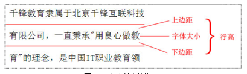

# 119 文本

视频序号038-042

目录
- [119 文本](#119-文本)
- [1. CSS 文本效果](#1-css-文本效果)
  - [1.1 direction](#11-direction)
  - [1.2 letter-spacing](#12-letter-spacing)
  - [1.3 line-height](#13-line-height)
  - [1.4 text-align](#14-text-align)
  - [1.5 text-decoration](#15-text-decoration)
  - [1.6 text-indent](#16-text-indent)
  - [1.7 text-transform](#17-text-transform)
  - [1.8 unicode-bidi](#18-unicode-bidi)
  - [1.9 vertical-align](#19-vertical-align)
  - [1.10 white-space](#110-white-space)
  - [1.11 word-spacing](#111-word-spacing)
- [2. CSS3 文本效果](#2-css3-文本效果)
  - [2.1 hanging-punctuation](#21-hanging-punctuation)
  - [2.2 punctuation-trim](#22-punctuation-trim)
  - [2.3 text-align-last](#23-text-align-last)
  - [2.4 text-justify](#24-text-justify)
  - [2.5 text-outline](#25-text-outline)
  - [2.6 text-overflow](#26-text-overflow)
  - [2.7 text-shadow](#27-text-shadow)
  - [2.8 text-wrap](#28-text-wrap)
  - [2.9 word-break](#29-word-break)
  - [2.10 word-wrap](#210-word-wrap)


***

# 1. CSS 文本效果

| 属性                                                         | 描述                     |
| :----------------------------------------------------------- | :----------------------- |
| [color](https://www.w3cschool.cn/cssref/pr-text-color.html)  | 设置文本颜色             |
| [direction](https://www.w3cschool.cn/cssref/pr-text-direction.html) | 设置文本方向。           |
| [letter-spacing](https://www.w3cschool.cn/cssref/pr-text-letter-spacing.html) | 设置字符间距             |
| [line-height](https://www.w3cschool.cn/cssref/pr-dim-line-height.html) | 设置行高                 |
| [text-align](https://www.w3cschool.cn/cssref/pr-text-text-align.html) | 对齐元素中的文本         |
| [text-decoration](https://www.w3cschool.cn/cssref/pr-text-text-decoration.html) | 向文本添加修饰           |
| [text-indent](https://www.w3cschool.cn/cssref/pr-text-text-indent.html) | 缩进元素中文本的首行     |
| [text-shadow](https://www.w3cschool.cn/cssref/css3-pr-text-shadow.html) | 设置文本阴影             |
| [text-transform](https://www.w3cschool.cn/cssref/pr-text-text-transform.html) | 控制元素中的字母         |
| [unicode-bidi](https://www.w3cschool.cn/cssref/pr-text-unicode-bidi.html) | 设置或返回文本是否被重写 |
| [vertical-align](https://www.w3cschool.cn/cssref/pr-pos-vertical-align.html) | 设置元素的垂直对齐       |
| [white-space](https://www.w3cschool.cn/cssref/pr-text-white-space.html) | 设置元素中空白的处理方式 |
| [word-spacing](https://www.w3cschool.cn/cssref/pr-text-word-spacing.html) | 设置字间距               |


## 1.1 direction

文本方向/书写方向。

ltr:默认。文本方向从左到右。

rtl:文本方向从右到左。


## 1.2 letter-spacing 

增加或减少字符间的空白（字符间距）

normal:默认。规定字符间没有额外的空间。

length:定义字符间的固定空间（允许使用负值）。


## 1.3 line-height

定义行高

什么是行高，一行文字的高度，上边距和下边距的等价关系。

默认行高：不是固定值，而是变化的。根据当前字体的大小再不断的变化。

取值：1. number( px )   |  scale ( 比例值 , 跟文字大小成比例的 )   |  length 设置固定的行间距。



##  1.4 text-align

文本对齐方式

对齐方式 : left 、right、center、justify（两端点对齐）


## 1.5 text-decoration

文本装饰

下划线 : underline

删除线 :line-through

上划线 : overline

不添加任何装饰 : none

注：添加多个文本修饰：line-through underline overline


##  1.6 text-indent

文本缩进 首行缩进

em单位：相对单位，1em永远都是跟字体大小相同


## 1.7 text-transform

针对英文段落 文本大小写

lowercase:定义仅有小写

uppercase:定义仅有大写

capitalize:文本中的每个单词以大写字母开头。


## 1.8 unicode-bidi

设置或返回文本是否被重写 

官方文档的描述看不懂

引用他人博客详细解释:https://www.cnblogs.com/dolphinX/p/4087816.html

本地链接：  [direction和unicode-bidi - 谦行 - 博客园.html](direction和unicode-bidi - 谦行 - 博客园.html) 


## 1.9 vertical-align

设置一个元素的垂直对齐。

baseline:默认。元素放置在父元素的基线上。

sub:垂直对齐文本的下标。

super:垂直对齐文本的上标

top:把元素的顶端与行中最高元素的顶端对齐

text-top:把元素的顶端与父元素字体的顶端对齐

middle:把此元素放置在父元素的中部。

bottom:把元素的顶端与行中最低的元素的顶端对齐。

text-bottom:把元素的底端与父元素字体的底端对齐。

length

% 使用 "line-height" 属性的百分比值来排列此元素。允许使用负值。


## 1.10 white-space

指定元素内的空白怎样处理。

normal:默认。空白会被浏览器忽略。                                

pre:空白会被浏览器保留。其行为方式类似 HTML 中的 pre 标签。 

nowrap:文本不会换行，文本会在在同一行上继续，直到遇到 br 标签为止。

pre-wrap:保留空白符序列，但是正常地进行换行。                      

pre-line:合并空白符序列，但是保留换行符。                         


## 1.11 word-spacing

词之间的间距  ( 针对英文段落的 )

normal:默认。定义单词间的标准空间。

length:定义单词间的固定空间。


# 2. CSS3 文本效果

| 属性                                                         | 描述                                                     | CSS  |
| :----------------------------------------------------------- | :------------------------------------------------------- | :--- |
| [hanging-punctuation](https://www.w3cschool.cn/cssref/css3-pr-hanging-punctuation.html) | 规定标点字符是否位于线框之外。                           | 3    |
| [punctuation-trim](https://www.w3cschool.cn/cssref/css3-pr-punctuation-trim.html) | 规定是否对标点字符进行修剪。                             | 3    |
| [text-align-last](https://www.w3cschool.cn/cssref/css3-pr-text-align-last.html) | 设置如何对齐最后一行或紧挨着强制换行符之前的行。         | 3    |
| text-emphasis                                                | 向元素的文本应用重点标记以及重点标记的前景色。           | 3    |
| [text-justify](https://www.w3cschool.cn/cssref/css3-pr-text-justify.html) | 规定当  text-align 设置为 "justify" 时所使用的对齐方法。 | 3    |
| [text-outline](https://www.w3cschool.cn/cssref/css3-pr-text-outline.html) | 规定文本的轮廓。                                         | 3    |
| [text-overflow](https://www.w3cschool.cn/cssref/css3-pr-text-overflow.html) | 规定当文本溢出包含元素时发生的事情。                     | 3    |
| [text-shadow](https://www.w3cschool.cn/cssref/css3-pr-text-shadow.html) | 向文本添加阴影。                                         | 3    |
| [text-wrap](https://www.w3cschool.cn/cssref/css3-pr-text-wrap.html) | 规定文本的换行规则。                                     | 3    |
| [word-break](https://www.w3cschool.cn/cssref/css3-pr-word-break.html) | 规定非中日韩文本的换行规则。                             | 3    |
| [word-wrap](https://www.w3cschool.cn/cssref/css3-pr-word-wrap.html) | 允许对长的不可分割的单词进行分割并换行到下一行。         | 3    |

参考：https://www.w3cschool.cn/css3/ov693flj.html


## 2.1 hanging-punctuation

指定一个标点符号是否会在启动或在结束时文本行框以外。

目前浏览器都不支持 2333


## 2.2 punctuation-trim

是否应修饰，当它出现在一条线，或相邻的另一个全形标点符号字符开头或结束标点字符。

目前浏览器都不支持 2333


## 2.3 text-align-last

规定如何对齐文本的最后一行。

**注意：**text-align-last 属性只有在 text-align 属性设置为 "justify" 时才起作用。

只支持chrome和IE


## 2.4 text-justify

文本对齐设置为"justify"的理据。

此属性指定应怎样对齐文本以及对齐间距。

只支持IE 2333


## 2.5 text-outline

文本-轮廓 文字大纲。

都不支持2333


## 2.6 text-overflow

文本溢出包含它的元素，应该发生的事情。

clip:修剪文本。

ellipsis:显示省略符号来代表被修剪的文本。

string:使用给定的字符串来代表被修剪的文本。


## 2.7 text-shadow

```
text-shadow: h-shadow v-shadow blur color;
```

给文本添加阴影。

h-shadow:必需。水平阴影的位置。允许负值。
v-shadow:必需。垂直阴影的位置。允许负值。
blur:可选。模糊的距离。
color:可选。阴影的颜色。参阅 [CSS 颜色值](https://www.w3cschool.cn/cssref/css-colors-legal.html)。


## 2.8 text-wrap

文本换行规则。

任何浏览器都不支持2333


## 2.9 word-break

word-break属性指定非CJK脚本的断行规则。

**提示:**CJK脚本是中国，日本和韩国（"中日韩"）脚本。

normal:使用浏览器默认的换行规则。

break-all:允许在单词内换行 (非常强烈的折行)

keep-all:只能在半角空格或连字符处换行。


## 2.10 word-wrap 

允许长的内容可以自动换行。

break-word:(不是那么强烈的折行 ，会产生一些空白区域)  


实例：  [11902text10.html](11902text10.html) 

参考： [个人简介.html](个人简介.html) 

练习：   [11902text10test01.html](11902text10test01.html) 

使用PS测量 取色等