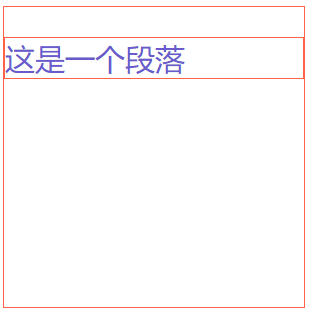

# 128 css样式的继承

视频序号052

***

文字相关和布局相关的区别：

* 文字相关的样式可以被继承。
* 布局相关的样式不能被继承 ( 默认是不能继承的，但是可以设置继承属性 inherit 值 )。

示例：

```
    <style>
        div{
            width: 300px;
            height: 300px;
            border: 1px solid tomato;
            color: slateblue;
            font-size: 30px;
        }
        p{
            border: inherit;
            /* 继承了父元素的border属性 */
        }
    </style>

<body>
    <div>
        <p>这是一个段落</p>
    </div>
</body>
```

运行结果：



实例：  [12801jicheng01.html](12801jicheng01.html) 

