# 130 盒子模型

视频序号056-061

目录
- [130 盒子模型](#130-盒子模型)
- [1. 什么是盒子模型](#1-什么是盒子模型)
  - [1.1 content 内容区域](#11-content-内容区域)
  - [1.2 padding 内填充](#12-padding-内填充)
  - [1.3 margin 外边距](#13-margin-外边距)
  - [1.4 注意事项](#14-注意事项)
- [2. box-sizing改变盒模型](#2-box-sizing改变盒模型)
- [3. 盒模型之margin叠加问题](#3-盒模型之margin叠加问题)
- [4. BFC规范](#4-bfc规范)
  - [4.1 布局规则：](#41-布局规则)
  - [4.2 如何创建BFC：](#42-如何创建bfc)
    - [4.2.1 利用BFC避免margin重叠。](#421-利用bfc避免margin重叠)
    - [4.2.2 自适应两栏布局](#422-自适应两栏布局)
    - [4.2.3 清除浮动](#423-清除浮动)
  - [4.3 总结](#43-总结)
- [5. 盒模型之margin传递问题](#5-盒模型之margin传递问题)
- [6. CSS盒子模型与扩展](#6-css盒子模型与扩展)
- [7. 盒子模式的嵌套练习](#7-盒子模式的嵌套练习)


***

# 1. 什么是盒子模型

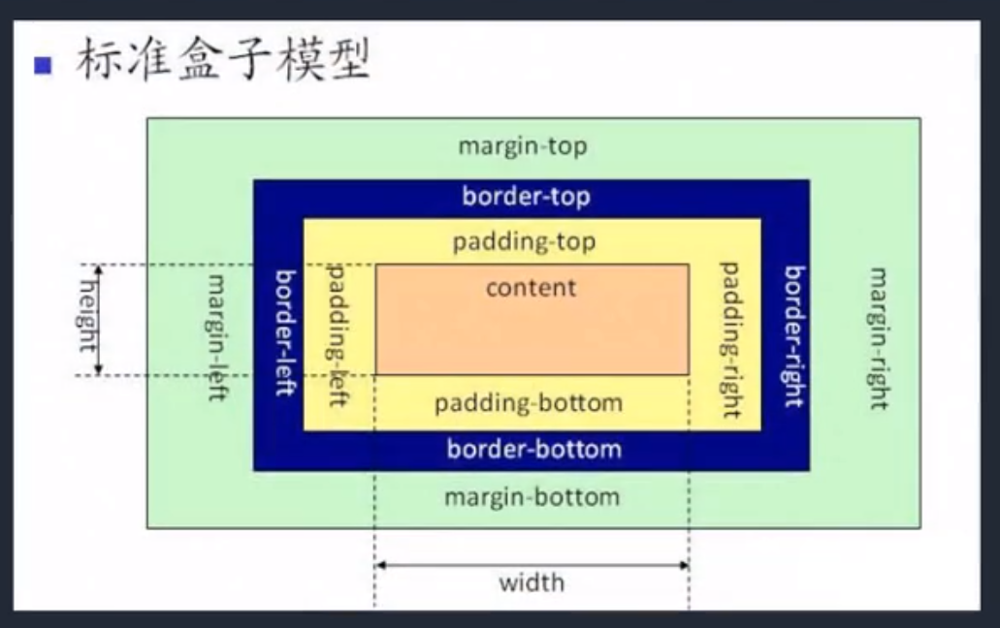

组成：content -> padding -> border -> margin

简单的讲：物品 -> 填充物 -> 包装盒 -> 盒子与盒子之间的间距。

浏览器控制台可查看（F12键）。


## 1.1 content 内容区域

内容区域 width和height组成的


## 1.2 padding 内填充

内边距(内填充)

padding:10px  上下左右都10px

padding:10px 20px   上下10px 左右20px

padding:10px 20px 15px  上10px 左右20px 下15px

padding:四个值 顺序为上右下左


单一样式只能写一个值

padding-top

padding-right

padding-bottom

padding-left

示例：

```
    <style>
        #box1{
            width: 200px;
            height: 200px;
            background: lightskyblue;
            border: 10px solid royalblue;
            padding: 30px;
        }

        #box2{
            width: 200px;
            height: 200px;
            background: lightskyblue;
            border: 10px solid royalblue;
            padding: 20px 30px 15px;
            
        }
    </style>

<body>
    <div id="box1">这是一个盒子</div>
    <p>设置完后这盒子的长和宽都为（这是正方形）：</p>
    <p>内容区域200px</p>
    <p>内填充30px+30px</p>
    <p>边框10px+10px</p>
    <p>总计280px</p>
    <hr>
    <div id="box2">ABC</div>
</body>
```

运行结果：

页面显示的#box1:

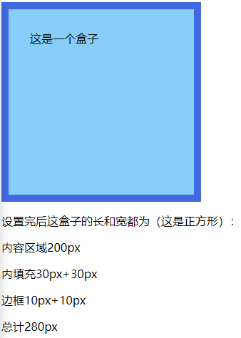

控制台里的#box1:

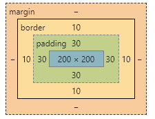


页面显示的#box2:

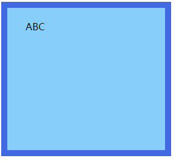

控制台里的#box2:

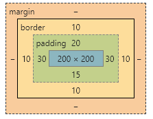

实例： [03001hezi01.html](03001hezi01.html) 


## 1.3 margin 外边距

写法和上面的padding完全一样

长宽不在盒子内，只是盒子与另一个盒子的距离

示例：

```
    <style>
        #box1{
            width: 200px;
            height: 200px;
            background: lightskyblue;
            border: 10px solid royalblue;
            padding: 30px;
            margin: 50px;
        }

        .box2{
            width: 200px;
            height: 200px;
            background: lightskyblue;
            border: 10px solid royalblue;
            padding: 20px 30px 15px;
            
        }
        .margin{
            margin: -50px;
        }
    </style>

<body>
    <div id="box1">这是一个盒子</div>
    <p>设置完后这盒子的长和宽都为（这是正方形）：</p>
    <p>内容区域200px</p>
    <p>内填充30px+30px</p>
    <p>边框10px+10px</p>
    <p>总计280px</p>
    <hr>
    <div class="box2">ABC</div>
    <div class="box2 margin">这俩盒子间距为-50px</div>
    <!-- 这俩盒子间距为 XX px -->
</body>
```

运行结果：

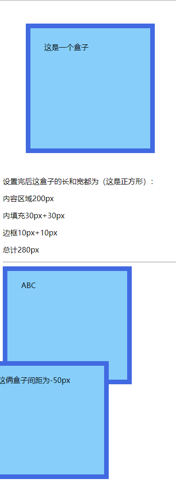

实例： [03001hezi02.html](03001hezi02.html) 


## 1.4 注意事项

* 背景颜色会填充到margin以内的区域。

* 文字会在content区域。

* padding不能出现负值，margin是可以出现负值。


# 2. box-sizing改变盒模型

盒尺寸，可以改变盒子模型的展示形态。

默认值： content-box :  width、height -> content

border-box : width、height -> content padding border

允许您以特定的方式定义匹配某个区域的特定元素。取值为content-box（默认值） | border-box。

| 值          | 描述                                                         |
| :---------- | :----------------------------------------------------------- |
| content-box | 这是由 CSS2.1 规定的宽度高度行为。宽度和高度分别应用到元素的内容框。在宽度和高度之外绘制元素的内边距和边框。 |
| border-box  | 为元素设定的宽度和高度决定了元素的边框盒。就是说，为元素指定的任何内边距和边框都将在已设定的宽度和高度内进行绘制。通过从已设定的宽度和高度分别减去边框和内边距才能得到内容的宽度和高度。 |

使用的场景：

* 不用再去计算一些值。

* 解决一些100%的问题。

示例：

```
    <style>
        #box{
            width: 300px;
            height: 300px;
            background: skyblue;
            border: 10px solid royalblue;
            padding: 30px 50px;
            /* box-sizing: content-box; */
            /* 宽度和高度分别应用到元素的内容框。在宽度和高度之外绘制元素的内边距和边框。即默认值 */

            box-sizing: border-box;
            /* 为元素设定的宽度和高度决定了元素的边框盒。 */
        }

        #box1{
            width: 300px;
            height: 300px;
            background: tomato;
            border: 10px solid brown;
            /* padding: 30px; */
        }
        #box1 .box1-little{
            width: 50%;
            height: 50%;
            background: salmon;
            border: 10px dotted darkred;
            float: left;
            box-sizing: border-box;
            /* box-sizing: content-box; */
        }

        input{
            width: 100%;
            padding: 30px;
            box-sizing: border-box;
        }
    </style>

<body>
    <div id="box">盒子</div>
    <hr>
    <div id="box1">
        <div class="box1-little">小盒子1</div>
        <div class="box1-little">小盒子2</div>
        <div class="box1-little">小盒子3</div>
        <div class="box1-little">小盒子4</div>
    </div>
    <br />
    <input type="text">
</body>
```

运行结果：

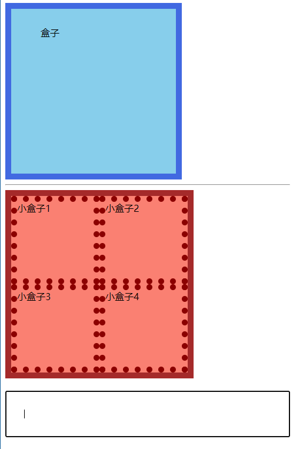

实例： [03002hezi01.html](03002hezi01.html) 


# 3. 盒模型之margin叠加问题

当给两个盒子同时添加上下外边距的时候，就会出现叠加的问题。这个问题，只在上下有，左右是没有这个叠加问题的。

**情况1：**

如果两个盒子都设置了margin:40px

上下间距是40px，而不是40px+40px=80px

如果上面盒子margin为30px，下面盒子margin为50px，那么这俩盒子间距为50px，所以取这两个中的最大值。

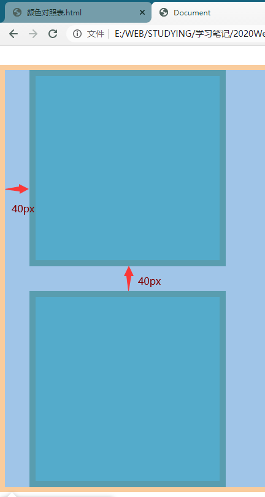

**情况2：**

设置margin:40px 又设置float:left

左右间距是40pz+40px=80px

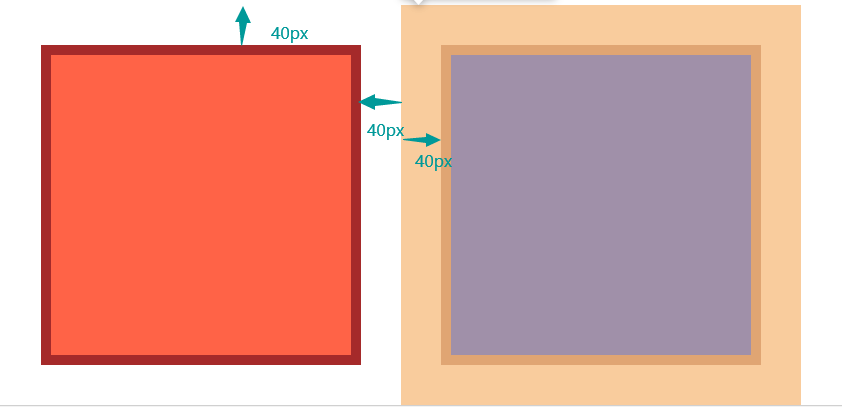

实例： [03003hezi01.html](03003hezi01.html) 

**上下盒子叠加问题解决方案：**

给元素添加属性：如果想给两个盒子上下间距为70px，上面的 margin-bottom 设为 0px，下面的 margin-top 设为 70px 即可。


# 4. BFC规范

BFC 规范：百度找（找到了）下面详解！

先知道 Box、Formatting Context 的概念。

## 4.1 布局规则：

* 内部的 Box 会在垂直方向，一个接一个地放置。

* Box 垂直方向的距离由 margin 决定。属于同一个 BFC 的两个相邻 Box 的 margin 会发生重叠。

* 每个盒子（块盒与行盒）的margin box 的左边，与包含块 border box 的左边相接触(对于从左往右的格式化，否则相反)。即使存在浮动也是如此。

* BFC 的区域不会与 float box 重叠。

* BFC 就是页面上的一个隔离的独立容器，容器里面的子元素不会影响到外面的元素。反之也如此。

* 计算 BFC 的高度时，浮动元素也参与计算。


## 4.2 如何创建BFC：

* float 的值不是 none。

* position 的值不是 static 或者 relative。

* display 的值是 inline-block、table-cell、flex、table-caption 或者 inline-flex。

* overflow 的值不是 visible。


### 4.2.1 利用BFC避免margin重叠。

示例：

```
    <style>
        *{
            margin: 0;
            padding: 0;
        }
        p {
            color: #f55;
            background: yellow;
            width: 200px;
            line-height: 100px;
            text-align:center;
            margin: 30px;
        }
        div{
            overflow: hidden; 
            /* 上面属性取消试试效果*/
        }
    </style>

<body>
    <p>看看我的 margin是多少</p>
    <div>
        <p>看看我的 margin是多少</p>
    </div>
    我们可以设置，两个不同的BFC，也就是我们可以让把第二个p用div包起来，然后激活它使其成为一个BFC
</body>
```

实例： [03004hezi01.html](03004hezi01.html) 


### 4.2.2 自适应两栏布局

每个盒子的margin box的左边，与包含块border box的左边相接触(对于从左往右的格式化，否则相反)。即使存在浮动也是如此。

```
    <style>
        *{
            margin: 0;
            padding: 0;
        }
        body {
            width: 100%;
            position: relative;
        }
        .left {
            width: 100px;
            height: 150px;
            float: left;
            background: rgb(139, 214, 78);
            text-align: center;
            line-height: 150px;
            font-size: 20px;
        }
        .right {
            overflow: hidden;
            /* 取消上面一行试效果 */
            height: 300px;
            background: rgb(170, 54, 236);
            text-align: center;
            line-height: 300px;
            font-size: 40px;
        }
    </style>

<body>
    <div class="left">LEFT</div>
    <div class="right">RIGHT</div>
</body>
```

LEFT绿块占据了RIGHT紫块左上

解决方法：在RIGHT块的元素里添加overflow: hidden；

实例： [03004hezi02.html](03004hezi02.html) 


### 4.2.3 清除浮动

当我们不给父节点设置高度，子节点设置浮动的时候，会发生高度塌陷，这个时候我们就要清楚浮动。

```
    <style>
        .par {
            border: 5px solid rgb(91, 243, 30);
            width: 300px;
            overflow: hidden;
            /* 取消上面一行试效果 */
        }
        .child {
            border: 5px solid rgb(233, 250, 84);
            width:100px;
            height: 100px;
            float: left;
        }
    </style>


<body>
    <div class="par">
        <div class="child"></div>
        <div class="child"></div>
    </div>
</body>
```

父元素不能被子元素撑满

解决方法：在父元素里添加overflow: hidden;

实例： [03004hezi03.html](03004hezi03.html) 


## 4.3 总结

BFC就是页面上的一个隔离的独立容器，容器里面的子元素不会影响到外面的元素。反之也如此。

因为BFC内部的元素和外部的元素绝对不会互相影响，因此， 当BFC外部存在浮动时，它不应该影响BFC内部Box的布局，BFC会通过变窄，而不与浮动有重叠。同样的，当BFC内部有浮动时，为了不影响外部元素的布局，BFC计算高度时会包括浮动的高度。避免margin重叠也是这样的一个道理。

转载于https://blog.csdn.net/sinat_36422236/article/details/88763187?ops_request_misc=&request_id=&biz_id=102&utm_term=BFC&utm_medium=distribute.pc_search_result.none-task-blog-2~all~sobaiduweb~default-0-88763187


# 5. 盒模型之margin传递问题

margin传递的问题只会出现在嵌套的结构中，且只有margin-top会有传递的问题，其它三个方向是没有传递问题的。

```
    <style>
        .box1{
            width: 200px;
            height: 200px;
            background: tomato;
        }
        .box2{
            width: 100px;
            height: 100px;
            background: lightskyblue;
            margin-top: 100px;
        }
    </style>

<body>
    <div class="box1">
        <div class="box2"></div>
    </div>
</body>
```

运行结果：

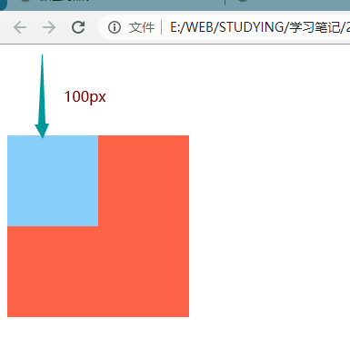

却不能在大盒子里下调100px，连同大盒子也跟着下调100px，margin-left和marginright无这问题。

实例： [03005hezi01.html](03005hezi01.html) 


**解决方法：**

1. BFC规范（上面有详解）。

2. 给父容器添加边框：

   ```
   border: 2px dashed brown;
   ```

   运行结果：

   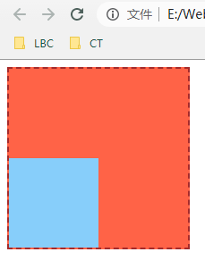

   实例： [03005hezi02.html](03005hezi02.html) 

3. margin换成padding：

   给父元素设置padding-top，然后调整高度，子元素去掉margin-top

   ```
       <style>
           .box1{
               width: 200px;
               height: 100px;
               background: tomato;
               padding-top: 100px;
           }
           .box2{
               width: 100px;
               height: 100px;
               background: lightskyblue;
           }
       </style>
   
   <body>
       <div class="box1">
           <div class="box2"></div>
       </div>
   </body>
   ```

   运行结果：

   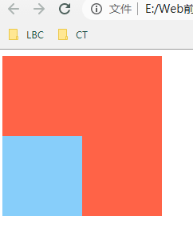

   实例： [03005hezi03.html](03005hezi03.html) 


# 6. CSS盒子模型与扩展

margin左右自适应是可以的 ，但是上下自适应是不行的。( 如果想实现上下自适应的话，需要在第二大部分来进行学习 )

width、height不设置的时候，对盒子模型的影响，会自动去计算容器的大小，节省代码。


示例1：

margin自适应居中

浏览器窗口自适应居中

```
    <style>
        .box-little{
            width: 100px;
            height: 100px;
            background: royalblue;
            /* margin-left: auto; */
            /* margin-right: auto; */
            margin: auto auto;
            /* 只有左右才有效果，上下设置auto无效 */
        }
    </style>

<body>
    <div class="box-little"></div>
</body>
```

无论浏览器窗口 width 多少，box-little 能保持居中。

实例： [03006hezi01.html](03006hezi01.html) 


示例2：

盒子内居中

```
    <style>
        .box{
            width: 500px;
            height: 500px;
            background: royalblue;
            position: relative;
        }
        .box-little{
            width: 100px;
            height: 100px;
            background: lightskyblue;
            margin-left: 200px;
            margin-right: auto;
            position: absolute;
        }
    </style>

<body>
    <div class="box">
        <div class="box-little">小盒子</div>
    </div>
</body>
```

实例： [03006hezi02.html](03006hezi02.html) 


示例3：

不设置content的现象

width、height不设置的时候，对盒子模型的影响，会自动去计算容器的大小，节省代码。

```
    <style>
        div{
            color: white;
        }
        .box1{
            width: 300px;
            height: 300px;
            background: seagreen;
            
        }
        .box2{
            width: 100%;
            /* 100%的只能继承父元素的300px */
            height: 100px;
            background: lightseagreen;
            padding-left: 30px;
            box-sizing: border-box; 
            /* 取消上面一行试效果 */
        }
    </style>

<body>
    <div class="box1">
        <div class="box2">这是一些内容</div>
    </div>
</body>
```

box2因为设置了padding超出范围外了。

解决方法：给box2添加box-sizing: border-box;

实例： [03006hezi03.html](03006hezi03.html) 


# 7. 盒子模式的嵌套练习

按图所示：


千锋的答案： [16_嵌套盒子的练习.html](16_嵌套盒子的练习.html) 这是采用测量方法参考设计图 缺点是改数值会坍塌。

自己的答案：

 [03007test01.html](03007test01.html) 把最外面的盒子设置display:inline-block才能紧紧包含子元素 随便改数值都上下左右完美间距。

 [03007test02.html](03007test02.html) 