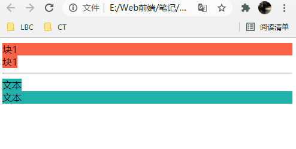
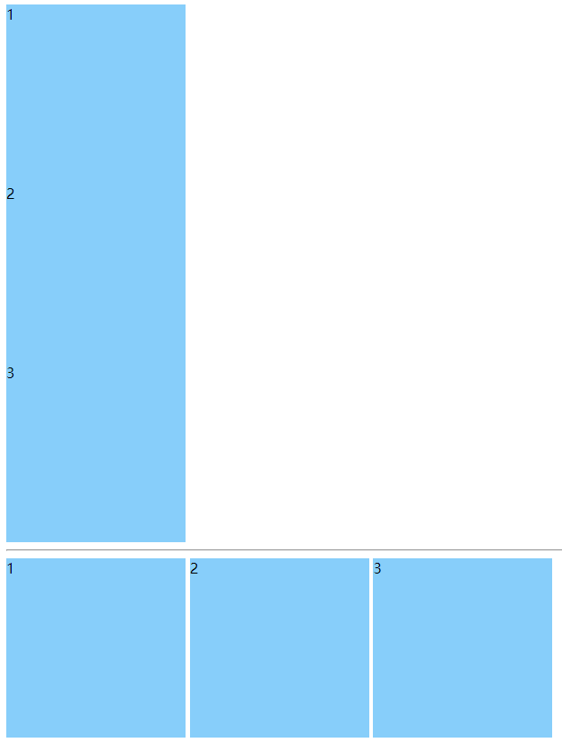
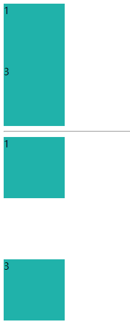

# 032 display显示

视频序号065
- [032 display显示](#032-display显示)
- [1.display的属性值](#1display的属性值)
- [2.display:none 与 visibility:hidden 的区别](#2displaynone-与-visibilityhidden-的区别)


***

# 1.display的属性值

block 块级元素

inline 内联元素

inline-block 内联块级元素

none  此元素不会被显示


示例1：

如何把div弄成内联元素，span弄成块级元素。

```
    <style>
        .p1{
            background: tomato;
        }
        .p2{
            display: inline;
            background: tomato;
        }
        .p3{
            background: lightseagreen;
        }
        .p4{
            display: block;
            background: lightseagreen;
        }
    </style>

<body>
    <div class="p1">块1</div>
    <div class="p2">块1</div>
    <hr>
    <span class="p3">文本</span>
    <span class="p4">文本</span>
</body>
```

运行结果：



实例： [03201display01.html](03201display01.html) 


示例2：

如何把div弄成内联块级元素。

```
    <style>
        .box{
            width: 200px;
            height: 200px;
            background: lightskyblue;
            /* display: inline-block; */
        }
        .box1{
            width: 200px;
            height: 200px;
            background: lightskyblue;
            display: inline-block;
        }
    </style>

<body>
    <div class="box">1</div>
    <div class="box">2</div>
    <div class="box">3</div>
    <hr>
    <div class="box1">1</div>
    <div class="box1">2</div>
    <div class="box1">3</div>
</body>
```

运行结果：



实例： [03201display02.html](03201display02.html) 


# 2.display:none 与 visibility:hidden 的区别

display:none 不占空间的隐藏

visibility:hidden 占空间的隐藏

```
    <style>
        .box{
            width: 100px;
            height: 100px;
            background: lightseagreen;
        }
        .none{
            display: none;
        }
        .none1{
            visibility: hidden;
        }
    </style>

<body>
    <div class="box">1</div>
    <div class="box none">2</div>
    <div class="box">3</div>
    <hr>
    <div class="box">1</div>
    <div class="box none1">2</div>
    <div class="box">3</div>
</body>
```

运行结果：



实例： [03202display01.html](03202display01.html) 