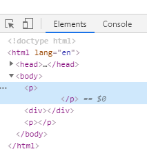

# 033 标签嵌套规范

视频序号066


***

例：

ul、li

dl、dt、dd

table、tr、td


块标签可以嵌套内联标签

```
<div>
	<span></span>
	<a href="#"></a>
</div>
```

块标签不一定能嵌套块标签

块嵌套块

```
<div>
	<div></div>
</div>
```

特殊：

```
<p>
	<div></div>
</p> 这是错误写法
```



这么写法，控制台显示两个p标签 一个div标签。

实例： [03301guifan01.html](03301guifan01.html) 


内联标签不能嵌套块标签

```
<span>
	<div></div>
</span> 这是错误写法
```

但是a标签是一个例外

```
<a href="#">
	<div></div>
</a> 正确写法
```

```
    <style>
        div{
            width: 300px;
            height: 300px;
            background: royalblue;
            color: white;
        }
    </style>

<body>
    <a href="http://www.baidu.com">
        <div>会面向百度能找到工作 信不？点击这块试试</div>
    </a>
</body>
```

实例： [03301guifan02.html](03301guifan02.html) 