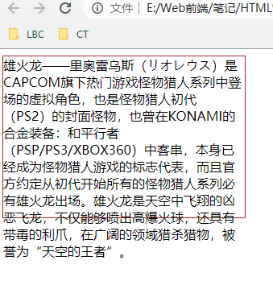
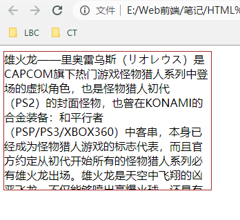
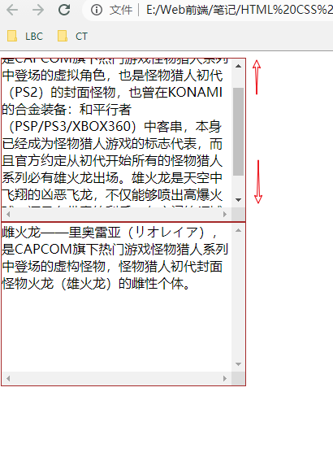
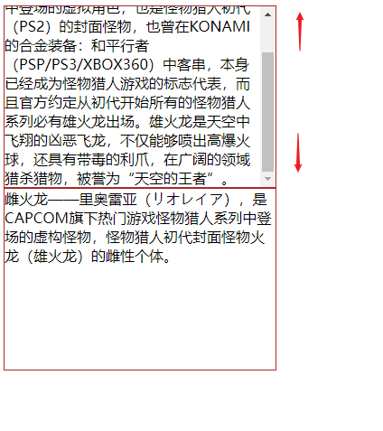
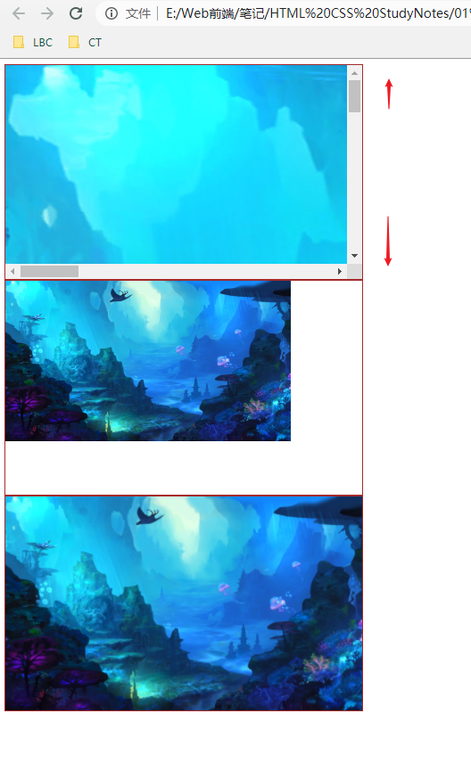
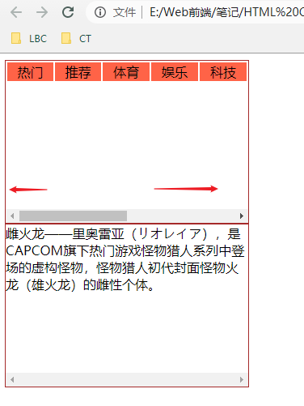

# 034 overflow溢出与隐藏

视频序号067

目录
- [034 overflow溢出与隐藏](#034-overflow溢出与隐藏)
- [1. visible 默认值，溢出](#1-visible-默认值溢出)
- [2. hidden 内容会被修剪，其余不可见](#2-hidden-内容会被修剪其余不可见)
- [3. scroll 内容会被修剪，但滚动条可查其余内容](#3-scroll-内容会被修剪但滚动条可查其余内容)
- [4. auto 若内容被修剪，则显示滚动条查看其余内容](#4-auto-若内容被修剪则显示滚动条查看其余内容)
- [5. 带有图片的](#5-带有图片的)
- [6. overflow-x、overflow-y](#6-overflow-xoverflow-y)


***

overflow 属性规定当内容溢出元素框时发生的事情。

| 值      | 描述                                                     |
| :------ | :------------------------------------------------------- |
| visible | 默认值。内容不会被修剪，会呈现在元素框之外。             |
| hidden  | 内容会被修剪，并且其余内容是不可见的。                   |
| scroll  | 内容会被修剪，但是浏览器会显示滚动条以便查看其余的内容。 |
| auto    | 如果内容被修剪，则浏览器会显示滚动条以便查看其余的内容。 |
| inherit | 规定应该从父元素继承 overflow 属性的值。                 |

# 1. visible 默认值，溢出

```
    <style>
        .box{
            width: 300px;
            height: 200px;
            border: 1px solid brown;
            overflow: visible;
        }
    </style>

<body>
    <div class="box">雄火龙——里奥雷乌斯（リオレウス）是CAPCOM旗下热门游戏怪物猎人系列中登场的虚拟角色，也是怪物猎人初代（PS2）的封面怪物，也曾在KONAMI的合金装备：和平行者（PSP/PS3/XBOX360）中客串，本身已经成为怪物猎人游戏的标志代表，而且官方约定从初代开始所有的怪物猎人系列必有雄火龙出场。雄火龙是天空中飞翔的凶恶飞龙，不仅能够喷出高爆火球，还具有带毒的利爪，在广阔的领域猎杀猎物，被誉为“天空的王者”。</div>
</body>
```

运行结果：



visible 为 overflow 的默认值，文字溢出边框外了。

实例：  [03401overflow01.html](03401overflow01.html) 


# 2. hidden 内容会被修剪，其余不可见

```
overflow:hidden;
```

运行结果：



内容会被修剪，其余不可显示。

实例： [03402overflow01.html](03402overflow01.html) 


# 3. scroll 内容会被修剪，但滚动条可查其余内容

```
overflow:scroll;
```



* 内容过多则会出现滚动条，以便查看剩下内容。
* 内容小于边框，则不出现滚动条。

实例： [03403overflow01.html](03403overflow01.html) 


# 4. auto 若内容被修剪，则显示滚动条查看其余内容

```
overflow:auto;
```



和 scroll 的区别：

* 内容过多则会出现滚动条框与滚动条。
* 内容小于边框，不会出现滚动条框，注意是滚动条框

实例： [03404overflow01.html](03404overflow01.html) 


# 5. 带有图片的

使用 overflow:auto

```
    <style>
        .box{
            width: 500px;
            height: 300px;
            border: 1px solid brown;
            overflow: auto;
        }

        .box1{
            width: 500px;
            height: 300px;
            border: 1px solid brown;
        }
    </style>

<body>
    <div class="box">
        
    </div>
    <div class="box">
        
    </div>
    <div class="box1">
        
    </div>
</body>
```



1. 第一张图片没设定宽高，方框只能在图片左上角显示，右边和下边出现滚动条。
2. 第二张图片宽高小于方框，无滚动条。
3. 第三张图片宽高分别设定100%，则铺满方框。

实例： [03405overflow01.html](03405overflow01.html) 


# 6. overflow-x、overflow-y

x 属性规定是否对内容的左/右边缘进行裁剪 - 如果溢出元素内容区域的话。

y 属性规定是否对内容的上/下边缘进行裁剪 - 如果溢出元素内容区域的话。

示例：

```
    <style>
        .box{
            width: 300px;
            height: 200px;
            border: 1px solid brown;
            overflow-x: scroll;
        }
        td{
            background: tomato;
            text-align: center;
        }
    </style>

<body>
    <div class="box">
        <table width="600px">
            <tr>
                <td>热门</td>
                <td>推荐</td>
                <td>体育</td>
                <td>娱乐</td>
                <td>科技</td>
                <td>财经</td>
                <td>军事</td>
                <td>地理</td>
                <td>美术</td>
                <td>色情</td>
            </tr>
        </table>    
    </div>
    <div class="box">雌火龙——里奥雷亚（リオレイア），是CAPCOM旗下热门游戏怪物猎人系列中登场的虚构怪物，怪物猎人初代封面怪物火龙（雄火龙）的雌性个体。</div>
</body>
```



实例： [03406overflow01.html](03406overflow01.html) 


