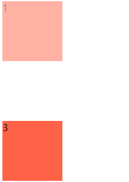
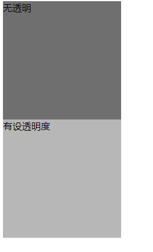

# 135 透明度

视频序号068

目录
- [135 透明度](#135-透明度)
- [1. 透明度示例](#1-透明度示例)
- [2. 两张图片叠加在一起并互相隐约显示](#2-两张图片叠加在一起并互相隐约显示)


***

# 1. 透明度示例

```
opacity : 0;
```

取值范围：

* 0(透明) ~ 1(不透明)

* 0.5(半透明)


```
..... : rgba()
```

a 在 0 ~ 1区间内，例如：rgba(255, 100, 102, 0.5)。


**==注意==**

* 可以让指定的样式透明，而不影响其他样式。
* 占空间的、所有的子内容也会透明。


示例：

```
        .box1{
            width: 100px;
            height: 100px;
            background: tomato;
            opacity: 0.5;
        }
        .box2{
            width: 100px;
            height: 100px;
            background: tomato;
            opacity: 0;
            /* display: none; */
            /* visibility: hidden; */
        }
        .box3{
            width: 100px;
            height: 100px;
            background: tomato;
        }
```



```
        span{
            color: seagreen;
        }
        span.touming{
            opacity: .5;
        }
```


```
        .box11{
            width: 200px;
            height: 200px;
            background: rgb(111, 111, 111);
        }
        .box12{
            width: 200px;
            height: 200px;
            background: rgba(111, 111  , 111, .5);
        }
```



实例：  [13501opacity01.html](13501opacity01.html) 


# 2. 两张图片叠加在一起并互相隐约显示

练习：


 [13502test01.html](13502test01.html) 


 [13502test02.html](13502test02.html) 