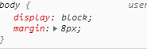

# 138 css默认样式与重置样式

视频序号070-071

目录
- [138 css默认样式与重置样式](#138-css默认样式与重置样式)
- [1. 默认样式](#1-默认样式)
- [2. 重置样式](#2-重置样式)
  - [2.1 *通用重置方法：](#21-通用重置方法)
  - [2.2图片出现问题的现象：](#22图片出现问题的现象)
  - [2.3写具体页面或一个布局效果的顺序姿势](#23写具体页面或一个布局效果的顺序姿势)
- [3.默认样式大全](#3默认样式大全)
- [4.重置样式示例](#4重置样式示例)


***

# 1. 默认样式

有些标签有默认样式，有些标签没有默认样式。

* 没有默认样式：

  div、span ...

* 有默认样式：

  body、h1~h6、p、ul、 ...

  * body =>  marign : 8px
  * h1 =>  margin : 上下 21.440px; font-weight : bold;
  * p  =>  margin : 上下 16px
  * ul =>  margin : 上下 16px  padding : 左 40px
  * 默认点：list-style : disc
  * a =>   text-decoration: underline;


实例：  [13801moren01.html](13801moren01.html) 

控制台查看body的默认样式。




# 2. 重置样式

也叫清除样式。

## 2.1 *通用重置方法：

```
*{ margin:0; padding:0;}
```

优点：不用考虑哪些标签有默认的margin和padding

缺点：稍微的影响性能

```
body,p,h1,ul{ margin:0; padding:0;}

ul{ list-style : none;}    

a{ text-decoration: none; color:#999;}
```


## 2.2图片出现问题的现象：

* 图片跟容器底部有一些空隙。
* 内联元素的对齐方式是按照文字基线对齐的，而不是文字底线对齐的。

解决方法：

```
img{ dispaly:block}

img{vertical-align: baseline;  }基线对齐方式，默认值

img{ vertical-align:bottom;} 解决方式是推荐的
```


## 2.3写具体页面或一个布局效果的顺序姿势

1. 写结构

2. css重置样式

3. 写具体样式


# 3.默认样式大全

```
html,address,blockquote,body,dd,div,dl,dt,fieldset,form,frame,frameset,h1,h2,h3,h4,h5,h6,noframes,ol,p,ul,center,dir,hr,menu,pre{display:block}
li{display:list-item}
head{display:none}
table{display:table}
tr{display:table-row}
thead{display:table-header-group}
tbody{display:table-row-group}
tfoot{display:table-footer-group}
col{display:table-column}
colgroup{display:table-column-group}
td,th{display:table-cell;}
caption{display:table-caption}
th{font-weight:bolder; text-align:center}
caption{text-align:center}
body{margin:8px; line-height:1.12}
h1{font-size:2em; margin:.67em 0}
h2{font-size:1.5em; margin:.75em 0}
h3{font-size:1.17em; margin:.83em 0}
h4,p,blockquote,ul,fieldset,form,ol,dl,dir,menu{margin:1.12em 0}

h5{font-size:.83em; margin:1.5em 0}
h6{font-size:.75em; margin:1.67em 0}
h1,h2,h3,h4,h5,h6,b,strong{font-weight:bolder}
blockquote{margin-left:40px; margin-right:40px}
i,cite,em,var,address{font-style:italic}
pre,tt,code,kbd,samp{font-family:monospace}
pre{white-space:pre}
button,textarea,input,object,select{display:inline-block;}
big{font-size:1.17em}
small,sub,sup{font-size:.83em}
sub{vertical-align:sub}
sup{vertical-align:super}
table{border-spacing:2px;}
thead,tbody,tfoot{vertical-align:middle}
td,th{vertical-align:inherit}
s,strike,del{text-decoration:line-through}
hr{border:1px inset}
ol,ul,dir,menu,dd{margin-left:40px}
ol{list-style-type:decimal}
ol ul,ul ol,ul ul,ol ol{margin-top:0; margin-bottom:0}
u,ins{text-decoration:underline}
br:before{content:”\A”}
:before,:after{white-space:pre-line}

center{text-align:center}
abbr,acronym{font-variant:small-caps; letter-spacing:0.1em}
:link,:visited{text-decoration:underline}
:focus{outline:thin dotted invert}

@media print{
h1{page-break-before:always}
h1,h2,h3,
h4,h5,h6{page-break-after:avoid}
ul,ol,dl{page-break-before:avoid}
```


# 4.重置样式示例

```
/* 清除内外边距 */
body, h1, h2, h3, h4, h5, h6, hr, p, blockquote, /* structural elements 结构元素 */
dl, dt, dd, ul, ol, li, /* list elements 列表元素 */
pre, /* text formatting elements 文本格式元素 */
fieldset, lengend, button, input, textarea, /* form elements 表单元素 */
th, td { /* table elements 表格元素 */
    margin: 0;
    padding: 0;
}

/* 设置默认字体 */
body,
button, input, select, textarea { /* for ie */
    /*font: 12px/1 Tahoma, Helvetica, Arial, "宋体", sans-serif;*/
    font: 12px/1 Tahoma, Helvetica, Arial, "\5b8b\4f53", sans-serif; /* 用 ascii 字符表示，使得在任何编码下都无问题 */
}

h1 { font-size: 18px; /* 18px / 12px = 1.5 */ }
h2 { font-size: 16px; }
h3 { font-size: 14px; }
h4, h5, h6 { font-size: 100%; }

address, cite, dfn, em, var { font-style: normal; } /* 将斜体扶正 */
code, kbd, pre, samp, tt { font-family: "Courier New", Courier, monospace; } /* 统一等宽字体 */
small { font-size: 12px; } /* 小于 12px 的中文很难阅读，让 small 正常化 */

/* 重置列表元素 */
ul, ol { list-style: none; }

/* 重置文本格式元素 */
a { text-decoration: none; }
a:hover { text-decoration: underline; }

abbr[title], acronym[title] { /* 注：1.ie6 不支持 abbr; 2.这里用了属性选择符，ie6 下无效果 */
border-bottom: 1px dotted;
cursor: help;
}

q:before, q:after { content: ''; }

/* 重置表单元素 */
legend { color: #000; } /* for ie6 */
fieldset, img { border: none; } /* img 搭车：让链接里的 img 无边框 */
/* 注：optgroup 无法扶正 */
button, input, select, textarea {
    font-size: 100%; /* 使得表单元素在 ie 下能继承字体大小 */
}

/* 重置表格元素 */
table {
border-collapse: collapse;
border-spacing: 0;
}

/* 重置 hr */
hr {
    border: none;
    height: 1px;
}
```


还有可以参考这方法： [CSS Tools_ Reset CSS.html](CSS Tools_ Reset CSS.html) 