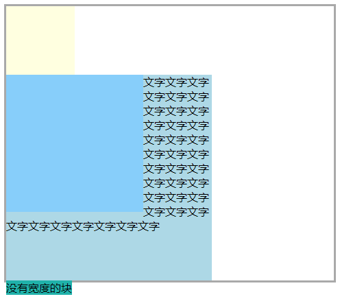
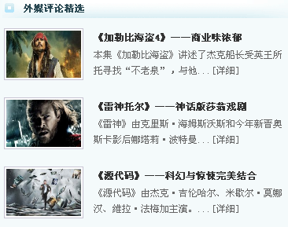

# 140 float浮动

视频序号078-083

目录
- [140 float浮动](#140-float浮动)
- [1. float浮动概念及原理](#1-float浮动概念及原理)
- [2. float注意点整理](#2-float注意点整理)
- [3. 清除浮动](#3-清除浮动)
  - [3.1 clear](#31-clear)
  - [3.2 固定宽高](#32-固定宽高)
  - [3.3 父元素浮动](#33-父元素浮动)
  - [3.4 overflow : hidden](#34-overflow--hidden)
  - [3.5 display : inline-block](#35-display--inline-block)
  - [3.6 设置空标签](#36-设置空标签)
  - [3.7 after 伪类](#37-after-伪类)
- [4. float练习](#4-float练习)
- [5.总结 推荐 after 伪类清除浮动](#5总结-推荐-after-伪类清除浮动)


***

# 1. float浮动概念及原理

**float特性：**

* 加浮动的元素，会脱离文档流，会延迟父容器靠左或靠右排列，如果之前已经有浮动的元素，会挨着浮动的元素进行排列。


**float取值：**

* left
* right
* none(默认)

示例：

```
    <style>
        .box1{
            width: 200px;
            height: 200px;
            background: tomato;
        }
        .box2{
            width: 100px;
            height: 100px;
            background: lightskyblue;
            float: left;
        }
        .box3{
            width: 100px;
            height: 100px;
            background: lightblue;
            float: left;
        }
        .clear{
            clear: both;
            /* 取消上面一行试效果 */
        }
    </style>

<body>
    <!-- <div class="box1">1</div>
    <div class="box1">2</div>
    <hr> -->
    <div class="box2">1</div>
    <div class="box2">2</div>
    <hr>
    <div class="clear">
        <div class="box3">1</div>
        <div class="box3">2</div>
        <div class="box3">3</div>
    </div>
</body>
```

**不设 clear : both; 时**


**有设 clear : both; 时**


实例：  [14001float01.html](14001float01.html) 


**父元素自适应已设浮动的子元素方法：**

给父元素添加

```
overflow:hidden
```

实例：  [14001float02.html](14001float02.html) 


# 2. float注意点整理

**float注意点：**

* 只会影响后面的元素。

* 内容默认提升半层。

* 默认宽根据内容决定。

* 换行排列。

* 主要给块元素添加，但也可以给内联元素添加。


**示例1：**

```
    <style>
        .box{
            border: 2px gray solid;
        }
        .box-little1{
            width: 100px;
            height: 100px;
            background: tomato;
            float: left;   
            /* 取消上面一行试效果 */
        }
        .box-little2{
            width: 300px;
            height: 300px;
            background: lightskyblue;
        }
    </style>
</head>
<body>
    <div class="box">
        <div class="box-little1"></div>
        <div class="box-little2">火龙在和地面的敌人作战时，会灵活运用飞行能力展开空中袭击。就算在地面上，雄火龙的突进和火球也同样具有威胁危险度可以说更胜雌火龙。</div>
    </div>
</body>
```

.box-little1 不设 float : left;时


有设 float : left;时


实例：  [14002float01.html](14002float01.html) 


**示例2：**

```
    <style>
        .box{
            border: 2px gray solid;
        }
        .box-little1{
            width: 100px;
            height: 100px;
            background: tomato;
            float: left;
        }
        .box-little2{
            width: 300px;
            height: 300px;
            background: lightskyblue;
        }
        .box-little3{
            background: lightseagreen;
            float: left; 
             /* 取消上面一行试效果 */
        }
    </style>

<body>
    <div class="box">
        <div class="box-little1"></div>
        <div class="box-little2"></div>
        <div class="box-little3">没有宽度的块</div>
    </div>
</body>
```

若把 .box-little3 的 float:left; 取消，运行结果如下图：


添加 float:left; 如图：


添加float:left，变成脱离了，宽度根据内容大小决定。

实例：  [14002float02.html](14002float02.html) 


**示例3：**

```
    <style>
        ul{
            width: 300px;
            height: 300px;
            background: lightyellow;
            list-style: none;
            border: 2px solid brown;
            margin: 0;
            padding: 0;
        }
        li{
            width: 100px;
            height: 100px;
            background: lightseagreen;
            border: 2px solid seagreen;
            box-sizing: border-box;
            float: left;
            color: white;
        }


        li:nth-of-type(1){
            height: 120px;
        }
        li:nth-of-type(2){
            height: 150px;
        }
        /* 取消前面两段代码试效果 */
    </style>

<body>
    <ul>
        <li>1</li>
        <li>2</li>
        <li>3</li>
        <li>4</li>
        <li>5</li>
    </ul>
</body>
```

运行结果：


第1块和第2块高度超出了，第4块被迫移到第3块下面，第5块也位移了。

实例：  [14002float03.html](14002float03.html) 


**示例4：**

```
    <style>
        body{
            border: 3px solid darkgray;
        }
        .box1{
            width: 100px;
            height: 100px;
            background: lightyellow;
            /* float: left; */
        }
        .box2{
            width: 200px;
            height: 200px;
            background: lightskyblue;
            float: left;
        }
        .box3{
            width: 300px;
            height: 300px;
            background: lightblue;
            
        }
        .box4{
            background: lightseagreen;
            float: left;
        }
    </style>

<body>
    <div class="box1"></div>
    <div class="box2"></div>
    <div class="box3">文字文字文字文字文字文字文字文字文字文字文字文字文字文字文字文字文字文字文字文字文字文字文字文字文字文字文字文字文字文字文字文字文字文字文字文字文字</div>
    <div class="box4">没有宽度的块</div>
</body>
```

.box1 没有 float:left; 时：



有 float: left; 时：


实例：  [14002float04.html](14002float04.html) 


# 3. 清除浮动

如何清除浮动。

## 3.1 clear

上下排列：clear属性，表示清除浮动的，left、right、both。

| 值    | 描述                             |
| :---- | :------------------------------- |
| left  | 在左侧不允许浮动元素。           |
| right | 在右侧不允许浮动元素。           |
| both  | 在左右两侧均不允许浮动元素。     |
| none  | 默认值。允许浮动元素出现在两侧。 |

示例

```
    <style>
        .box1{
            width: 100px;
            height: 100px;
            background: lightseagreen;
            float: left;
        }
        .box2{
            width: 200px;
            height: 200px;
            background: lightskyblue;
            float: right;
        }
        .box3{
            width: 300px;
            height: 300px;
            background: tomato;
            /* clear: both;   */
            /* 取消上面一行试效果 */
        }
    </style>

<body>
    <div class="box1"></div>
    <div class="box2"></div>
    <div class="box3"></div>
</body>
```

绿块和蓝块分别添加float:left和float:right，然后脱离出来了，红块就自动移到前面空的位置。


如果想让红块不自动移上去，解决方法为给红块添加 clear:both。


实例：  [14003float01.html](14003float01.html) 


## 3.2 固定宽高

**==注意==**

* 不推荐 , 不能把高度固定死，不适合做自适应的效果。

```
    <style>
        .box1{
            width: 200px;
            /* height: 200px; */
            /* 设置高度能避免浮动问题，但不适合做自适应的效果。 */
            border: 2px solid darkgray;
        }
        .box2{
            width: 100px;
            height: 200px;
            background: darkseagreen;
            float: left;
        }
    </style>
</head>
<body>
    <div class="box1">
        <div class="box2"></div>
    </div>
</body>
```

.box1 无设定高度：


有高度并设定 200px：


实例：  [14003float02.html](14003float02.html) 


## 3.3 父元素浮动

**==注意==**

* 不推荐 , 因为父容器浮动也会影响到后面的元素。

```
    <style>
        .box1{
            width: 200px;
            border: 2px solid darkgray;
            /* float: left; */
            /* 父元素设置float，但是会影响后面的元素 */
        }
        .box2{
            width: 100px;
            height: 200px;
            background: darkseagreen;
            float: left;
        }

        .box3{
            width: 200px;
            height: 200px;
            background: lightseagreen;
            /* clear: both; */
        }
    </style>

<body>
    <div class="box1">
        <div class="box2"></div>
    </div>

    <div>333</div>
    <!-- <div class="box3"></div> -->
    <!-- 后面的元素受影响 不得不设置clear:both -->
</body>
```

父元素 .box1 无浮动（即 float:left;）：


添加了浮动（float:left）：


方能被子元素撑满。

但是如果添加后面元素.box3 宽200px 高200px 颜色lightseagreen：


这样会影响后面的元素。

解决方法就是给后面的元素添加 clear: both;

```
        .box3{
            width: 200px;
            height: 200px;
            background: lightseagreen;
            clear: both; 
        }
```


实例：  [14003float03.html](14003float03.html) 


## 3.4 overflow : hidden

**==注意==**

* BFC规范 , 如果有子元素想溢出，那么会受到影响。

```
    <style>
        .box1{
            width: 200px;

            border: 2px solid darkgray;
            overflow: hidden;
            /* BFC规范，如果有子元素想溢出，那么会受到影响。 */
        }
        .box2{
            width: 100px;
            height: 200px;
            background: darkseagreen;
            float: left;
        }
    </style>

<body>
    <div class="box1">
        <div class="box2"></div>
    </div>
    aaa
</body>
```


实例：  [14003float04.html](14003float04.html) 


## 3.5 display : inline-block

**==注意==**

* BFC规范，不推荐，父容器会影响到后面的元素。

```
    <style>
        .box1{
            width: 200px;

            border: 2px solid darkgray;
            display: inline-block;
            /* 取消上面一行试效果 */
            /* BFC规范，父容器会影响到后面的元素。 */
        }
        .box2{
            width: 100px;
            height: 200px;
            background: darkseagreen;
            float: left;
        }
    </style>
</head>
<body>
    <div class="box1">
        <div class="box2"></div>
    </div>
    aaa
    <!-- aaa受影响 -->
</body>
```


实例： [14003float05.html](14003float05.html) 


## 3.6 设置空标签

**==注意==**

* 不推荐 , 会多添加一个标签。

```
    <style>
        .box1{
            width: 200px;
            border: 2px solid darkgray;
        }
        .box2{
            width: 100px;
            height: 200px;
            background: darkseagreen;
            float: left;
        }
        .clear{
            clear: both;
        }
    </style>
</head>
<body>
    <div class="box1">
        <div class="box2"></div>
        <div class="clear"></div>
        <!-- 这是一个空标签 -->
    </div>
    aaa
</body>
```


实例：  [14003float06.html](14003float06.html) 


## 3.7 after 伪类

**推荐**

* 是空标签的加强版，目前各大公司的做法。( clear属性只会操作块标签，对内联标签不起作用 )。

```
    <style>
        .box1{
            width: 200px;
            border: 2px solid darkgray;
        }
        .box2{
            width: 100px;
            height: 200px;
            background: darkseagreen;
            float: left;
        }
        .clear:after{
            content: '';
            clear: both;
            display: block;
        }
    </style>
</head>
<body>
    <div class="box1 clear">
        <div class="box2"></div>
    </div>
    aaa
</body>
```

实例： [04003float07.html](04003float07.html) 


# 4. float练习

练习1：



 [14004test01.html](14004test01.html) 


练习2：


 [14004test02.html](14004test02.html) 


参考答案：

 [14004demo.html](14004demo.html) 


# 5.总结 推荐 after 伪类清除浮动

```
        .clear:after{
            content: '';
            clear: both;
            display: block;
        }
```

方法，哪个元素需要清除浮动，就在这个元素标签里添加 .clear:after{...} 即可

例如：

```
    <div class="box1 clear">
        <div class="box2"></div>
    </div>
    aaa
```

