# 141 position定位

视频序号084-088

目录
- [141 position定位](#141-position定位)
- [1. static 静态定位](#1-static-静态定位)
- [2. relative 相对定位](#2-relative-相对定位)
- [3. absolute 绝对定位](#3-absolute-绝对定位)
  - [3.1脱离文档流](#31脱离文档流)
  - [3.2使内联元素支持宽高](#32使内联元素支持宽高)
  - [3.3 使不设宽度的块元素具备内联特性](#33-使不设宽度的块元素具备内联特性)
  - [3.4 对定位祖先元素进行偏移](#34-对定位祖先元素进行偏移)
- [4. fixed](#4-fixed)
- [5. sticky 黏性定位](#5-sticky-黏性定位)
- [6. z-index 重叠元素](#6-z-index-重叠元素)
- [7. position 练习](#7-position-练习)
  - [7.1定位实现下拉菜单](#71定位实现下拉菜单)
  - [7.2定位实现居中](#72定位实现居中)
- [7.3列表的装饰点](#73列表的装饰点)
- [8. position 总结](#8-position-总结)


***

position定位

position特性

position 属性的五个值：

- static 静态定位，此为默认值
- relative 相对定位
- absolute 绝对定位
- fixed 视口定位
- sticky 元素根据滚动的位置进行定位

元素可以使用的顶部，底部，左侧和右侧属性定位。然而，这些属性无法工作，除非是先设定position属性。他们也有不同的工作方式，这取决于定位方法。


# 1. static 静态定位

**特性：**

* HTML 元素默认情况下的定位方式为 static（静态）。
* 静态定位的元素不受 top、bottom、left 和 right 属性的影响。
* position: static; 的元素不会以任何特殊方式定位；它始终根据页面的正常流进行定位：

```
    <style>
        .box{
            position:static;
            width: 100px;
            height: 100px;
            background: tomato;
            top: 100px;
            left: 500px;
        }
    </style>
</head>
<body>
    <div class="box">132</div>
    <!-- 不受 top left等影响 -->
</body>
```

实例：  [14101position01.html](14101position01.html) 


# 2. relative 相对定位

**特性：**

* 如果没有定位偏移量，对元素本身没有任何影响

* 不使元素脱离文档流

* 不影响其他元素布局

* left、top、right、bottom是相对于当前元素自身进行偏移的

```
    <style>
        .box{
            position: relative;
            width: 100px;
            height: 100px;
            background: tomato;
            top: 100px;
            left: 500px;
        }
    </style>
</head>
<body>
    <div class="box">132</div>
    <!-- 受 top left等影响 -->
</body>
```

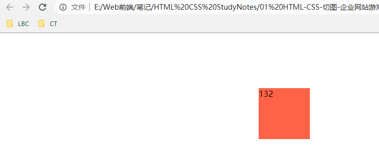

实例：  [14102position01.html](14102position01.html) 


# 3. absolute 绝对定位

绝对定位的元素的位置相对于最近的已定位祖先元素，如果元素没有已定位的祖先元素，那么它的位置相对于 html 元素。（而不是相对于视口定位，如 fixed）

如果绝对定位的元素没有祖先，它将使用文档主体（body），并随页面滚动一起移动。

**==注意==**

* “被定位的”元素是其位置除 **static** 以外的任何元素。

## 3.1脱离文档流

示例：

```
    <style>
        .box{
            width: 100px;
            height: 100px;
            background: turquoise;
            border: 1px solid lightseagreen;
        }

    </style>
</head>
<body>
    <div class="box" >1</div>
    <div class="box" >2</div>
    <div class="box" >3</div>
</body>
```

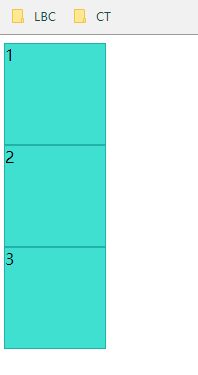

3个绿块并列地排行。

如果给第二块添加绝对定位：

```
        #box2{
            position: absolute;
            top: 50px;
            left: 30px;
        }
        
        <div class="box" id="box2">2</div>
```

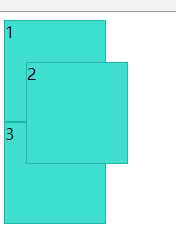

第2块脱离了父元素。

实例：  [14103position01.html](14103position01.html) 


## 3.2使内联元素支持宽高

让内联元素具备块特性。

示例：

```
    <style>
        #box1{
            width: 200px;
            height: 200px;
            background: turquoise;
        }
        #box2{
            width: 100px;
            height: 100px;
            background: tomato;
            /* position: absolute; */
            /* 取消上面一行试效果 */
            top: 100px;
            left: 30px;
        }
    </style>
</head>
<body>
    <div id="box1">块</div>
    <span id="box2">这原来是内联的</span>
    <!-- 使内联元素支持宽高 （让内联具备块特性） -->
</body>
```

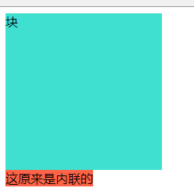

给内联元素 span box2 添加 position: absolute;后：

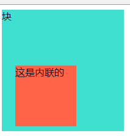

添加后可支持宽高分别为 100px。

实例：  [14103position02.html](14103position02.html) 


## 3.3 使不设宽度的块元素具备内联特性

```
    <style>
        .box1{
            width: 100px;
            height: 100px;
            background: lightskyblue;
            
        }
        .boxAbsolute{
            background: tomato;
            /* position: absolute;  */
            /* 取消上面一行试效果 */
            top: 20px;
        }
    </style>
</head>
<body>
    <div class="box1">1</div>
    <div class="boxAbsolute">这原来是一个块</div>
</body>
```

boxAbsolute没设宽高，是一个高度跟内容决定而且宽度跟浏览器窗口决定的块级元素。

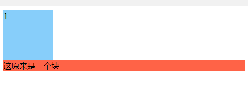

给 .boxAbsolute添加position:absolute 后：

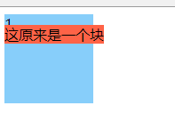

变成一个宽高跟内容决定的内联块级元素。

实例：  [14103position03.html](14103position03.html) 


## 3.4 对定位祖先元素进行偏移

如果有定位祖先元素相对于定位祖先元素发生偏移，没有定位祖先元素相对于整个文档发生偏移（绝对、相对、固定）

```
    <style>
        body{
            margin: 0;
            padding: 0;
        }
        .box-big{
            width: 500px;
            height: 500px;
            border: 2px dashed lightgray;
            margin: 0 auto;
            position: relative;
            /* 设置后 middle箱子相对big箱子进行定位 */
        }
        .box-middle{
            width: 250px;
            height: 250px;
            background: tomato;
            border: 1px dashed black;
            box-sizing: border-box;
            position: absolute;
            top: 100px;
            left: 30px;
            /* 相对于父元素.box-big进行定位*/
        }
        .box-middle2{
            width: 180px;
            height: 180px;
            background: brown;
            border: 1px dashed black;
            box-sizing: border-box;

            position: absolute;
            top: 200px;
            left: 250px;
            /* 相对于父元素.box-big进行定位，不跟兄弟 */
        }
        .box-little{
            width: 50px;
            height: 50px;
            background: wheat;

            top: 100px;
            left: 0px;
            position: absolute;
            /* 相对于父元素.box-middle */
            
        }
    </style>

<body>
    <div class="box-big">
        <div class="box-middle">
            <div class="box-little">
                小箱
            </div>
        </div>
        <div class="box-middle2"></div>
    </div>
</body>
```

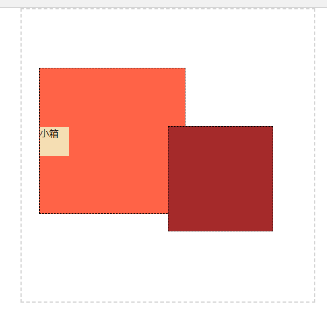

实例： [14103position04.html](14103position04.html) 


# 4. fixed

**特性：**

* 使元素完全脱离文档流。
* 使内联元素支持宽高 （让内联具备块特性）。
* 使块元素默认宽根据内容决定（让块具备内联的特性），和上面的 absolute 讲解3.3内容类似。
* 相对于整个浏览器窗口进行偏移，不受浏览器滚动条的影响。

```
    <style>
        body{
            margin: 0;
            padding: 0;
            background: lightskyblue;
            height: 2000px;
        }
        .box-big{
            width: 500px;
            height: 500px;
            border: 1px dashed black;
            margin: 100px auto;
            position: relative;
        }
        .box-mid{
            width: 100px;
            height: 100px;
            background: tomato;
            position: fixed;
            /* 完全脱离 无视父元素 跟浏览器窗口进行定位 */
            top: 0px;
            left: 100px;
        }
        .box-bottom{
            width: 100%;
            height: 50px;
            background: royalblue;
            position: fixed;
            bottom: 0px;
            text-align: center;
            color: white;
            line-height: 50px;
        }
    </style>

<body>
    <div class="box-big">
        <div class="box-mid"></div>
    </div>
    <div class="box-bottom">底 部 导 航</div>
</body>
```

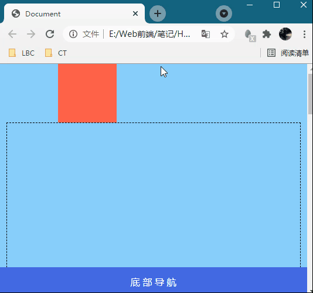

滚动浏览器窗口试效果。

实例：  [14104position01.html](14104position01.html) 


# 5. sticky 黏性定位

根据用户的滚动位置进行定位。

**==注意==**

* Internet Explorer、Edge 15 以及更早的版本不支持粘性定位。 Safari 需要 -webkit- 前缀（请参见下面的实例）。您还必须至少指定 **top**、**right**、**bottom** 或 **left** 之一，以便粘性定位起作用。

  在此例中，在到达其滚动位置时，sticky 元素将停留在页面顶部（top: 0）。

  ```
  div.sticky {
    position: -webkit-sticky; /* Safari */
    position: sticky;
    top: 0;
    background-color: green;
    border: 2px solid #4CAF50;
  }
  ```


实例：

```
    <style>
        .top{
            width: 100%;
            background: black;
            position: sticky;
            top: 0;
            top: 30px;
            color: white;
        }
    </style>
    
<body>
    <p>文本段落 文本段落</p>
    <p>文本段落 文本段落</p>
    .
    .
    .
    <p>文本段落 文本段落</p>
    <div class="top">文本段落 文本段落</div>
    <p>文本段落 文本段落</p>
    <p>文本段落 文本段落</p>
    .
    .
    .
```

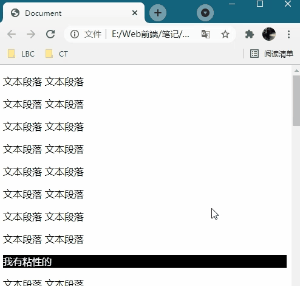

滚动浏览器窗口试效果。

实例：  [14105position01.html](14105position01.html) 


stycky 练习：  [14105position02.html](14105position02.html) 


# 6. z-index 重叠元素

元素的定位与文档流无关，所以它们可以覆盖页面上的其它元素。

z-index属性指定了一个元素的堆叠顺序（哪个元素应该放在前面，或后面）。

元素可以设置正或负的堆叠顺序。

无设定 z-index时：

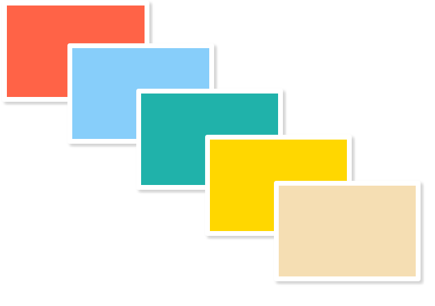

使不同元素设定 z-index 不同数值后：

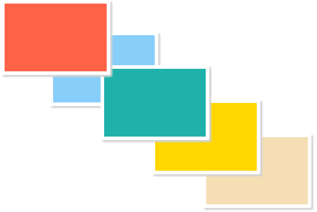

实例：  [14106position01.html](14106position01.html) 


# 7. position 练习

## 7.1定位实现下拉菜单

参考淘宝顶部图示：鼠标划入时就出现下拉菜单。


父元素里分两部分，顶部一行字高度，列表弄几行

父元素设置position:relative, 列表设置position:absolute并调整好位置

把列表隐藏 display:none

鼠标移入顶部显示下拉菜单 父元素:hover 列表{display:block}

鼠标移入列表内某个行 列表 li:hover{background:颜色}

练习： [14107test01.html](14107test01.html) 


## 7.2定位实现居中

给父容器设置position:relative生成相对定位

然后给子元素设置position:absolute生成绝对定位，top-50% left-50%，

margin-top: - (子元素高度的一半)

margin-left: - (子元素宽度的一半)

示例：

```
    <style>
        .box1{
            width: 300px;
            height: 300px;
            border: 3px solid lightgray;
            position: relative;
        }
        .box2{
            width: 100px;
            height: 100px;
            background-color: turquoise;
            position: absolute;    
            top: 50%;
            left: 50%;
            margin-top: -50px;
            margin-left: -50px;
        }
    </style>
</head>
<body>
    <div class="box1">
        <div class="box2"></div>
    </div>
</body>
```

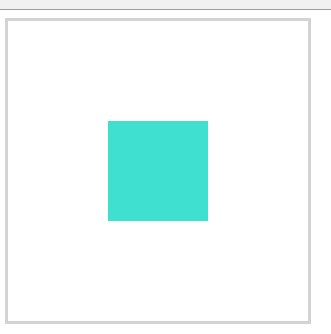

实例：   [14107test02.html](14107test02.html) 


# 7.3列表的装饰点

**装饰点**

在CSS里的\#main ul li 一行改动

原版本：   [14107demo01.html](14107demo01.html) 

改完后：  [14107test03.html](14107test03.html) 添加了:before{...}


# 8. position 总结

| 值       | 描述                                                         |
| :------- | :----------------------------------------------------------- |
| absolute | 生成绝对定位的元素，相对于 static 定位以外的第一个父元素进行定位。元素的位置通过 "left", "top", "right" 以及 "bottom" 属性进行规定。                                                                                    元素会被移出正常文档流，并不为元素预留空间，通过指定元素相对于最近的非 static 定位祖先元素的偏移，来确定元素位置。绝对定位的元素可以设置外边距（margins），且不会与其他边距合并。 |
| fixed    | 生成绝对定位的元素，相对于浏览器窗口进行定位。元素的位置通过 "left", "top", "right" 以及 "bottom" 属性进行规定。                                                                                                                    元素会被移出正常文档流，并不为元素预留空间，而是通过指定元素相对于屏幕视口（viewport）的位置来指定元素位置。元素的位置在屏幕滚动时不会改变。打印时，元素会出现在的每页的固定位置。`fixed` 属性会创建新的层叠上下文。当元素祖先的 `transform`, `perspective` 或 `filter` 属性非 `none` 时，容器由视口改为该祖先。 |
| relative | 生成相对定位的元素，相对于其正常位置进行定位。因此，"left:20" 会向元素的 LEFT 位置添加 20 像素。                                                                                                                                                      该关键字下，元素先放置在未添加定位时的位置，再在不改变页面布局的前提下调整元素位置（因此会在此元素未添加定位时所在位置留下空白）。position:relative 对 table-*-group, table-row, table-column, table-cell, table-caption 元素无效。 |
| static   | 默认值。没有定位，元素出现在正常的流中（忽略 top, bottom, left, right 或者 z-index 声明）。                                                                                                                                                           该关键字指定元素使用正常的布局行为，即元素在文档常规流中当前的布局位置。此时 `top`, `right`, `bottom`, `left` 和 `z-index `属性无效。 |
| sticky   | css定位新增属性；可以说是相对定位relative和固定定位fixed的结合；它主要用在对scroll事件的监听上；简单来说，在滑动过程中，某个元素距离其父元素的距离达到sticky粘性定位的要求时(比如top：100px)；position:sticky这时的效果相当于fixed定位，固定到适当位置。                        元素根据正常文档流进行定位，然后相对它的*最近滚动祖先（nearest scrolling ancestor）*和 [containing block](https://developer.mozilla.org/en-US/docs/Web/CSS/Containing_Block) (最近块级祖先 nearest block-level ancestor)，包括table-related元素，基于`top`, `right`, `bottom`, 和 `left`的值进行偏移。偏移值不会影响任何其他元素的位置。 |
| inherit  | 规定应该从父元素继承 position 属性的值。                     |