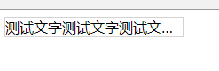

# 142 css文本省略号

视频序号089


***

属于 CSS3 的文本效果：text-overflow。

添加省略号来代表被修剪的文本的前提条件：

* 必须有一个固定的宽，width。
* 不让内容折行，white-span: nowrap。
* 隐藏溢出的内容，overflow:hidden

最后才能显示省略号，text-overflow:ellipsis。

示例：

```
    <style>
        div{
            border: 1px solid lightgray;
            width: 200px;
            /* 必须有一个固定的宽，width。 */

            white-space: nowrap;
            /* 不让内容折行 */

            overflow: hidden;
            /* 修剪掉溢出文本 */

            text-overflow: ellipsis;
            /* 添加省略号来代表被修剪的文本 */
        }
    </style>
</head>
<body>
    <div>测试文字测试文字测试文字测试文字测试文字测试文字</div>
</body>
```



实例：  [14201textoverflow01.html](14201textoverflow01.html) 


练习： [14201textoverflow02.html](14201textoverflow02.html) 

就算内容多长，页面上显示只能一行内容并后面添加省略号，除非用换行。