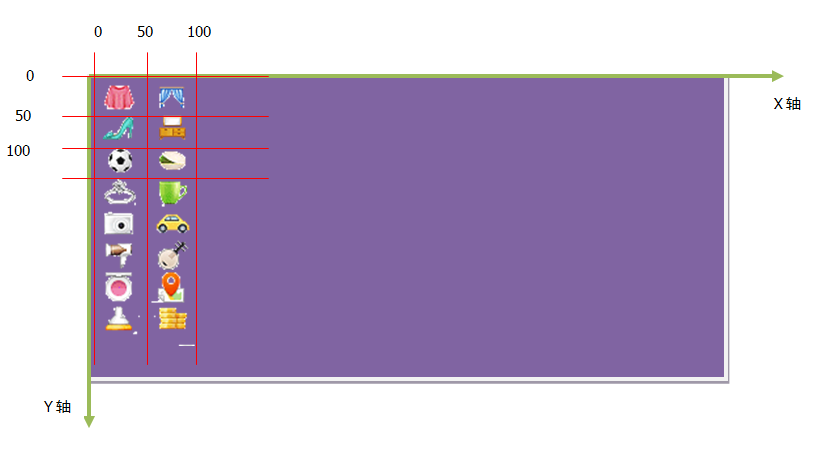
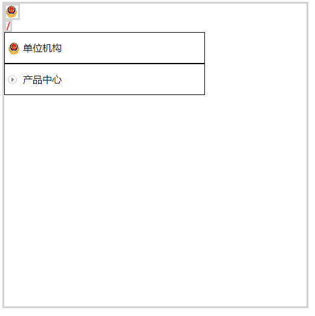

# 143 css精灵

视频序号090


***

CSS Sprite

CSS精灵也叫做CSS雪碧，是一种网页图片应用处理方式。它允许你将一个页面涉及到的所有零星图片都包含到一张大图中去加载。

代码示例：

```
background: url(./sprite_icon.png) no-repeat -1px -596px;
```

好处：

* 可以减少图片质量，网页的图片加载速度快。

* 减少图片的请求次数，加快网页的打开。

CSS Sprite 图示：




示例：

```
    <style>
        div{
            width: 500px;
            height: 500px;
            border: 3px solid lightgray;
        }
        .icon1{
            width: 20px;
            height: 21px;
            background: url(./img/sprite_icon.png) no-repeat -1px -596px;
            /* border: none; */
        }
        .icon2{
            width: 7px;
            height: 14px;
            background: url(./img/sprite_icon.png) no-repeat -1px -288px;
            /* border: none; */
        }
        .icon3{
            width:300px ;
            height: 50px;
            line-height: 50px;
            background: url(./img/sprite_icon.png) no-repeat 5px -580px;
            border: 1px solid black;
            padding-left: 30px;
        }
        .icon4{
            width:300px ;
            height: 50px;
            line-height: 50px;
            background: url(./img/sprite_icon.png) no-repeat -80px -519px;
            border: 1px solid black;
            padding-left: 30px;
        }
    </style>

<body>
    <div>
        <div class="icon1"></div>
        <div class="icon2"></div>
        <div class="icon3">单位机构</div>
        <div class="icon4">产品中心</div>
    </div>
</body>
```

页面显示：



实例：  [14301csssprite01.html](14301csssprite01.html) 

所使用的 CSS Sprite图片：


