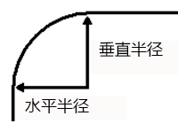

# 144 css圆角

视频序号091

目录
- [144 css圆角](#144-css圆角)
- [1. 属性值的个数区别](#1-属性值的个数区别)
  - [1.1 四个属性值](#11-四个属性值)
  - [1.2三个属性值](#12三个属性值)
  - [1.3两个属性值](#13两个属性值)
  - [1.4一个属性值](#14一个属性值)
- [2. 圆角数值的参考](#2-圆角数值的参考)
- [3. 斜杠二组值](#3-斜杠二组值)
- [4. border-radius完整结构形式](#4-border-radius完整结构形式)
- [5. 各种图形](#5-各种图形)


***

border-radius 属于CSS3的内容

使用 CSS3 border-radius 属性，你可以给任何元素制作 "圆角"。

添加圆角：设置四个方向的值。

在线圆角制作器：https://www.runoob.com/css-radius


# 1. 属性值的个数区别

添加圆角：设置四个方向的值。

## 1.1 四个属性值

分别表示左上角、右上角、右下角、左下角的圆角大小（**顺时针方向**）。

示例：

```
border-radius：10px  20px  30px 40px;
```


## 1.2三个属性值

第一个值表示左上角，第二个值表示右上角和左下角（对角），第三个值表示右下角。

```
border-radius:10px  30px 60px; 
```


## 1.3两个属性值

第一个值表示左上角和右下角，第二个值表示右上角和左下角。

```
border-radius:20px 40px;
```


## 1.4一个属性值

就是四个方向都一个属性值


# 2. 圆角数值的参考

```
    <style>
        div{
            width: 200px;
            height: 200px;
            margin: 30px 0;
        }
        .box1{

            background: tomato;
            border-radius: 20px;
        }
        .box2{

            background: lightskyblue;
            border-radius: 100px;
        }
        .box3{

            background: lightseagreen;
            border-radius: 50%;
        }
        .box4{

            background: gold;
            border-radius: 50px 0px;
        }
        .box5{

            background: salmon;
            border-radius: 30px 100px 0px;
        }
        .box6{

            background: lightblue;
            border-radius: 20px 100px 10px 50px;
        }
        .box7{
            width: 400px;
            height: 200px;
            background: turquoise;
            border-radius: 50px;
        }
    </style>
```


实例：  [14402borderradius01.html](14402borderradius01.html) 


# 3. 斜杠二组值

第一组值表示水平半径x，第二组值表示垂直半径y，每组值也可以同时设置1到4个值，规则与上面相同。

```
border-radius:100px/40px;
```


egg：

```
.egg{
   width: 120px;
   height: 160px;
   background: #EC0465;
   border-radius: 60px 60px 60px 60px/100px 100px 60px 60px;

}
```


# 4. border-radius完整结构形式

扩展了解一下，个人感觉好像用不到。

在W3C上查border-radius属性时，会发现上面描述的语法是这样的：

* border-radius: 1-4 length|% / 1-4 length|%;

平时我们写的border-radius : 50px，其实完整的写法应该是：

```
border-radius : 50px 50px 50px 50px / 50px 50px 50px 50px;
```



**4个值/4个值：**

* 左上角  右上角  右下角  左下角 / 左上角  右上角  右下角  左下角

**4个值/3个值：**

* 左上角  右上角  右下角  左下角 / 左上角  右上角和左下角  右下角

以此类推。。。

**1个值 / 1个值：**

* 四个方向/四个方向


示例：

```
    <style>
        div{
            margin: 30px 0;
        }
        .box1{
            width: 200px;
            height: 200px;
            background: tomato;
            border-radius: 50px / 40px;
        }
        .box2{
            width: 200px;
            height: 200px;
            background: tomato;
            border-radius: 100px 30px 60px / 40px 100px;
        }
    </style>
</head>
<body>
    <div class="box1">1 值: 50px / 40px</div>
    <div class="box2">2 值: 100px 30px 60px / 40px 100px;</div>
</body>
```


实例： [14404borderradius01.html](14404borderradius01.html) 


# 5. 各种图形

实心圆、半圆、扇形、花瓣、胶囊、椭圆等方法：

```
        .circle {
            width: 120px;
            height: 120px;
            background: #EC0465;
            border-radius: 100%;
        }
        /* 实心圆 */

        .lf-self-circle {
            width: 60px;
            height: 120px;
            background: #EC0465;
            border-radius: 60px 0 0 60px;
        }
        /* 半圆 */

        .quarter-botlf-cir {
            width: 60px;
            height: 60px;
            background: #EC0465;
            border-radius: 0 0 0 60px;
        }
        /* 扇形 */

        .flower {
            width: 120px;
            height: 120px;
            background: #EC0465;
            border-radius: 60px 60px 0 60px;
        }
        /* 花瓣 */

        .level-capsule {
            width: 160px;
            height: 100px;
            border-radius: 50px;
            background: #EC0465;
        }
        /* 胶囊 */

        .ty {
            width: 160px;
            height: 100px;
            background: #EC0465;
            border-radius: 80px/50px;
        }
        /* 椭圆 */
```


实例：  [14405borderradius01.html](14405borderradius01.html) 


蛋糕 甜筒练习：

 [14405borderradius02.html](14405borderradius02.html) 


