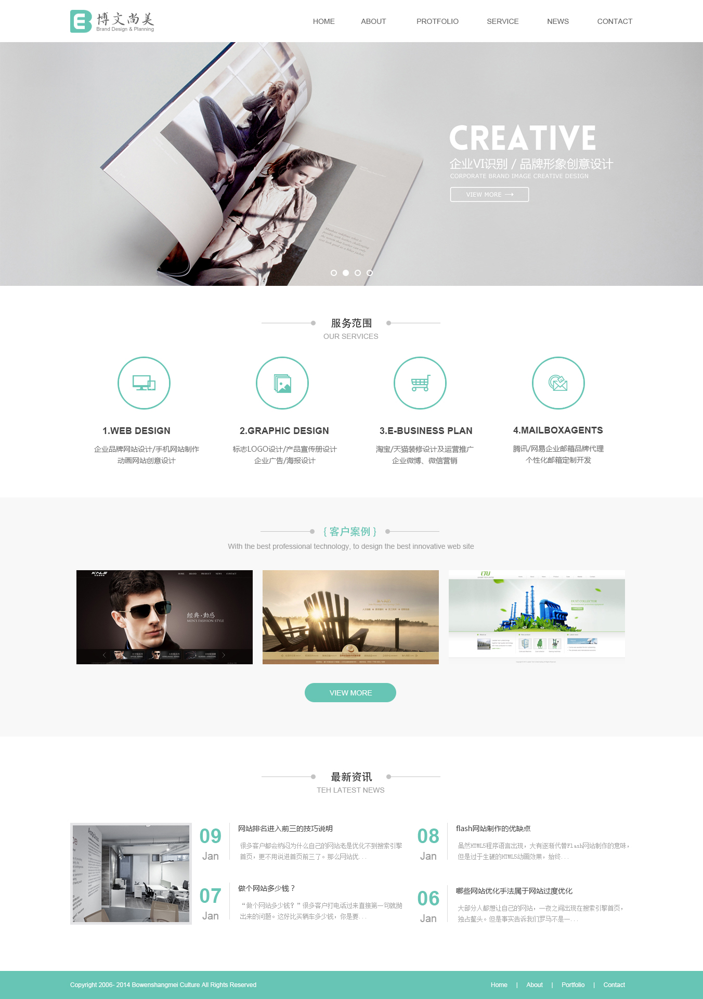

# 045 整页制作

视频序号092-109

目录
- [045 整页制作](#045-整页制作)
- [1. PC端企业类型整页制作](#1-pc端企业类型整页制作)
- [2. PC端游戏类型整页制作](#2-pc端游戏类型整页制作)

***

# 1. PC端企业类型整页制作

通栏 : 自适应浏览器的宽度。

版心 : 固定一个宽度，并且让容器居中。

HTML： [index.html](qiye\index.html) 

CSS： [common.css](qiye\css\common.css) 

# 2. PC端游戏类型整页制作

HTML： [index.html](game\index.html) 

CSS： [common.css](game\css\common.css) 

鼠标停留切换页面：

 [test.html](game\test.html)  

[test.css](game\css\test.css) 