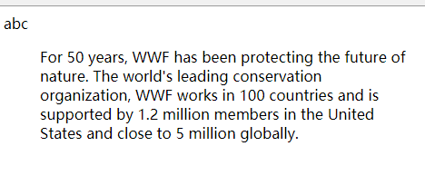

# 203 引用类标签

视频序号113

目录
- [203 引用类标签](#203-引用类标签)
- [1. blockquote 标签](#1-blockquote-标签)
- [2. q 标签](#2-q-标签)
- [3. blockquote 和 q 的区别](#3-blockquote-和-q-的区别)
- [4. abbr标签](#4-abbr标签)


***

# 1. blockquote 标签

blockquote 标签定义摘自另一个源的块引用，就是引用大段的段落解释。

浏览器通常会对 blockquote 元素进行缩进。

blockquote 标签的属性 cite 规定引用的来源。值为 URL。

示例1：

```
<blockquote>
<p>这是一个长引用，这是一个长引用。</p>
</blockquote>
```

示例2：

```
<body>
    <div>
        abc
    </div>
    <blockquote cite="http://www.worldwildlife.org/who/index.html">
        For 50 years, WWF has been protecting the future of nature. The world's leading conservation organization, WWF
        works in 100 countries and is supported by 1.2 million members in the United States and close to 5 million
        globally.
    </blockquote>
</body>
```



blockquote 标签在页面上进行缩进了。

实例： [20301biaoqian01.html](20301biaoqian01.html) 


# 2. q 标签

引用小段的短语解释。

示例：

```
    <p>WWF's goal is to:
        <q>Build a future where people live in harmony with nature.</q>
        We hope they succeed.
    </p>
```

无缩进。

实例：  [20302biaoqian01.html](20302biaoqian01.html) 

可使用 cite 属性：

```
<p>WWF's goal is to:
<q cite="http://www.wwf.org">
Build a future where people live in harmony with nature.</q>
We hope they succeed.</p>
```


# 3. blockquote 和 q 的区别

* blockquote 标签是另一个源的块引用。
* q 标签是短引用，不需要段落分隔的短引用。


# 4. abbr标签

用来表示一个缩写词或者首字母缩略词，如"WWW"或者"NATO"。

通过对缩写词语进行标记，您就能够为浏览器、拼写检查程序、翻译系统以及搜索引擎分度器提供有用的信息。

可使用 title 属性

示例：

```
The<abbr title="World Health Organization">WHO</abbr> was founded in 1948.
```

**提示：**

* 在某些浏览器中，当您把鼠标移至带有 <abbr> 标签的缩写词/首字母缩略词上时，<abbr> 标签的 title 属性可被用来展示缩写词/首字母缩略词的完整版本。

实例：  [20304biaoqian01.html](20304biaoqian01.html) 