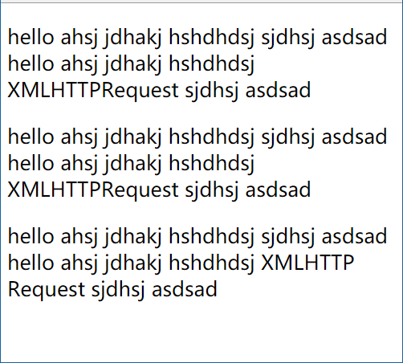

# 205 标签br-wbr换行

视频序号115


***

**区别：**

* br 标签表示换行操作。
* wbr 标签表示软换行操作。

**提示：**

* 如果单词太长，或者您担心浏览器会在错误的位置换行，那么您可以使用  wbr  元素来添加 Word Break Opportunity（单词换行时机）

示例：

```
<body>
    <p>hello ahsj jdhakj hshdhdsj sjdhsj asdsad hello ahsj jdhakj hshdhdsj XMLHTTPRequest sjdhsj asdsad</p>
    <p>hello ahsj jdhakj hshdhdsj sjdhsj asdsad 
        <br>hello ahsj jdhakj hshdhdsj XMLHTTPRequest sjdhsj asdsad</p>
    <p>hello ahsj jdhakj hshdhdsj sjdhsj asdsad hello ahsj jdhakj hshdhdsj XML<wbr>HTTP<wbr>Request sjdhsj asdsad</p>
</body>
```



动一动浏览器宽度看看每段文本的不同之处。

实例： [20501biaoqian01.html](20501biaoqian01.html) 