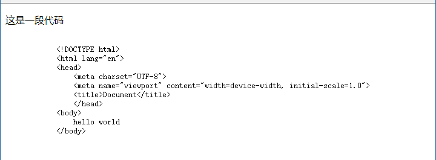
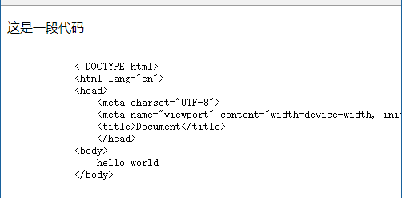

# 206 标签pre-code

视频序号116

目录


***

pre 元素可定义预格式化的文本。被包围在 pre 元素中的文本通常会保留空格和换行符。而文本也会呈现为等宽字体。针对网页中的程序代码的显示效果。

**==注意==**

* pre 元素是块级元素，但是只能包含文本或行内元素，任何块级元素（常见为可以导致段落断开的标签：例如title、p 和address 标签）都不能位于 pre 元素中。
* 在 HTML 4.01 中，"width" 属性已废弃，不可使用。 HTML5 不支持"width"属性。

**提示：**

* pre 标签的一个常见应用就是用来表示计算机的源代码。
* pre 标签与code标签结合起来使用，可以获得更加精确的语义。


code 标签的功能有：将文本变成等宽字体以及提示这段文本是源程序代码。一个短语标签，用来定义计算机代码文本。

**提示：**

* 我们并不反对使用这个标签，但是如果您只是为了达到某种视觉效果而使用这个标签的话，我们建议您使用 CSS ，这样可能会取得更丰富的效果。

示例：

```
<body>
    <p>这是一段代码</p>
    <pre>
        <code>
            &lt;!DOCTYPE html&gt;
            &lt;html lang="en">
            &lt;head>
                &lt;meta charset="UTF-8">
                &lt;meta name="viewport" content="width=device-width, initial-scale=1.0">
                &lt;title>Document&lt;/title>
                &lt;/head>
            &lt;body>
                hello world
            &lt;/body>
        </code>
    </pre>
</body>
```

注意：使用 code 标签后，不会因浏览器宽度而改变。





上图是比较宽的浏览器页面效果。

下图是比较窄的页面效果。

所以不会因浏览器宽度而改变。

实例： [20601biaoqian01.html](20601biaoqian01.html) 