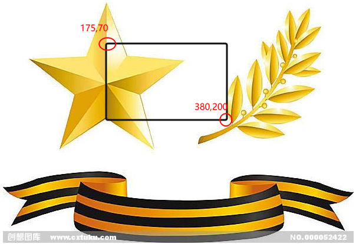
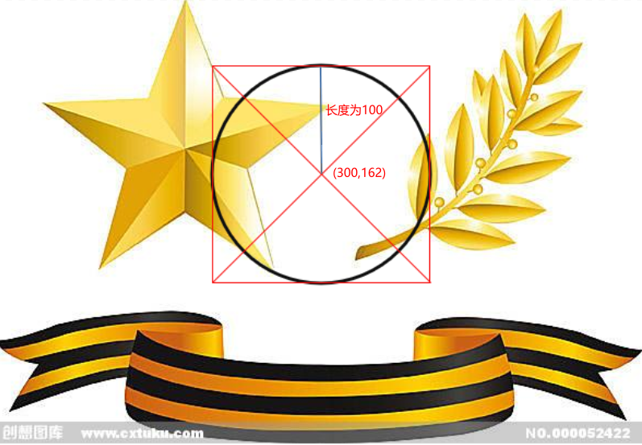
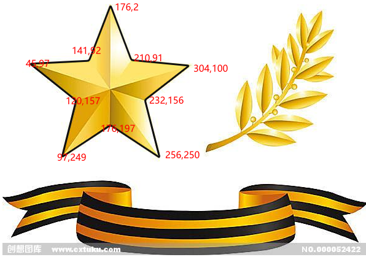

# 207 标签map-area

视频序号117


***

map 标签可以和 area 元素一起使用，以此来达到定义图像映射（可点击的链接区域）的目标。

**标签定义及使用说明：**

* map 标签用于客户端图像映射。图像映射指带有可点击区域的一幅图像。
* map 中的 usemap 属性可引用 map  中的 id 或 name 属性（取决于浏览器），所以我们应同时向 map  添加 id 和 name 属性。
* area 元素永远嵌套在 map 元素内部。area 元素可定义图像映射中的区域。
* 提示：要完成图像映射要用到三种标签：img 标签、map标签、area标签。

**area属性：**

| 属性                                                         | 值                                                           | 描述                                                         |
| :----------------------------------------------------------- | :----------------------------------------------------------- | :----------------------------------------------------------- |
| [alt](https://www.runoob.com/tags/att-area-alt.html)         | *text*                                                       | 规定区域的替代文本。如果使用 href 属性，则该属性是必需的。   |
| [coords](https://www.runoob.com/tags/att-area-coords.html)   | *coordinates*                                                | 规定区域的坐标。                                             |
| [href](https://www.runoob.com/tags/att-area-href.html)       | *URL*                                                        | 规定区域的目标 URL。                                         |
| [hreflang](https://www.runoob.com/tags/att-area-hreflang.html)**New** | *language_code*                                              | 规定目标 URL 的语言。                                        |
| [media](https://www.runoob.com/tags/att-area-media.html)**New** | *media query*                                                | 规定目标 URL 是为何种媒介/设备优化的。默认：all。            |
| [nohref](https://www.runoob.com/tags/att-area-nohref.html)   | *value*                                                      | HTML5 不支持。 规定没有相关链接的区域。                      |
| [rel](https://www.runoob.com/tags/att-area-rel.html)**New**  | alternate author bookmark help license next nofollow noreferrer prefetch prev search tag | 规定当前文档与目标 URL 之间的关系。                          |
| [shape](https://www.runoob.com/tags/att-area-shape.html)     | default rect circle poly                                     | 规定区域的形状。                                             |
| [target](https://www.runoob.com/tags/att-area-target.html)   | _blank _parent _self _top *framename*                        | 规定在何处打开目标 URL。                                     |
| [type](https://www.runoob.com/tags/att-area-type.html)**New** | *MIME_type*                                                  | 规定目标 URL 的 MIME 类型。 注：MIME = Multipurpose Internet Mail Extensions。 |


**如何读取坐标？**

使用 PS 或者其它绘画工具定位读取坐标。

不同图形区域示例：

**矩形 rect**

```
<body>
    
    <map name="star">
        <area shape="rect" coords="175 70 380 200" href="https://www.taobao.com" alt="">
        <!-- rect为矩形 -->
    </map>
</body>
```



实例：  [20701biaoqian01.html](20701biaoqian01.html) 


**正圆 circle**

```
<body>
    
    <map name="star">
        <area shape="circ" coords="300 162 100" href="https://www.taobao.com" alt="" target="_blank">
        <!-- circle为圆形 -->
    </map>
</body>
```



可以写 circle ，也可以缩写 circ。

实例： [20701biaoqian02.html](20701biaoqian02.html) 


**多边形 poly**

```
<body>
    
    <map name="star">
        <area shape="poly" coords="176 2 210 91 304 100 232 156 256 250 176 197 97 249 120 157 45 97 141 92" href="https://www.taobao.com" alt="" target="_blank">
        <!-- poly为多边形 -->
    </map>
</body>
```



实例： [20701biaoqian03.html](20701biaoqian03.html) 


