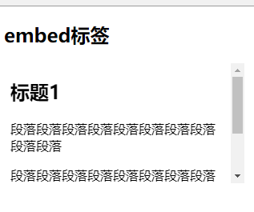

# 208 标签embed-object

视频序号118

目录
- [208 标签embed-object](#208-标签embed-object)
- [1. embed 标签（现在不使用了）](#1-embed-标签现在不使用了)
- [2. object 标签](#2-object-标签)


***

# 1. embed 标签（现在不使用了）

* 定义嵌入外部应用或者互动程序（插件）。
* 是**HTML5的新标签**。


embed 嵌入html页面实例：

```
<body>
    <h2>embed标签</h2>
    <embed src="./20801ohter01.html" type="text/html">
</body>
```

被嵌入页面的实例：

```
<body>
    <h2>标题1</h2>
    <p>段落段落段落段落段落段落段落段落段落段落</p>
    <p>段落段落段落段落段落段落段落段落段落段落</p>
    <p>段落段落段落段落段落段落段落段落段落段落</p>
</body>
```

运行结果：



实例： [20801biaoqian01.html](20801biaoqian01.html)  [20801ohter01.html](20801ohter01.html) 

也可以嵌入图片或视频：

```
<embed type="image/jpg" src="https://static.runoob.com/images/runoob-logo.png" width="258" height="39">
```

```
<embed type="video/webm" src="video.mp4" width="400" height="300">
```

**==注意==**

* 现在已经不建议使用 embed 标签了，可以使用 img、iframe、video、audio 等标签代替。


# 2. object 标签

* 都表示能够嵌入一些多媒体，如flash动画、插件等。基本使用没有太多区别，主要是为了兼容不同的浏览器而已。包含对象，比如图像、音频、视频、Java applets、ActiveX、PDF 以及 Flash。
* 表示一个外部资源，可以将其视为一个映像、一个嵌套的浏览上下文，或者一个由插件处理的资源。
* 配合param 元素一起完成。

```
<body>
    <object>
        <param name="movie" value="./img/helloworld.swf">
    </object>
    <hr>
    <object data="./img/helloworld.swf" type=""></object>
</body>
```

实例： [20802biaoqian01.html](20802biaoqian01.html) 

**==注意==**

* 现在新版浏览器的问题，页面上出现插件不受支持的情况。