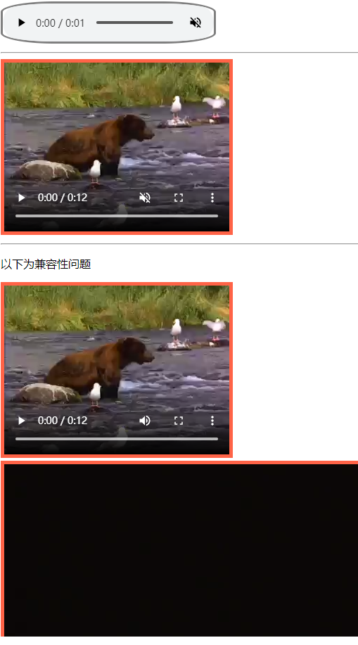

# 209 标签video-audio

视频序号119

目录
- [209 标签video-audio](#209-标签video-audio)
- [1. video](#1-video)
- [2. audio](#2-audio)
- [3. source标签（兼容支持）](#3-source标签兼容支持)
- [4. 可设定样式](#4-可设定样式)


***

# 1. video

定义视频，比如电影片段或其他视频流。

是HTML5的新标签。

默认控件是不显示的，可通过controls属性来显示控件。

**==注意==**

* 目前，video 元素支持三种视频格式：MP4、WebM、Ogg。

示例：

```
    <video src="./img/Intermission-Walk-in_512kb.mp4" controls>
        您的浏览器不支持 video 标签。
    </video>
    <video src="./img/Intermission-Walk-in.ogv" controls>
        您的浏览器不支持 video 标签。
    </video>
```

ogv 格式可播放。

实例： [20901biaoqian01.html](20901biaoqian01.html) 

可设定宽高：

```
<video width="320" height="240" controls>
...
</video>
```

| 属性                                                         | 值                 | 描述                                                         |
| :----------------------------------------------------------- | :----------------- | :----------------------------------------------------------- |
| [autoplay](https://www.runoob.com/tags/att-video-autoplay.html)**New** | autoplay           | 如果出现该属性，则视频在就绪后马上播放。                     |
| [controls](https://www.runoob.com/tags/att-video-controls.html)**New** | controls           | 如果出现该属性，则向用户显示控件，比如播放按钮。             |
| [height](https://www.runoob.com/tags/att-video-height.html)**New** | *pixels*           | 设置视频播放器的高度。                                       |
| [loop](https://www.runoob.com/tags/att-video-loop.html)**New** | loop               | 如果出现该属性，则当媒介文件完成播放后再次开始播放。         |
| [muted](https://www.runoob.com/tags/att-video-muted.html)**New** | muted              | 如果出现该属性，视频的音频输出为静音。                       |
| [poster](https://www.runoob.com/tags/att-video-poster.html)**New** | *URL*              | 规定视频正在下载时显示的图像，直到用户点击播放按钮。         |
| [preload](https://www.runoob.com/tags/att-video-preload.html)**New** | auto metadata none | 如果出现该属性，则视频在页面加载时进行加载，并预备播放。如果使用 "autoplay"，则忽略该属性。 |
| [src](https://www.runoob.com/tags/att-video-src.html)**New** | *URL*              | 要播放的视频的 URL。                                         |
| [width](https://www.runoob.com/tags/att-video-width.html)**New** | *pixels*           | 设置视频播放器的宽度。                                       |

# 2. audio

定义声音，比如音乐或其他音频流。

HTML5 的新标签。

默认控件是不显示的，可通过controls属性来显示控件。

示例：

```
    <audio src="./img/johann_sebastian_bach_air.mp3" controls>
        您的浏览器不支持 audio 元素。
    </audio>
    <audio src="./img/johann_sebastian_bach_air.ogg" controls>
        您的浏览器不支持 audio 元素。
    </audio>
```

实例： [20902biaoqian01.html](20902biaoqian01.html) 

| 属性                                                         | 值                 | 描述                                                        |
| :----------------------------------------------------------- | :----------------- | :---------------------------------------------------------- |
| [autoplay](https://www.runoob.com/tags/att-audio-autoplay.html)**New** | autoplay           | 如果出现该属性，则音频在就绪后马上播放。                    |
| [controls](https://www.runoob.com/tags/att-audio-controls.html)**New** | controls           | 如果出现该属性，则向用户显示音频控件（比如播放/暂停按钮）。 |
| [loop](https://www.runoob.com/tags/att-audio-loop.html)**New** | loop               | 如果出现该属性，则每当音频结束时重新开始播放。              |
| [muted](https://www.runoob.com/tags/att-audio-muted.html)**New** | muted              | 如果出现该属性，则音频输出为静音。                          |
| [preload](https://www.runoob.com/tags/att-audio-preload.html)**New** | auto metadata none | 规定当网页加载时，音频是否默认被加载以及如何被加载。        |
| [src](https://www.runoob.com/tags/att-audio-src.html)**New** | *URL*              | 规定音频文件的 URL。                                        |


# 3. source标签（兼容支持）

为了能够支持多个备选文件的兼容支持，可以配合source标签。

示例：

```
<video controls>
        <source src="./img/Intermission-Walk-in.ogv\"></source>
</video>
```


# 4. 可设定样式

```
    <style>
        audio{
            border: 3px solid gray;
            border-radius: 25%;
        }
        video{
            border: 5px solid tomato;
        }
    </style>

<body>
    <audio src="./img/johann_sebastian_bach_air.mp3" controls muted loop></audio>
    <hr>
    <video src="./img/Intermission-Walk-in_512kb.mp4" controls muted>12341234</video>
    <hr>
    <p>以下为兼容性问题</p>
    <video controls>
        <source src="./img/Intermission-Walk-in.ogv\"></source>
    </video>

    <div style="position: relative; height:250px; overflow: hidden;">
        <video style="min-width:100%; min-height:100%;" loop="" playsinline="true" webkit-playsinline="true" x-webkit-airplay="true" x5-video-player-fullscreen="false" x5-video-player-type="h5" id="introvideo" autoplay="">
                <source src="http://shimmer.neusoft.edu.cn/h/www/media/intro2016.mp4" type="video/mp4">
                <source src="http://shimmer.neusoft.edu.cn/h/www/media/intro2016.webm" type="video/webm">
        </video>
    </div>
</body>
```



实例： [20904biaoqian01.html](20904biaoqian01.html) 