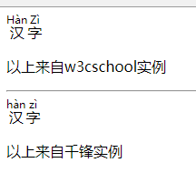

# 210 标签ruby注解-bdo方向

视频序号120

目录

- [210 标签ruby注解-bdo方向](#210-标签ruby注解-bdo方向)
- [1. ruby 注释（中文注音或字符）](#1-ruby-注释中文注音或字符)
- [2. bdo文本方向（内有CSS方法）](#2-bdo文本方向内有css方法)

***

# 1. ruby 注释（中文注音或字符）

ruby 标签定义 ruby 注释（中文注音或字符）。
在东亚使用，显示的是东亚字符的发音。
将 ruby 标签与 rt 和 rp 标签一起使用：
ruby 元素由一个或多个需要解释/发音的字符和一个提供该信息的 rt 元素组成，还包括可选的 rp 元素，定义当浏览器不支持 "ruby" 元素时显示的内容。

```
    <ruby>
        汉 <rp>(</rp><rt>Hàn</rt><rp>)</rp>
        字 <rp>(</rp><rt>Zì</rt><rp>)</rp>
    </ruby>
    <p>以上来自w3cschool实例</p>
    <hr>
    <ruby>
        汉<rt>hàn</rt>
        字<rt>zì</rt>
    </ruby>
    <p>以上来自千锋实例</p>
```



实例：  [21001biaoqian01.html](21001biaoqian01.html) 


# 2. bdo文本方向（内有CSS方法）

**标签定义及使用说明：**

* bdo 指的是 bidi 覆盖（Bi-Directional Override）。
* bdo 标签用来覆盖默认的文本方向。
* bdo 标签必须配合 dir 属性使用。
* bdo 标签有 ltr 和 rtl 两个属性值，分别表示：从左到右显示文本和从右到左显示文本。
* ltr 就是 left to right，左往右，rtl类似。

示例：

```
    <p>该段落文字从左到右显示。</p>
    <p>
        <bdo dir="rtl">该段落文字从右到左显示。</bdo>
    </p> 
```


实例： [21002biaoqian01.html](21002biaoqian01.html) 


使用CSS方法：

```
    <style>
        span {
            direction: rtl;
            unicode-bidi: bidi-override;
        }
    </style>


<body>
    <p>
        里奥雷乌斯就是雄火龙。
    </p>
    <p>
        <span>里奥雷乌斯</span>就是雄火龙
    </p>
</body>
```


实例： [21002biaoqian02.html](21002biaoqian02.html) 