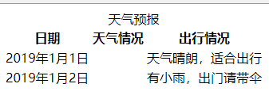
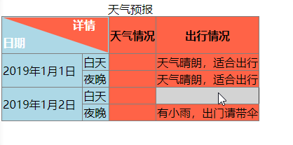

# 213 表格扩展学习

视频序号126


***

添加单线 : border-collapse : collapse

隐藏空单元 : empty-cells : hide

斜线分类 : border / rotate

原始表格：

```
    <!-- 原始表格 -->
    <table>
        <caption>天气预报</caption>
        <tHead>
            <tr>
                <th>日期</th>
                <th>天气情况</th>
                <th>出行情况</th>
            </tr>
        </tHead>
        <tBody>
            <tr>
                <td>2019年1月1日</td>
                <td></td>
                <td>天气晴朗，适合出行</td>
            </tr>
            <tr>
                <td>2019年1月2日</td>
                <td></td>
                <td>有小雨，出门请带伞</td>
            </tr>
        </tBody>
        <tFood>

        </tFood>
    </table>
```



实例： [21301table01.html](21301table01.html) 

修饰后的表格：

```
    <style>
        table{
            empty-cells: hide; 
            /* 隐藏空单元 */
            border-collapse: collapse; 
            /* 添加单线 */
        }
        table .line{
            border-top: 50px solid tomato;
            border-left: 150px solid lightblue ;
            /* 上面两行代码为添加斜线 */
            position: relative;
            color: #fff;
        }
        table .line em{
            position: absolute;
            left: -50px;
            top: -50px;
            font-style: normal;
        }
        table .line span{
            position: absolute;
            left: -150px;
            top: -25px;
        }
        td:hover{
            background: lightgray;
        }
    </style>

<body>
    <table border="1">
        <caption>天气预报</caption>
        <colgroup>
            <col span="2" style="background-color: lightblue;">
            <col span="2" style="background-color:  tomato;">
            <!-- 上面两行为列分组 -->
        </colgroup>
        <tHead>
            <tr>
                <th colspan="2" >
                    <div class="line">
                        <em>详情</em>
                        <span>日期</span>
                    </div>
                </th>
                <th>天气情况</th>
                <th>出行情况</th>
            </tr>
        </tHead>
        <tBody>
            <tr>
                <td rowspan="2">2019年1月1日</td>
                <td>白天</td>
                <td></td>
                <td>天气晴朗，适合出行</td>
            </tr>
            <tr>
                <td>夜晚</td>
                <td></td>
                <td>天气晴朗，适合出行</td>
            </tr>
            <tr>
                <td rowspan="2">2019年1月2日</td>
                <td>白天</td>
                <td></td>
                <td></td>
            </tr>
            <tr>
                <td>夜晚</td>
                <td></td>
                <td>有小雨，出门请带伞</td>
            </tr>
        </tBody>
        <tFood>

        </tFood>
    </table>
</body>
```



鼠标划入表内时有变色效果。

实例： [21301table02.html](21301table02.html) 

cogroup /  col：列分组

            <col span="2" style="background-color: lightblue;">
            <col span="2" style="background-color:  tomato;">
            <!-- 上面两行为列分组 -->