# 214 表单扩展学习

视频序号127-131

目录
- [214 表单扩展学习](#214-表单扩展学习)
- [1. 美化控件](#1-美化控件)
  - [1.1 label 和 : checked](#11-label-和--checked)
  - [1.2 position 和 opacity](#12-position-和-opacity)
- [2. 新input控件](#2-新input控件)
- [3. 控件总结](#3-控件总结)
- [4. 表单扩展之新属性](#4-表单扩展之新属性)
  - [4.1 autocomplete自动完成、name="username"下拉内容](#41-autocomplete自动完成nameusername下拉内容)
  - [4.2 autofocus获取焦点](#42-autofocus获取焦点)
  - [4.3 required不能为空](#43-required不能为空)
  - [4.4 pattern正则验证](#44-pattern正则验证)
- [5. 表单扩展之数据传输](#5-表单扩展之数据传输)
- [6. 标签fieldset、legend 表内元素分组](#6-标签fieldsetlegend-表内元素分组)
- [7. optgroup定义选项组](#7-optgroup定义选项组)


***

# 1. 美化控件

## 1.1 label 和 : checked    

```
    <style>
        label input{
            display: none;
        }
        label input:checked + div{
            background-position: 0 0;
        }
        label div{
            width: 28px;
            height: 28px;
            background: url(./img/checkbox.png) 0 -28px;
        }
    </style>
</head>
<body>
    <label>
        <input type="checkbox">
        <div></div>
    </label>
</body>
```

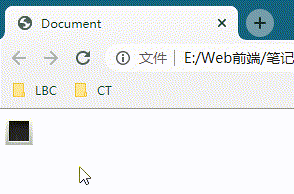

点击黑框试效果。

实例： [21401form01.html](21401form01.html) 


## 1.2 position 和 opacity

无使用 position 和 opacity

```
    <style>
        label input{display: none;}
        label div{
            width: 86px;
            height: 34px;
            background: url(./img/upload.png) no-repeat;
        }
        label div:active{
            width: 86px;
            height: 34px;
            box-shadow: 2px 2px 5px gray;
        }
    </style>
</head>
<body>
    <label>
        <input type="file">
        <div></div>
    </label>
</body>
```

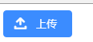

实例： [21401form02.html](21401form02.html) 

使用 position 和 opacity

```
    <style>
        .upload{
            width: 86px;
            height: 34px;
            position: relative;
        }
        .upload div{
            width: 100%;
            height: 100%;
            background: url(./img/upload.png);
        }
        .upload input{
            width: 100%;
            height: 100%;
            position: absolute;
            left: 0;
            top: 0;
            opacity: 0; /* 透明度 */
        }
    </style>
</head>
<body>
    <div class="upload">
        <input type="file">
        <div></div>
    </div>
</body>
```

```
position : relative;
和
opacity: 0;
```

鼠标移入【上传】能显示选择文件的情况。

未选择文件上传：

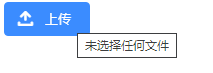

已选择文件上传：

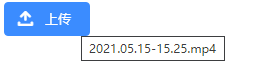

实例：  [21401form02-01.html](21401form02-01.html) 


# 2. 新input控件

input type="以下新控件名"

* email  :  电子邮件地址输入框，如果输入后没带@会有提示框。

* url  :  网址输入框，如果漏http://或https://会出现格式不对的提示框。

* mber  :  数值输入框，字母键盘无法输入，而且有箭头键用来加减数字。

* range  :  滑动条。

  ```
  <input type="range" min="0" max="10" value="2">
  ```

* date / month / week  :  日期控件。

          <p><input type="date"></p>
          <p><input type="month"></p>
          <p><input type="week"></p>

* search  :  搜索框，输入字符 框内右侧会显示叉号。

  ```
  <input type="search" placeholder="your keyword">
  ```

* color  :  颜色控件。

* tel  :  电话号码输入框（在移动端会默认调起数字键盘）。

* time  :  时间控件。

**==注意==**

* 以上控件在不同浏览器或不同版本 显示有所区别。

示例：

```
    <form action="https://www.baidu.com">
        <p><input type="email"></p>
        <p><input type="url"></p>
        <p><input type="number"></p>
        <p><input type="range" min="0" max="10" value="8"></p>
        <p><input type="date"></p>
        <p><input type="month"></p>
        <p><input type="week"></p>
        <p><input type="search" placeholder="your keyword"></p>
        <p><input type="color"></p>
        <p><input type="tel"></p>
        <p><input type="time"></p>
        <p><input type="submit"></p>
    </form>
```

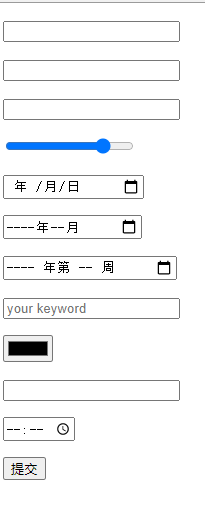

实例： [21402form01.html](21402form01.html) 


# 3. 控件总结

| 值                | 描述                                                         |
| :---------------- | :----------------------------------------------------------- |
| button            | 定义可点击的按钮（通常与 JavaScript 一起使用来启动脚本）。   |
| checkbox          | 定义复选框。                                                 |
| colorNew          | 定义拾色器。                                                 |
| dateNew           | 定义 date 控件（包括年、月、日，不包括时间）。               |
| datetimeNew       | 定义 date 和 time 控件（包括年、月、日、时、分、秒、几分之一秒，基于 UTC 时区）。 |
| datetime-localNew | 定义 date 和 time 控件（包括年、月、日、时、分、秒、几分之一秒，不带时区）。 |
| emailNew          | 定义用于 e-mail 地址的字段。                                 |
| file              | 定义文件选择字段和 "浏览..." 按钮，供文件上传。              |
| hidden            | 定义隐藏输入字段。                                           |
| image             | 定义图像作为提交按钮。                                       |
| monthNew          | 定义 month 和 year 控件（不带时区）。                        |
| numberNew         | 定义用于输入数字的字段。                                     |
| password          | 定义密码字段（字段中的字符会被遮蔽）。                       |
| radio             | 定义单选按钮。                                               |
| rangeNew          | 定义用于精确值不重要的输入数字的控件（比如 slider 控件）。   |
| reset             | 定义重置按钮（重置所有的表单值为默认值）。                   |
| searchNew         | 定义用于输入搜索字符串的文本字段。                           |
| submit            | 定义提交按钮。                                               |
| telNew            | 定义用于输入电话号码的字段。                                 |
| text              | 默认。定义一个单行的文本字段（默认宽度为 20 个字符）。       |
| timeNew           | 定义用于输入时间的控件（不带时区）。                         |
| urlNew            | 定义用于输入 URL 的字段。                                    |
| weekNew           | 定义 week 和 year 控件（不带时区）。                         |


# 4. 表单扩展之新属性

表单属性：

## 4.1 autocomplete自动完成、name="username"下拉内容

autocomplete 属性规定表单是否应该启用自动完成功能。

自动完成允许浏览器预测对字段的输入。当用户在字段开始键入时，浏览器基于之前键入过的值，应该显示出在字段中填写的选项。

**提示：**

* autocomplete "on" 适用于表单，"off" 适用于特定的输入字段，反之亦然。

添加 name="username"会出现下拉多个username的内容

示例：

```
    <form action="https://www.baidu.com">
        <input type="text" name="username" autocomplete="on">
        <input type="submit">
    </form>

    <p>填写并提交表单,然后重载页面,再次填写表格,看看 autocomplete 是如何工作的。</p>
    <p>然后,尝试设置 autocomplete 为“off”。</p>

    <p><b>注意：</b>除了 Opera，其他主流浏览器都支持 autocomplete 属性。</p>
```

autocomplete="on"时：

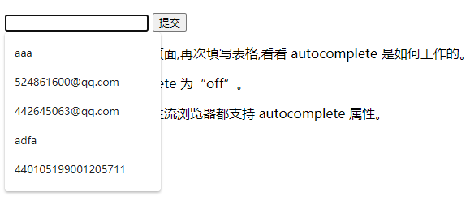

autocomplete="off"时：

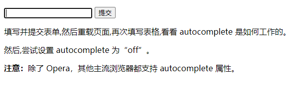

没有显示下拉的内容。

实例： [21404form01.html](21404form01.html) 


## 4.2 autofocus获取焦点

打开页面或刷新页面光标第一时间出现在有设autocomplete的框。

示例：

```
    <form action="">
        <input type="text" name="username" autocomplete="off" >
        <br>
        <input type="text" name="username" autocomplete="off" autofocus>
        <br>
        <input type="text" name="username" autocomplete="off">
        <br>
        <input type="submit">
    </form>
```

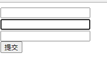

无论刷新多少次，焦点都是在第二行的输入框。

实例： [21404form02.html](21404form02.html) 


## 4.3 required不能为空

不能为空，空框提交会出现提示框。

```
<input type="text" name="username" autocomplete="on" required>
```

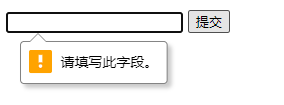

输入框为空，点击提交会跳出“请填写此字段”的提示框。

实例： [21404form03.html](21404form03.html) 


## 4.4 pattern正则验证

```
<input type="text" name="username" autocomplete="off" autofocus required pattern="[a-z]+">
```

* \d 匹配一个数字0~9 

* \d+表示1个或多个数字

* [a-z]+ 26个字母里选1个或多个

输入提交后如不符合格式会出现提示。

如果只输入数字：

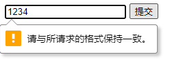

会弹出提示框。

组合：

* 纯数字，提交失败。
* 数字+字母，提交失败。
* 纯字母，提交成功

实例： [21404form04.html](21404form04.html) 

正则表达式可参考链接：https://www.w3cschool.cn/rxoyts/或者其它手册


# 5. 表单扩展之数据传输

method  :  数据传输方式。

```
<form action="./data.php" method="GET|POST">
```

| 值   | 描述                                                         |
| :--- | :----------------------------------------------------------- |
| get  | 默认。将表单数据（form-data）以名称/值对的形式附加到 URL 中：URL?name=value&name=value。 |
| post | 以 HTTP post 事务的形式发送表单数据（form-data）。           |

enctype  :  数据传输类型
name / value  :  数据的键值对

实例： [21405form01.html](21405form01.html)  [data.php](data.php) 


# 6. 标签fieldset、legend 表内元素分组

fieldset  :  表单内元素分组 。
legend  :  为fieldset元素定义标题。

```
    <fieldset>
        <legend>登录</legend>
        <p>
            用户名：<input type="text">
        </p>
        <p>
            密码：<input type="pasword">
        </p>
    </fieldset>
```

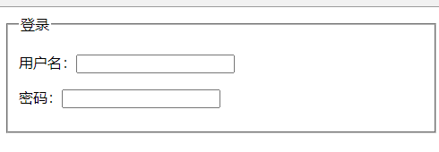

实例： [21406form01.html](21406form01.html) 


# 7. optgroup定义选项组

```
    <select name="" id="">
        <optgroup label="水果"></optgroup>
        <option value="">苹果</option>
        <option value="">香蕉</option>
        <option value="">雪梨</option>
        <option value="">猕猴桃</option>
        <optgroup label="蔬菜"></optgroup>
        <option value="">白菜</option>
        <option value="">黄瓜</option>
        <option value="">南瓜</option>
        <option value="">茄子</option>
    </select>
```

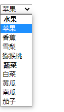

实例： [21407form01.html](21407form01.html) 