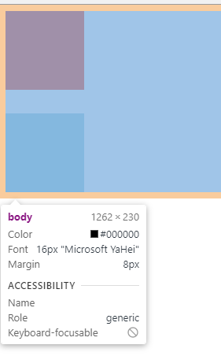

# 215 BFC规范

视频序号132-133

目录


***

Formatting context(格式化上下文) 是 W3C CSS2.1 规范中的一个概念。它是页面中的一块渲染区域，并且有一套渲染规则，它决定了其子元素将如何定位，以及和其他元素的关系和相互作用。

BFC 即 Block Formatting Contexts (块级格式化上下文) ，它属于上述中的其中一种规范。具有 BFC 特性的元素可以看作是隔离了的独立容器，容器里面的元素不会在布局上影响到外面的元素，并且 BFC 具有普通容器所没有的一些特性。

触发BFC规范的元素，可以形成一个独立的容器。不受到外界的影响，从而解决一些布局问题。

触发BFC

浮动元素：float 除 none 以外的值
绝对定位元素：position (absolute、fixed) 
display 为 inline-block、table-cells、flex
overflow 除了 visible 以外的值 (hidden、auto、scroll)

# 1. 解决margin叠加问题

```
    <style>
        .div1{
            width: 100px;
            height: 100px;
            background: tomato;
            margin-bottom: 30px;
        }
        .div2{
            width: 100px;
            height: 100px;
            background: lightblue;
            margin-top: 30px;
        }
    </style>
    
<body>
    <div class="div1"></div>
    <div class="div2"></div>
</body>
```



红块设置了margin-bottom 30px 蓝块设置了margin-top 30px，可是两块纵向距离却不是30px+30px=60px，而是选取最大的30px。

实例： [21501BFC01.html](21501BFC01.html) 


**解决方法：**

## 1.1 style部分添加

```
.box{
            overflow: hidden;/* 溢出隐藏 */
        }
```

```
<body>
    <div class="box">
        <div class="div1"></div>
    </div>
    <div class="box">
        <div class="div2"></div>
    </div>
</body>
```

使用这方法可以使30px+30px=60px。

实例： [21501BFC02.html](21501BFC02.html) 


## 1.2 display: flex;

```
.box{
            display: flex;
        }
```

实例： [21501BFC03.html](21501BFC03.html) 


# 2. 解决margin传递问题