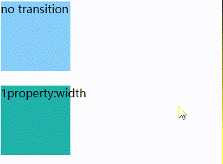
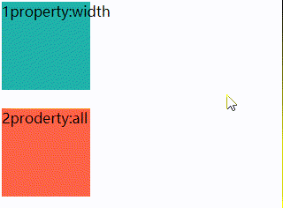
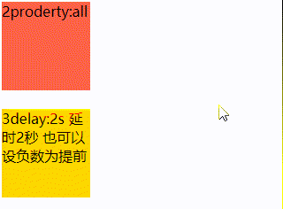
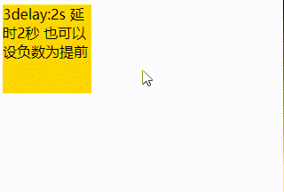
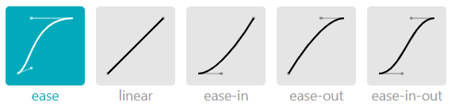
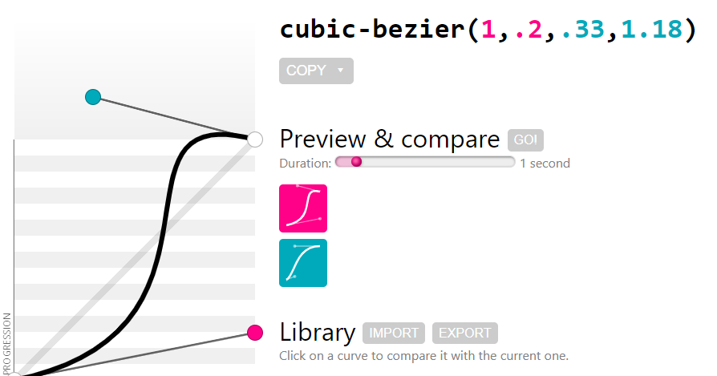
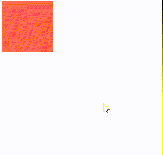
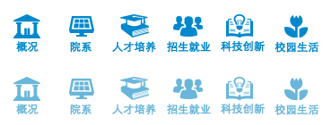
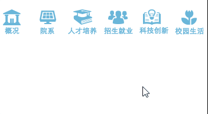
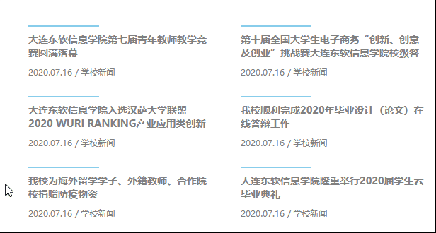

# 217 transition过渡

视频序号135-136

目录
- [217 transition过渡](#217-transition过渡)
- [1. transition过渡基础语法](#1-transition过渡基础语法)
- [2 transition 简写](#2-transition-简写)
- [3 transition-delay 可负数](#3-transition-delay-可负数)
- [4 transition-timing-function 时间曲线](#4-transition-timing-function-时间曲线)
- [5. 导航实例](#5-导航实例)
- [6. 文章列表实例](#6-文章列表实例)


***

CSS3中，我们为了添加某种效果可以从一种样式转变到另一个的时候，无需使用 Flash 动画 或 JavaScript。

**它是如何工作？**

CSS3 过渡是元素从一种样式逐渐改变为另一种的效果。

要实现这一点，必须规定两项内容：

* 指定要添加效果的CSS属性
* 指定效果的持续时间。


# 1. transition过渡基础语法

transition-property  :  规定设置过渡效果的CSS属性的名称。

transition-duration  :  规定完成过渡效果需要多少秒或毫秒。

transition-delay  :  定义过渡效果何时开始。

transition：简写属性。

示例：

**无 transition：**

```
        .box{
            width: 100px;
            height: 100px;
            background: lightskyblue;
        }
        .box:hover{
            width: 200px;
            height: 200px;
            background: royalblue;
        }
```




**设宽度变化：**

```
        .box1{
            width: 100px;
            height: 100px;
            background: lightseagreen;
            transition-property: width; /* 只设宽度过渡 */
            transition-duration: 1s;    /* 过渡所花时长 */
        }
        .box1:hover{
            width: 200px;
            height: 200px;
            background: seagreen;
        }
```



**宽高都变化：**

```
        .box2{
            width: 100px;
            height: 100px;
            background: tomato;
            transition-property: all; /* 宽高都设过渡 */
            transition-duration: 2s;
        }
        .box2:hover{
            width: 200px;
            height: 200px;
            background: brown;
            border-radius: 20px;
        }
```



**延时2秒后变化：**



实例： [21701transition01.html](21701transition01.html) 


# 2 transition 简写

```
            transition-property: all;
            transition-duration: 2s;
            transition-delay: 2s;   

            /* 可缩写为 */
            transition: all 2s 2s;
```


# 3 transition-delay 可负数

transition-delay 可设负数，作为提前过渡。

```
            transition-property: all;
            transition-duration: 2s;
            transition-delay: -2s; 
            
            /* 简写 */
            transition: all 2s -2s;
```


# 4 transition-timing-function 时间曲线

规定过渡效果的时间曲线。默认是 "ease"。

| 值                            | 描述                                                         |
| :---------------------------- | :----------------------------------------------------------- |
| linear                        | 规定以相同速度开始至结束的过渡效果（等于 cubic-bezier(0,0,1,1)）。 |
| ease                          | 规定慢速开始，然后变快，然后慢速结束的过渡效果（cubic-bezier(0.25,0.1,0.25,1)）。**默认** |
| ease-in                       | 规定以慢速开始的过渡效果（等于 cubic-bezier(0.42,0,1,1)）。  |
| ease-out                      | 规定以慢速结束的过渡效果（等于 cubic-bezier(0,0,0.58,1)）。  |
| ease-in-out                   | 规定以慢速开始和结束的过渡效果（等于 cubic-bezier(0.42,0,0.58,1)）。 |
| cubic-bezier(*n*,*n*,*n*,*n*) | 在 cubic-bezier 函数中定义自己的值。可能的值是 0 至 1 之间的数值。 |

速度曲线图示：



可使用在线工具进行设置：



传送门：https://cubic-bezier.com/

示例：

```
        div{
            width: 100px;
            height: 100px;
            background: tomato;
            transition-property: all;
            transition-duration: 1s;
            transition-delay: 0s;
            transition-timing-function: cubic-bezier(1,.2,.33,1.18);
        }
        div:hover{
            width: 300px;
            height: 300px;
        }
```



实例： [21704transition01.html](21704transition01.html) 

**==注意==**

* 不要把 transition-timing-function 添加在 :hover 里


# 5. 导航实例

```
d    <style>
        ul,li{
            margin: 0;
            padding: 0;
            list-style: none;
        }
        ul{
            width: 360px;
        }
        ul li{
            width: 60px;
            height: 70px;
            float: left;
            background: url(./img/aNavBg.png);
            transition-property: all;
            transition-duration: .3s;
        }
        ul li:nth-child(1){ background-position: 0 -70px;}
        ul li:nth-child(2){ background-position: -60px -70px;}
        ul li:nth-child(3){ background-position: -120px -70px;}
        ul li:nth-child(4){ background-position: -180px -70px;}
        ul li:nth-child(5){ background-position: -240px -70px;}
        ul li:nth-child(6){ background-position: -300px -70px;}

        ul li:nth-child(1):hover{ background-position: 0 0;}
        ul li:nth-child(2):hover{ background-position: -60px 0;}
        ul li:nth-child(3):hover{ background-position: -120px 0;}
        ul li:nth-child(4):hover{ background-position: -180px 0;}
        ul li:nth-child(5):hover{ background-position: -240px 0;}
        ul li:nth-child(6):hover{ background-position: -300px 0;}
    </style>
</head>
<body>
    <ul>
        <li></li>
        <li></li>
        <li></li>
        <li></li>
        <li></li>
        <li></li>
    </ul>
</body>
```

精灵图：



页面显示



实例：  [21705test01.html](21705test01.html) 


# 6. 文章列表实例

css

```
*{
    margin: 0;
    padding: 0;
}
a{
    text-decoration: none;
}
a:visited{color: gray;}
h2{
    font-size: 14px;
    padding-bottom: 10px;
}

.newsbox{
    width: 600px;
    height: auto;
    padding-top: 50px;
    overflow: hidden;
    margin: 0 auto 0;
}
.newsbox .newsitem{
    width: 300px;
    height: 100px;
    float: left;
    box-sizing: border-box;
    padding: 10px 40px 20px 0px;
    position: relative;
}
.newsbox .newsitem:hover{
    color: skyblue;
}
.newsbox .newsitem p{
    font-size: 10px;
    color: gray;
}
.newsbox .newsitem::before{
    content: "";
    display: block;
    width: 100px;
    height: 2px;
    background: skyblue;
    position: absolute;
    top: 0;
    transition: all .3s;
}
.newsbox .newsitem:hover::before{
    width: 200px;
}
```

html

```
<body>
    <div class="newsbox">
        <a href="" title="大连东软信息学院第七届青年教师教学竞赛圆满落幕">
            <div class="newsitem">
                <h2>大连东软信息学院第七届青年教师教学竞赛圆满落幕</h2>
                <p>2020.07.16 / 学校新闻</p>
            </div>
        </a>
        <a href="">
            <div class="newsitem">
                <h2>第十届全国大学生电子商务“创新、创意及创业”挑战赛大连东软信息学院校级答</h2>
                <p>2020.07.16 / 学校新闻</p>
            </div>
        </a>
        <a href="">
            <div class="newsitem">
                <h2>大连东软信息学院入选汉萨大学联盟 2020 WURI RANKING产业应用类创新</h2>
                <p>2020.07.16 / 学校新闻</p>
            </div>
        </a>
        <a href="">
            <div class="newsitem">
                <h2>我校顺利完成2020年毕业设计（论文）在线答辩工作</h2>
                <p>2020.07.16 / 学校新闻</p>
            </div>
        </a>
        <a href="">
            <div class="newsitem">
                <h2>我校为海外留学学子、外籍教师、合作院校捐赠防疫物资</h2>
                <p>2020.07.16 / 学校新闻</p>
            </div>
        </a>
        <a href="">
            <div class="newsitem">
                <h2>大连东软信息学院隆重举行2020届学生云毕业典礼</h2>
                <p>2020.07.16 / 学校新闻</p>
            </div>
        </a>
    </div>
</body>
```



实例：

 [21706test01.html](21706test01.html) 

 [style.css](css\style.css) 