# 218 2D转换

视频序号137-141

目录
- [218 2D转换](#218-2d转换)
- [1. translate() 位移](#1-translate-位移)
- [2. scale() 缩放](#2-scale-缩放)
- [3. rotate() 旋转](#3-rotate-旋转)
- [4. skew() 斜切](#4-skew-斜切)
- [5. transform复合写法与注意点](#5-transform复合写法与注意点)
  - [5.1变形操作不会影响到其他元素。](#51变形操作不会影响到其他元素)
  - [5.2块元素能变形，内联元素不行](#52块元素能变形内联元素不行)
  - [5.3复合写法](#53复合写法)
- [6. matrix() 矩阵变形](#6-matrix-矩阵变形)
- [7. 斜切的导航实例](#7-斜切的导航实例)
- [8. 变形的列表实例](#8-变形的列表实例)
- [9. 2D转换方法总结](#9-2d转换方法总结)


***

CSS3 转换可以对元素进行移动、缩放、转动、拉长或拉伸。

注意不同浏览器种类或版本对转换的支持，需要添加前缀。

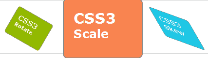

| Property                                                     | 描述                   | CSS  |
| :----------------------------------------------------------- | :--------------------- | :--- |
| [transform](https://www.runoob.com/cssref/css3-pr-transform.html) | 适用于2D或3D转换的元素 | 3    |
| [transform-origin](https://www.runoob.com/cssref/css3-pr-transform-origin.html) | 允许您更改转化元素位置 | 3    |

* translate() 位移
* rotate() 旋转
* scale() 缩放
* skew() 斜切

# 1. translate() 位移

根据左(X轴)和顶部(Y轴)位置给定的参数，从当前元素位置移动。数值可以是负数。

|                    |                                        |
| ------------------ | -------------------------------------- |
| translate(*x*,*y*) | 定义 2D 转换，沿着 X 和 Y 轴移动元素。 |
| translateX(*n*)    | 定义 2D 转换，沿着 X 轴移动元素。      |
| translateY(*n*)    | 定义 2D 转换，沿着 Y 轴移动元素。      |

translate(x, y)

```
    <style>
        .box{
            width: 300px;
            height: 300px;
            border: 1px solid gray;
            position: relative;
        }
        .box1{
            width: 120px;
            height: 120px;
            background: tomato;
            opacity: 0.5;
        }
        .translate2d{
            transform: translate(50px, 30px);
            position: absolute;
            top: 0px;
            left: 0px;
            opacity: 1;
        }
    </style>

<body>
    <div class="box">
        <div class="box1">原始</div>
        <div class="box1 translate2d">translate(50px, 30px)</div>
    </div>
</body>
```

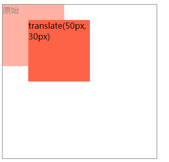

实例： [21801translate01.html](21801translate01.html) 

translateX、translateY

```
    <style>
        .box{
            width: 200px;
            height: 200px;
            border: 1px dashed gray;
        }
        .littlebox{
            width: 100px;
            height: 100px;
            background: tomato;
        }
        .tX{
            transform: translateX(50px);
        }
        .tY{
            transform: translateY(-20px);
        }
    </style>
</head>
<body>
    <div class="box">
        <div class="littlebox">origin</div>
    </div>
    <div class="box">
        <div class="littlebox tX">translateX(50px)</div>
    </div>
    <div class="box">
        <div class="littlebox tY">translateY(-20px)</div>
    </div>
</body>
```

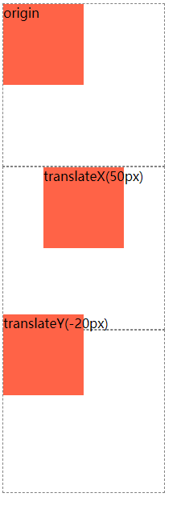

实例： [21801translate02.html](21801translate02.html) 


可使用 :hover 伪元素进行位移变化：

```
    <style>
        .box1{
            width: 200px;
            height: 200px;
            border: 1px solid gray;
            margin: 30px auto;
        }
        .box2{
            width: 100px;
            height: 100px;
            background: tomato;
            transition: 1s;
        }
        .box1:hover .box2{
            background: skyblue;
            transform: translate(-100px,20px);
            /* translate输入不同数值试效果 */
        }
    </style>

<body>
    <div class="box1">
        <div class="box2">

        </div>
    </div>
</body>
```

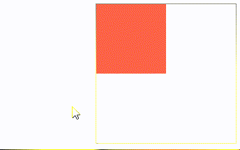

实例：  [21801translate03.html](21801translate03.html) 


# 2. scale() 缩放

元素增加或减少的大小，取决于宽度（X轴）和高度（Y轴）的参数。

scale(值)，值是一个比例值，正常大小就是1，会已当前元素中心点进行缩放。

scale(2,3) 转变宽度为原来的大小的2倍，和其原始大小3倍的高度。

scale (0.5) 转变为原来的一半。

|                |                                          |
| -------------- | ---------------------------------------- |
| scale(*x*,*y*) | 定义 2D 缩放转换，改变元素的宽度和高度。 |
| scaleX(*n*)    | 定义 2D 缩放转换，改变元素的宽度。       |
| scaleY(*n*)    | 定义 2D 缩放转换，改变元素的高度。       |

示例：

```
        .box{
            width: 200px;
            height: 200px;
            border: 1px dashed gray;
            margin: 20px auto;
        }
        .littlebox{
            width: 100px;
            height: 100px;
            background: skyblue;
        }
        .scaleN{
            transform: scale(1.2);
        }
        ...
        ...
```

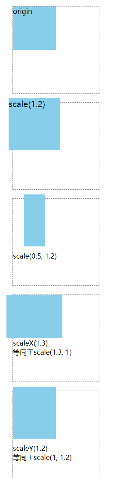

实例： [21802scale01.html](21802scale01.html) 

可以使用 :hover 伪元素进行变化：

```
    <style>
        .box1{
            width: 200px;
            height: 200px;
            border: 1px solid gray;
            margin: 30px auto;
        }
        .box2{
            width: 100px;
            height: 100px;
            background: tomato;
            transition: 1s;
        }
        .box1:hover .box2{
            background: skyblue;
            /* transform: scale(2); */
            /* transform: scale(2,2); */
            transform: scale(2,.5);
        }
    </style>

<body>
    <div class="box1">
        <div class="box2">

        </div>
    </div>
</body>
```

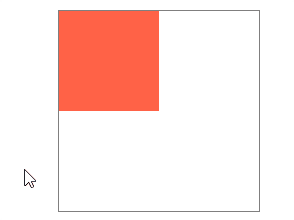

实例： [21802scale02.html](21802scale02.html) 


# 3. rotate() 旋转

在一个给定度数顺时针旋转的元素。单位是角度（deg）。

正值为顺时针，负值为逆时针。

```
rotate(30deg);
元素顺时针旋转30度。
```

示例：

```
        .box{
            width: 200px;
            height: 200px;
            border: 1px solid gray;
            position: relative;
            margin: 50px auto;
        }
        .box1{
            width: 120px;
            height: 120px;
            background: lightskyblue;
            opacity: 0.5;
        }
        .rotate2d{
            transform: rotate(30deg);
            position: absolute;
            top: 0px;
            left: 0px;
            opacity: 1;
        }
    </style>
</head>
<body>
    <div class="box">
        <div class="box1">原始</div>
        <div class="box1 rotate2d">rotate(30deg)</div>
    </div>
</body>
```

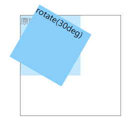

实例： [21803rotate01.html](21803rotate01.html) 


可使用 :hover 伪元素时行旋转：

```
    <style>
        .box1{
            width: 200px;
            height: 200px;
            border: 1px solid gray;
            margin: 30px auto;
        }
        .box2{
            width: 100px;
            height: 100px;
            background: tomato;
            transition: 1s;
        }
        .rotate180:hover {
            transform: rotate(180deg);
        }
        .rotate900:hover {
            transform: rotate(900deg);
        }
    </style>

<body>
    <div class="box1">
        <div class="box2 rotate180">
            1
        </div>
        <div class="box2 rotate900">
            2
        </div>
    </div>
</body>
```

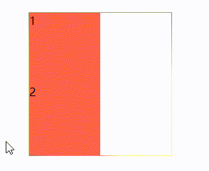

第一块旋转180度，第二块旋转900度。

实例： [21803rotate02.html](21803rotate02.html) 


# 4. skew() 斜切

包含两个参数值，分别表示X轴和Y轴倾斜的角度，如果第二个参数为空，则默认为0，参数为负表示向相反方向倾斜。

单位为角度 deg。

skewX : 单位也是角度，正值为顶部向左倾斜，负值为顶部向右倾斜。

|                           |                                    |
| ------------------------- | ---------------------------------- |
| skew(*x-angle*,*y-angle*) | 定义 2D 倾斜转换，沿着 X 和 Y 轴。 |
| skewX(*angle*)            | 定义 2D 倾斜转换，沿着 X 轴。      |
| skewY(*angle*)            | 定义 2D 倾斜转换，沿着 Y 轴。      |

```
        .box{
            width: 200px;
            height: 200px;
            border: 1px dashed gray;
            margin: 20px auto;
        }
        .littlebox{
            width: 100px;
            height: 100px;
            background: lightseagreen;
        }
        .skewN1{
            transform: skew(30deg);
        }
        ...
        ...
```

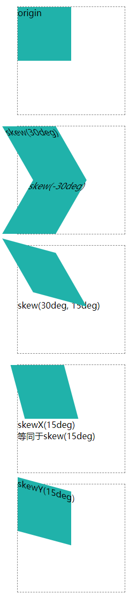

实例： [21804skew01.html](21804skew01.html) 

还可以用 :hover 伪元素，功能和前面几个一样，不多述了。

# 5. transform复合写法与注意点

**transform的注意事项：**

## 5.1变形操作不会影响到其他元素。

```
    <style>
        .box1{
            width: 200px;
            height: 200px;
            border: 1px solid gray;
            margin: 30px auto;
        }
        .box2{
            width: 100px;
            height: 100px;
            background: lightseagreen;
            transform: rotate(45deg);
        }
    </style>
</head>
<body>
    <div class="box1">
        <div class="box2"></div>
        <div>1234567</div>
    </div>
</body>
```

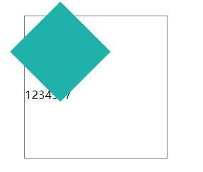

文本不会受到绿块旋转而变化，就是会被覆盖一部分。

实例：  [21805transform01.html](21805transform01.html) 


## 5.2块元素能变形，内联元素不行

变形操作只能添加给块元素，但是不能添加给内联元素。

```
    <style>
        .box{
            width: 200px;
            height: 200px;
            border: 1px solid gray;
            margin: 30px auto;
        }
        .transform2d{
            width: 100px;
            height: 100px;
            background: lightskyblue;
            transform: rotate(30deg);
        }
    </style>

<body>
    <div class="box">
        <div class="transform2d">
            div
        </div>
        <span class="transform2d">span</span>
    </div>
</body>
```

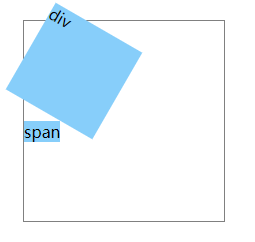

span 是内联元素，不能变形的。

实例： [21805transform02.html](21805transform02.html) 


## 5.3复合写法

执行是有顺序的，先执行后面的操作，再执行前面的操作。
translate会受到 rotate、scale、skew的影响。

**示例1：**

```
    <style>
        .box1{
            width: 100px;
            height: 100px;
            background: lightskyblue;
        }
        .box2{
            width: 100px;
            height: 100px;
            background: lightskyblue;
            transform: translate(100px,0) scale(.5);
            /* 先执行缩放后位移 */
        }
        .box3{
            width: 100px;
            height: 100px;
            background: lightskyblue;
            transform: scale(.5) translate(100px,0) ;
            /* 先执行位移50px后缩放 */
        }
        .box4{
            width: 100px;
            height: 100px;
            background: lightskyblue;
            transform: scale(2) translate(100px,0) ;
            /* 先执行位移200px后缩放 */
        }

    </style>

<body>
    <div class="box1">1</div>
    <div class="box2">2</div>
    <div class="box3">3</div>
    <div class="box4">4</div>
</body>
```

变形运动轨迹：

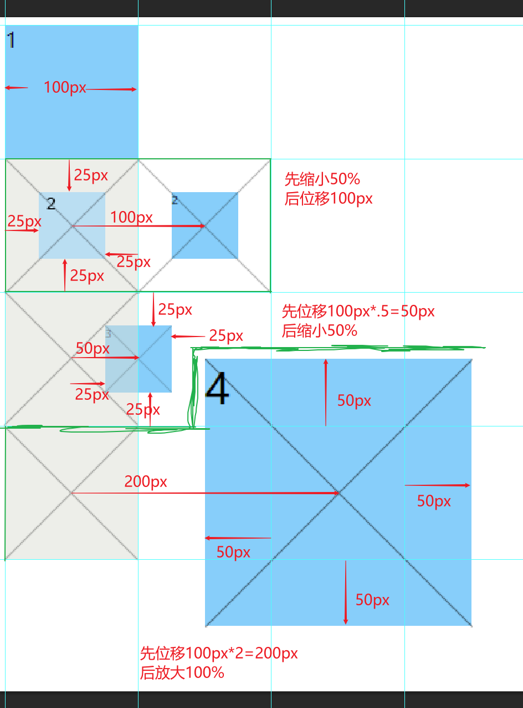

实例： [21805transform03.html](21805transform03.html) 


**示例2：**

```
    <style>
        .box1{
            width: 100px;
            height: 100px;
            background: lightskyblue;
        }
        .box2{
            width: 100px;
            height: 100px;
            background: lightskyblue;
            transform: translate(100px,0) rotate(45deg);
        }
        .box3{
            width: 100px;
            height: 100px;
            background: lightskyblue;
            transform: rotate(45deg) translate(100px,0) ;
        }

    </style>

<body>
    <div class="box1">1</div>
    <div class="box2">2</div>
    <div class="box3">3</div>
</body>
```

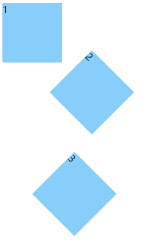

变化轨迹：

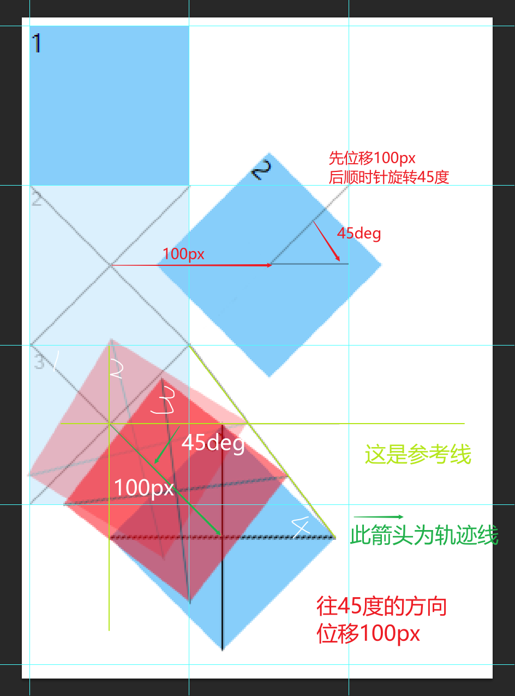

实例： [21805transform04.html](21805transform04.html) 

采用动图解释更为详细：

```
        .box1:hover ~ .box2{
            transform: translate(100px,0) rotate(45deg);
        }
        .box1:hover ~ .box3{
            transform: rotate(45deg) translate(100px,0) ;
        }
```

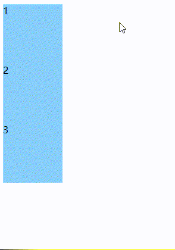

鼠标移到1号蓝块可看运动轨迹。

实例： [21805transform05.html](21805transform05.html) 


# 6. matrix() 矩阵变形

方法把所有 2D 变换方法组合为一个。

方法可接受六个参数，其中包括数学函数，这些参数使您可以旋转、缩放、移动（平移）和倾斜元素。

具体参数如下：

```
matrix(scaleX(),skewY(),skewX(),scaleY(),translateX(),translateY())
```

示例：

```
    <style>
        div {
            width: 300px;
            height: 100px;
            background-color: yellow;
            border: 1px solid black;
        }

        div#myDiv1 {
            -ms-transform: matrix(1, -0.3, 0, 1, 0, 0);
            /* IE 9 */
            transform: matrix(1, -0.3, 0, 1, 0, 0);
            /* 标准语法 */
        }

        div#myDiv2 {
            -ms-transform: matrix(1, 0, 0.5, 1, 150, 0);
            /* IE 9 */
            transform: matrix(1, 0, 0.5, 1, 150, 0);
            /* 标准语法 */
        }
    </style>
</head>

<body>

    <h1>matrix() 方法</h1>
    <p>matrix() 方法将所有 2D 转换方法组合为一个。</p>

    <div>
        这是一个普通的 div 元素。
    </div>

    <div id="myDiv1">
        使用 matrix() 方法。
    </div>

    <div id="myDiv2">
        matrix() 方法的另一种用法。
    </div>

</body>
```

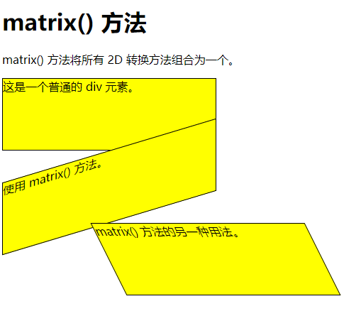

实例： [21806matrix01.html](21806matrix01.html) 

**他人分享的详解：**

网上链接：https://blog.csdn.net/ruangong1203/article/details/54586051


# 7. 斜切的导航实例

```
    <style>
        *{margin: 0;padding: 0;}
        ul{
            list-style: none;
        }
        ul{
            width: 460px;
            margin: 50px auto;
            overflow: hidden;
        }
        ul li{
            float: left;
            width: 100px;
            height: 26px;
            line-height: 26px;
            color: #ffffff;
            text-align: center;
            background: royalblue;
            display: block;
            margin: 0 10px 0;
            transform: skew(-30deg);
            
        }
        ul li span{
            transform: skew(30deg);
            display: block;
        }
        ul li:first-child{
            padding-left: 10px;
            margin-left: -10px;
        }
        ul li:last-child{
            padding-right: 10px;
            margin-right: -10px;
        }
    </style>

<body>
    <ul>
        <li><span>首页</span></li>
        <li><span>游戏新闻</span></li>
        <li><span>种族职业</span></li>
        <li><span>天赋装备</span></li>
    </ul>
</body>
```


实例： [21807test01.html](21807test01.html) 


# 8. 变形的列表实例

**练习1：**


参考千锋教程： [21808test01.html](21808test01.html) 

方法：采用overflow:hidden修剪掉框外的白框。

练习： [21808test02.html](21808test02.html) 


**练习2：**

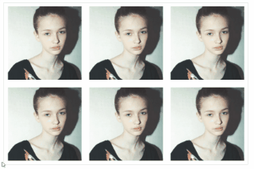

参考教程： [21808test03.html](21808test03.html) 

方法：

* 文本框设置高度0px和overflow:hidden达到隐藏效果，:hover{height:xxpx;}，达到鼠标移入能显现出来。
* 背景颜色采用RGBA，A为透明度，这样文字不会被透明度所影响

练习： [21808test04.html](21808test04.html) （图片更换为怪物猎人封面）

# 9. 2D转换方法总结

| 函数                            | 描述                                     |
| :------------------------------ | :--------------------------------------- |
| matrix(*n*,*n*,*n*,*n*,*n*,*n*) | 定义 2D 转换，使用六个值的矩阵。         |
| translate(*x*,*y*)              | 定义 2D 转换，沿着 X 和 Y 轴移动元素。   |
| translateX(*n*)                 | 定义 2D 转换，沿着 X 轴移动元素。        |
| translateY(*n*)                 | 定义 2D 转换，沿着 Y 轴移动元素。        |
| scale(*x*,*y*)                  | 定义 2D 缩放转换，改变元素的宽度和高度。 |
| scaleX(*n*)                     | 定义 2D 缩放转换，改变元素的宽度。       |
| scaleY(*n*)                     | 定义 2D 缩放转换，改变元素的高度。       |
| rotate(*angle*)                 | 定义 2D 旋转，在参数中规定角度。         |
| skew(*x-angle*,*y-angle*)       | 定义 2D 倾斜转换，沿着 X 和 Y 轴。       |
| skewX(*angle*)                  | 定义 2D 倾斜转换，沿着 X 轴。            |
| skewY(*angle*)                  | 定义 2D 倾斜转换，沿着 Y 轴。            |