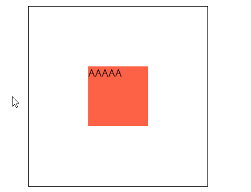

# 219 3D转换

视频序号147-151

目录


***

CSS3 允许使用 3D 转换来对元素进行格式化。

注意浏览器版本号的支持。有些浏览器需要添加前缀。

浏览器支持版本号的传送门：https://www.runoob.com/css3/css3-3dtransforms.html

通过 CSS transform 属性，可以使用以下 3D 转换方法：

- rotateX()
- rotateY()
- rotateZ()


# 1. 3D基本语法及成像原理

**三维坐标**


向上为-Y，向下为+Y，向左为-X，向右为+X，向前为+Z，向后为-Z。


# 2. 3D转换方法

通过 CSS transform 属性，可以使用以下 3D 转换方法。

## 2.1 rotateX() 方法

方法使元素绕其 X 轴旋转给定角度。

实例：

```
    <style>
        .box{
            width: 300px;
            height: 300px;
            border: 1px black solid;
            margin: 50px auto;
        }
        .box-little{
            width: 100px;
            height: 100px;
            background: tomato;
            margin: 100px;
            transition: 2s;
            transform: rotateX(0);
        }

        .box:hover .box-little{
            transform: rotateX(180deg);
            /* transform: rotateX(90deg); */
            /* transform: rotateX(45deg); */
        }
    </style>

<body>
    <div class="box">
        <div class="box-little">
            AAAAA
        </div>
    </div>
</body>
```


实例： [21902transform01.html](21902transform01.html) 


## 2.2 rotateY() 方法

使元素绕其 Y 轴旋转给定角度。

示例：

```
    <style>
        .box{
            width: 300px;
            height: 300px;
            border: 1px black solid;
            margin: 50px auto;
        }
        .box-little{
            width: 100px;
            height: 100px;
            background: tomato;
            margin: 100px;
            transition: 1s;
            transform: rotateY(0);
        }

        .box:hover .box-little{
            transform: rotateY(180deg);
            /* transform: rotateY(90deg); */
            /* transform: rotateY(45deg); */
        }
    </style>

<body>
    <div class="box">
        <div class="box-little">
            AAAAA
        </div>
    </div>
</body>
```



实例： [21902transform02.html](21902transform02.html) 


## 2.3 rotateZ() 方法

使元素绕其 Z 轴旋转给定角度。

示例：

```
        .box:hover .box-little{
            transform: rotateZ(180deg);
            /* transform: rotateZ(90deg); */
            /* transform: rotateZ(45deg); */
        }
```


实例： [21902transform03.html](21902transform03.html) 


## 2.4 translateZ() 方法

正值向前，负值向后。

示例：

```
    <style>
        .box{
            width: 300px;
            height: 300px;
            border: 1px black solid;
            margin: 50px auto;
            perspective: 200px;
        }
        .box-little{
            width: 100px;
            height: 100px;
            background: tomato;
            margin: 100px;
            transition: 1s;
            transform: translateZ(0);
        }

        .box:hover .box-little{
            /* transform: translateZ(150px); */
            transform: translateZ(-50px);
        }
    </style>
```

需要添加 persective: 200px; 才能透视看到这个方法所使用的往后退。


实例： [21902transform04.html](21902transform04.html) 


**还有很多 3D的方法，可以在网上查阅。**


# 3. perspective 透视

离屏幕多远的距离去观察元素，值越大幅度越小，以像素计。

该属性允许您改变 3D 元素查看 3D 元素的视图。

**==注意==**

* perspective 属性只影响 3D 转换元素。

示例：

```
    <style>
        .box{
            width: 300px;
            height: 300px;
            border: 1px black solid;
            margin: 50px auto;
            perspective: 200px;
		    /* 取消 perspective属性 试效果 */
        }
        .box-little{
            width: 100px;
            height: 100px;
            background: tomato;
            margin: 100px;
            transition: 1s;
            transform: rotateX(0);
        }

        .box:hover .box-little{
            transform: rotateX(180deg);
            /* transform: rotateX(90deg); */
            /* transform: rotateX(45deg); */
        }
    </style>

<body>
    <div class="box">
        <div class="box-little">
            AAAAA
        </div>
    </div>
```

无 perspective 属性：


有 perspective 属性：


实例： [21903perspective01.html](21903perspective01.html) 

 3D转换方法使用 perspective 属性会呈现透视效果。请自我手动试试不同方法。


# 4 backface-visibility 背面隐藏否

backface-visibility 属性定义当元素不面向屏幕时是否可见。

如果在旋转元素不希望看到其背面时，该属性很有用。

| 值      | 描述                    |
| ------- | ----------------------- |
| visible | 默认值。 背面是可见的。 |
| hidden  | 背面是不可见的。        |

给红块添加 backface-visibility: hidden; ，效果如下：


背面变成白色了。

实例： [21904backface-visibility01.html](21904backface-visibility01.html) 


# 5. 实现3D立方体(transform-origin和transform-style)

**transform-origin**

更改转换元素的位置（基点）。

| 值     | 描述                                                         |
| :----- | :----------------------------------------------------------- |
| x-axis | 定义视图被置于 X 轴的何处。可能的值：left, center, right, length, % |
| y-axis | 定义视图被置于 Y 轴的何处。可能的值：top, center, bottom,  length, % |
| z-axis | 定义视图被置于 Z 轴的何处。可能的值：length                  |

```
transform-origin: X-axis y-axis z-axis
```

示例：

```
transform-origin: center center -50px;   
/* Z轴只能写数值，不能写单词 */
```


**transform-style**

指定嵌套元素是怎样在三维空间中呈现。

| 值          | 描述                           |
| :---------- | :----------------------------- |
| flat        | 表示所有子元素在2D平面呈现。   |
| preserve-3d | 表示所有子元素在3D空间中呈现。 |


六面体示例：

style

````
        *{padding: 0;margin: 0;}
        ul{list-style: none;}
        .box{
            width: 300px;
            height: 300px;
            border: 1px black solid;
            margin: 50px auto;
            perspective:200px;
        }
        .box ul{
            width: 100px;
            height: 100px;
            margin: 100px;
            position: relative;
            transition: 3s;
            transform-style: preserve-3d;
            transform-origin: center center -50px;
        }
        .box ul li{
            width: 100px;
            height: 100px;
            position: absolute;
            line-height: 100px;
            text-align: center;
            color: #fff;
            font-size: 26px;
        }
        .box ul li:nth-child(1){ background: tomato; left: 0; top: 0;}
        /* 原地不动 */

        .box ul li:nth-child(2){ background: brown; left: 100px; top: 0; 
        transform-origin: left; transform: rotateY(90deg);}
        /* 向右平移100px，transform-origin以第2块的左边线作为轴，然后向右翻转90度 */

        .box ul li:nth-child(3){ background: lightseagreen; left: -100px; top: 0;
        transform-origin: right; transform: rotateY(-90deg);}
        /* 向左平移100px，transform-origin以第3块的右边线作为轴，然后向左翻转90度 */
        
        .box ul li:nth-child(4){ background: seagreen; left: 0; top: -100px;
        transform-origin: bottom; transform: rotateX(90deg);}
        /* 向上平移100px,transform-origin以第4块的底线作为轴，向上翻转90度 */

        .box ul li:nth-child(5){ background: lightskyblue; left: 0; top: 100px;
        transform-origin: top; transform: rotateX(-90deg);}
        /* 向下平移100px,transform-origin以第4块的底线作为轴，向上翻转90度 */

        .box ul li:nth-child(6){ background: tomato; left: 0; top: 0;
        transform: translateZ(-100px) rotateY(180deg);
        /* 向后100px,然后中心点翻转180度 */
        }

        .box:hover ul{
            /* transform: rotateY(180deg); */
            transform: rotateY(360deg);
        }
````

body

```
    <div class="box">
        <ul>
            <li>1</li>
            <li>2</li>
            <li>3</li>
            <li>4</li>
            <li>5</li>
            <li>6</li>
        </ul>
    </div>
```


ratateY(360deg) Y轴旋转360度，透视200px。

实例： [21905transform01.html](21905transform01.html) 


自我练习不同方向转换：


实例： [21905transform02.html](21905transform02.html) 


# 6. perspective-origin 景深

景深-基点位置，观察元素的角度。

定义时的perspective -Origin属性，它是一个元素的子元素，透视图，而不是元素本身。

示例：

```
perspective-origin: left; 
/* 在左边看 */
```

```
perspective-origin: bottom right;
/* 在右下角往里面看 */
```

示例：

```
        .box{
            width: 300px;
            height: 300px;
            border: 1px black solid;
            margin: 50px auto;
            perspective:200px;
            /* perspective-origin: left; */
            /* 在左边看 */
            /* perspective-origin: right; */
            /* perspective-origin: top; */
            /* perspective-origin: bottom; */
            perspective-origin: top right;
        }
```

perspective: 200px; 透视情况下：

* 无 perspective-origin

  

* perspective-origin: left; 在元素左边看（往右看）

  

  动图：

  

* perspective-origin: bottom; 在底部看

  

* perspective-origin: top right; 在右上角看

  

实例： [21906perspective-origin01.html](21906perspective-origin01.html) 内有不同角度的代码，请自行测试。


# 7. 3D写法

scale3d() : 三个值 x y z
translate3d() : 三个值 x y z
rotate3d() : 四个值 0|1(x轴是否添加旋转角度)  0|1(y轴是否添加旋转角度)  0|1(z轴是否添加旋转角度)  deg；0为否，1为是。

立方体实例：


```
            opacity: 0.5;
            /* 采用透明度可看角度 */
```

实例： [21907xiefa01.html](21907xiefa01.html) 


# 8. 几个练习的实例

**1 四棱锥quadrangular pyramid-test**


实例： [21908test01.html](21908test01.html) 

**2 改变厚度**


实例： [21908test02.html](21908test02.html) 

**3 背面隐藏+透明度**


有 :hover 伪元素。

实例： [21908test03.html](21908test03.html) 

**4 3D轮播图 slicebox-3dImageSlider**


由于为了节省空间，捕获帧率设低，建议打开页面看效果。

实例： [21908test04.html](21908test04.html) 


**5 3D旋转木马 3Dcarousel**

方法：transform-style  transform-origin


实例： [21908test05-01.html](21908test05-01.html) 

旋转木马风景图： [21908test05-02.html](21908test05-02.html) 


**6 图片翻转**

方法：正反面两张图都上transform，鼠标移入时:hover都设两张图


实例： [21908test06-01.html](21908test06-01.html) 


实例： [21908test06-02.html](21908test06-02.html) 

错误示范：


鼠标移入时翻转不平滑。

实例： [21908test06-03.html](21908test06-03.html) 

要和上面的实例看比较。


**7 翻书**


实例： [21908test0701.html](21908test0701.html) 

