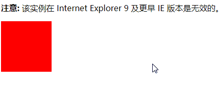
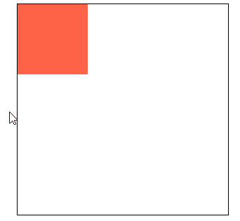
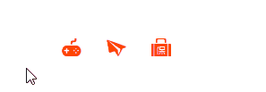
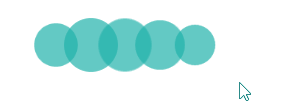
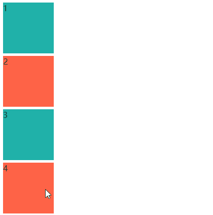
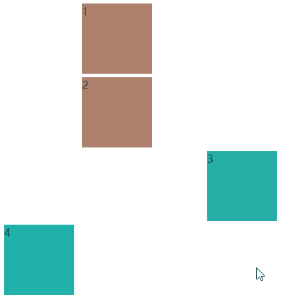

# 220 css动画

视频序号142-146

目录
- [220 css动画](#220-css动画)
- [1. 基础语法](#1-基础语法)
- [2. 总结](#2-总结)
- [3. 动画示例](#3-动画示例)
- [4. animation动画扩展语法](#4-animation动画扩展语法)
  - [4.1 animation-fill-mode](#41-animation-fill-mode)
  - [4.2 animation-direction](#42-animation-direction)
- [5. animation.css动画库](#5-animationcss动画库)


***

CSS3 可实现 HTML 元素的动画效果，而不使用 JavaScript 或 Flash。

注意不同浏览器或不同版本对动画的支持，具体的请查阅。

# 1. 基础语法

要创建 CSS3 动画，你需要了解 @keyframes 规则。

@keyframes 规则是创建动画。

@keyframes 规则内指定一个 CSS 样式和动画将逐步从目前的样式更改为新的样式。


当在 @keyframes 创建动画，把它绑定到一个选择器，否则动画不会有任何效果。

指定至少这两个CSS3的动画属性绑定向一个选择器：

- 规定动画的名称
- 规定动画的时长

变色示例：

```
    <style>
        div {
            width: 100px;
            height: 100px;
            background: red;
            animation: myfirst 3s;
            -webkit-animation: myfirst 3s;
            /* Safari and Chrome */
        }

        @keyframes myfirst {
            from {
                background: red;
            }

            to {
                background: blue;
            }
        }

        @-webkit-keyframes myfirst

        /* Safari and Chrome */
            {
            from {
                background: red;
            }

            to {
                background: blue;
            }
        }
    </style>

<body>
    <p><b>注意:</b> 该实例在 Internet Explorer 9 及更早 IE 版本是无效的。</p>

    <div></div>
</body>
```



动画时长：3S

实例： [22001keyframes01.html](22001keyframes01.html) 


animation-name : 设置动画的名字 (自定义的)。

animation-duration : 动画的持续时间。

animation-delay : 动画的延迟时间。

animation-iteration-count : 动画的重复次数 ，默认值就是1 ，infinite无限次数。


animation-timing-function : 动画的运动形式

| 值                            | 描述                                                        |
| :---------------------------- | :---------------------------------------------------------- |
| linear                        | 动画从开始到结束具有相同的速度。                            |
| ease                          | 动画有一个缓慢的开始，然后快，结束慢。                      |
| ease-in                       | 动画有一个缓慢的开始。                                      |
| ease-out                      | 动画结束缓慢。                                              |
| ease-in-out                   | 动画具有缓慢的开始和慢的结束。                              |
| cubic-bezier(*n*,*n*,*n*,*n*) | 在立方贝塞尔函数中定义速度函数。 可能的值是从0到1的数字值。 |

运动轨迹示例：

```
    <style>
        .box1{
            width: 300px;
            height: 300px;
            border: 1px black solid;
            margin: 30px auto;
        }
        .box2{
            width: 100px;
            height: 100px;
            background: tomato;
            animation-name:myBox;
            /* 动画名称 */
            animation-duration: 4s;
            /* 动画的持续时间 */

            animation-delay: 2s;
            /* 动画延迟时间 */

            animation-iteration-count: 2;
            /* animation-iteration-count: infinite; */
            /* 动画重复次数 */

            animation-timing-function:ease;
            /* 动画运动形式 */

            /* animation:myBox 4s 2s 2 ease */
            /* 此为缩写法 */
        }

        /* @keyframes myBox{
            from{ transform: translate(0,0);}
            to{ transform: translate(200px,0);}
        } */

        /* @keyframes myBox{
            0%{ transform: translate(0,0);}
            100%{ transform: translate(200px,0);}
        } */

        @keyframes myBox{
            0%{ transform: translate(0,0);}
            25%{ transform: translate(200px,0);}
            50%{ transform: translate(200px,200px);}
            75%{ transform: translate(0px,200px);}
        }
    </style>

<body>
    <div class="box1">
        <div class="box2"></div>
    </div>
</body>
```



一个小红块环着内边缘移动。

实例： [22001keyframes02.html](22001keyframes02.html) 

上面代码中的 .box2 可缩写为：

```
        .box2{
            width: 100px;
            height: 100px;
            background: tomato;
            animation:myBox 4s 2s 2 ease
        }
```

**==注意==**

* 运动结束后，默认情况下会停留在起始位置。

* 2.@keyframes :  from -> 0%   ,  to ->  100%

  

        @keyframes myBox{
            from{ transform: translate(0,0);}
            to{ transform: translate(200px,0);}
        }

相等于

```
        @keyframes myBox{
            0%{ transform: translate(0,0);}
            100%{ transform: translate(200px,0);}
        }
```

# 2. 总结

| 值                                                           | 说明                                                         |
| :----------------------------------------------------------- | :----------------------------------------------------------- |
| *[animation-name](https://www.w3cschool.cn/cssref/css3-pr-animation-name.html)* | 指定要绑定到选择器的关键帧的名称                             |
| *[animation-duration](https://www.w3cschool.cn/cssref/css3-pr-animation-duration.html)* | 动画指定需要多少秒或毫秒完成                                 |
| *[animation-timing-function](https://www.w3cschool.cn/cssref/css3-pr-animation-timing-function.html)* | 设置动画将如何完成一个周期                                   |
| *[animation-delay](https://www.w3cschool.cn/cssref/css3-pr-animation-delay.html)* | 设置动画在启动前的延迟间隔。                                 |
| *[animation-iteration-count](https://www.w3cschool.cn/cssref/css3-pr-animation-iteration-count.html)* | 定义动画的播放次数。                                         |
| *[animation-direction](https://www.w3cschool.cn/cssref/css3-pr-animation-direction.html)* | 指定是否应该轮流反向播放动画。                               |
| *[animation-fill-mode](https://www.w3cschool.cn/cssref/css3-pr-animation-fill-mode.html)* | 规定当动画不播放时（当动画完成时，或当动画有一个延迟未开始播放时），要应用到元素的样式。 |
| *[animation-play-state](https://www.w3cschool.cn/cssref/css3-pr-animation-play-state.html)* | 指定动画是否正在运行或已暂停。                               |
| initial                                                      | 设置属性为其默认值。 [阅读关于 *initial*的介绍。](https://www.w3cschool.cn/cssref/css-initial.html) |
| inherit                                                      | 从父元素继承属性。 [阅读关于 *initinherital*的介绍。](https://www.w3cschool.cn/cssref/css-inherit.html) |


# 3. 动画示例

**1.划入划出的小图标**



```
    <style>
        *{padding: 0;margin: 0;}
        ul li{list-style: none;}
        ul{
            width: 150px;
            height: auto;
            margin: 50px auto 0;
        }
        ul li{
            width: 50px;
            height: 50px;
            display: block;
            float: left;
        }
        ul li img{
            width: 22px;
            height: 20px;
            display: block;
            margin: 0px auto 0;
        }
        ul li:hover img{
            animation-name: navList;
            animation-duration: .5s;
            animation-iteration-count: 1;
        }

        @keyframes navList {
            0%{ transform: translate(0,0);opacity: 1;}
            60%{ transform: translate(0,-50px);opacity: 0;}
            70%{ transform: translate(0,30px);}
            100%{ transform: translate(0,0px);}
        }
    </style>

<body>
    <ul>
        <li>
            
        </li>
        <li>
            
        </li>
        <li>
            
        </li>
    </ul>
</body>
```

实例： [22003test01.html](22003test01.html) 


**2.loading加载动画**



```
    <style>
        *{padding: 0; margin: 0;}
        #loading{
            width: 200px;
            height: auto;
            margin: 50px auto 0px;
        }
        #loading .circle{
            width: 30px;
            height: 30px;
            background: lightseagreen;
            border-radius: 30px;
            display: inline-block;
            opacity: .7;
            animation: Loading-circle .96s infinite;
        }

        #loading .circle:nth-child(1){animation-delay: 0s;}
        #loading .circle:nth-child(2){animation-delay: .12s;}
        #loading .circle:nth-child(3){animation-delay: .24s;}
        #loading .circle:nth-child(4){animation-delay: .36s;}
        #loading .circle:nth-child(5){animation-delay: .48s;}
        @keyframes Loading-circle{
            0%{ transform: scale(1);}
            50%{ transform: scale(1.8);}
            100%{ transform: scale(1);}
        }
    </style>

<body>
    <div id="loading">
        <div class="circle"></div>
        <div class="circle"></div>
        <div class="circle"></div>
        <div class="circle"></div>
        <div class="circle"></div>
    </div>
</body>
```

实例： [22003test02.html](22003test02.html) 

参考： [22003test02-01.html](22003test02-01.html) 


# 4. animation动画扩展语法

## 4.1 animation-fill-mode

规定动画播放之前或之后，其动画效果是否可见。

* none (默认值) : 在运动结束之后回到初始位置，在延迟的情况下，让0%在延迟后生效。
* backwards  :  在延迟的情况下，让0%在延迟前生效。
* forwards  :  在运动结束的之后，停到结束位置。
* both  :  backwards和forwards同时生效。

示例：

```
    <style>
        .box1,.box2,.box3,.box4{
            width: 100px;
            height: 100px;
            background: lightseagreen;
            margin: 5px;
        }
        .box1{
            animation: 2s move 2s;
            /* 默认 */
        }
        .box2{
            animation: 2s move 2s; 
            animation-fill-mode: backwards;
            /* backwards 在延迟的情况下，让0%在延迟前生效 */
        }
        .box3{
            animation: 2s move 2s; 
            animation-fill-mode: forwards;
            /* forwards 在运动结束的之后，停到结束位置 */
        }
        .box4{
            animation: 2s move 2s;
            animation-fill-mode: both;
            /* backwards和forwards同时生效 */
        }
        @keyframes move{
            0%{transform: translate(0,0); background: tomato;}
            100%{transform: translate(300px,0);}
        }
    </style>

<body>
    <div class="box1">1</div>
    <div class="box2">2</div>
    <div class="box3">3</div>
    <div class="box4">4</div>
</body>
```



实例： [22004animation-fill-mode01.html](22004animation-fill-mode01.html) 

## 4.2 animation-direction

属性定义是否应该轮流反向播放动画。

* alternate  :  一次正向(0% ~ 100%)，一次反向(100% ~ 0%)。
* reverse : 永远都是反向 , 从100%~0%。
* normal (默认值) : 永远都是正向 , 从0%~100%。

示例：

```
    <style>
        .box1,.box2,.box3,.box4{
            width: 100px;
            height: 100px;
            background: lightseagreen;
            margin: 5px;
        }
        .box1{
            animation: 1s move infinite;
            /* 默认 */
        }
        .box2{
            animation: 1s move infinite;
            animation-direction: alternate;
            /* alternate  :  一次正向(0% ~ 100%)，一次反向(100% ~ 0%) 占两次*/
        }
        .box3{
            animation: 1s move infinite;
            animation-direction: reverse;
            /* reverse : 永远都是反向 , 从100%~0% */
        }
        @keyframes move{
            0%{transform: translate(0,0); background: tomato;}
            100%{transform: translate(300px,0);}
        }
    </style>

<body>
    <div class="box1">1</div>
    <div class="box2">2</div>
    <div class="box3">3</div>
    <div class="box4">4</div>
</body>
```



实例： [22004animation-fill-mode01.html](22004animation-fill-mode01.html) 


# 5. animation.css动画库

一款强大的预设css3动画库。

官网地址：https://daneden.github.io/animate.css/

基本使用：

animated : 基类(基础的样式，每个动画效果都需要加)

infinite : 动画的无限次数

引用写法：

1.本地连接：

```
<link rel="stylesheet" href="./css/animate.min.css">
```


2.连网连接

```
<link rel="stylesheet" href="https://cdnjs.cloudflare.com/ajax/libs/animate.css/4.0.0/animate.min.css"
  />
```


安装Animate.css之后，将该类animate__animated以及任何动画名称添加到元素中

不要忘记 animate__前缀！

代码示例：

```
<h1 class="animate__animated animate__bounce">An animated element</h1>
```


实例： [22005animation01.html](22005animation01.html) 

详细指南可访问官方：https://animate.style/

