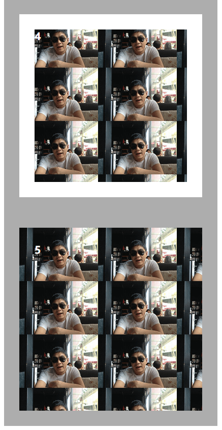

# 221 背景

视频序号152

目录
- [221 背景](#221-背景)
- [1. 背景尺寸](#1-背景尺寸)
- [2. 背景位置（填充方式）](#2-背景位置填充方式)
- [3. 背景裁切(clip)](#3-背景裁切clip)
- [4. 复合样式缩写法](#4-复合样式缩写法)


***

CSS3 中包含几个新的背景属性，提供更大背景元素控制。

在本章您将了解以下背景属性：

- background-image
- background-size
- background-origin
- background-clip

116有讲如何在背景里插入图片， [116 背景background](..\..\01 HTML-CSS-切图-企业网站游戏网站\116 背景background\116 背景background.md) 


# 1. 背景尺寸

backgrouns-size:背景图的尺寸大小

| 值         | 描述                                                         |
| :--------- | :----------------------------------------------------------- |
| length     | 设置背景图片高度和宽度。第一个值设置宽度，第二个值设置的高度。如果只给出一个值，第二个是设置为"auto(自动)" |
| percentage | 将计算相对于背景定位区域的百分比。第一个值设置宽度，第二个值设置的高度。如果只给出一个值，第二个是设置为"auto(自动)" |
| cover      | 此时会保持图像的纵横比并将图像缩放成将完全覆盖背景定位区域的最小大小。 |
| contain    | 此时会保持图像的纵横比并将图像缩放成将适合背景定位区域的最大大小。 |

示例：

```
        div{
            width: 300px;
            height: 300px;
            border: 1px solid black;
            font-size: 20px;
            color: #ffffff;
            text-shadow: 5px 5px 10px black;
            font-weight: bolder;
        }
        .box1{
            background: url(./img/mountain04.jpg);
        }
        .box2{

            background: url(./img/list_photo.png);
        }
        .box3{
            background: url(./img/list_photo.png) no-repeat;
            background-size: 50px 200px;

        }
        .box4{
            background: url(./img/list_photo.png);
            background-size: 100% 100%;
        }
        .box5{
            background: url(./img/list_photo.png);
            background-size: cover;
        }
        .box6{
            background: url(./img/list_photo.png);
            background-size: contain;
        }
        .box7{
            background: url(./img/list_photo.png) no-repeat;

        }
        .box8{
            background: url(./img/list_photo.png) no-repeat;
            border: 30px solid rgba(91, 91, 91, .5);
            padding: 30px;
        }
```


实例： [22101background-size01.html](22101background-size01.html) 


# 2. 背景位置（填充方式）

背景图像的位置区域。

**注意**:如果背景图像background-attachment是"固定"(flex)，这个属性没有任何效果。

| 值          | 描述                          |
| ----------- | ----------------------------- |
| padding-box | 背景图像填充框的相对位置 默认 |
| border-box  | 背景图像边界框的相对位置      |
| content-box | 背景图像的相对位置的内容框    |

示例：

```
        div{
            width: 300px;
            height: 300px;
            border: 1px solid black;
            font-size: 20px;
            color: #ffffff;
            text-shadow: 5px 5px 10px black;
            font-weight: bolder;
        }
        .box1{
            background: url(./img/list_photo.png);
            background-repeat: no-repeat;
            border: 30px solid rgba(91, 91, 91, .5);
            padding: 30px;
            background-origin: padding-box;
            /* 默认 */
        }
        .box2{
            background: url(./img/list_photo.png);
            background-repeat: no-repeat;
            border: 30px solid rgba(91, 91, 91, .5);
            padding: 30px;
            background-origin: border-box;
        }
        .box3{
            background: url(./img/list_photo.png);
            background-repeat: no-repeat;
            /* 取消上面一行试效果 */
            border: 30px solid rgba(91, 91, 91, .5);
            padding: 30px;
            background-origin: content-box;
        }
```


实例： [22102background-origin01.html](22102background-origin01.html) 

一图总结：


# 3. 背景裁切(clip)

指定背景绘制区域。

| 值          | 说明                                             |
| ----------- | ------------------------------------------------ |
| border-box  | 默认值。背景绘制在边框方框内（剪切成边框方框）。 |
| padding-box | 背景绘制在衬距方框内（剪切成衬距方框）。         |
| content-box | 背景绘制在内容方框内（剪切成内容方框）。         |

示例：

```
        div{
            width: 300px;
            height: 300px;
            border: 1px solid black;
            font-size: 20px;
            color: #ffffff;
            text-shadow: 5px 5px 10px black;
            font-weight: bolder;
        }

        .box1{
            background: url(./img/list_photo.png);
            /* background-repeat: no-repeat; */
            border: 30px solid rgba(91, 91, 91, .5);
            padding: 30px;
            background-origin: content-box;
        }
        .box2{
            background: url(./img/list_photo.png);
            border: 30px solid rgba(91, 91, 91, .5);
            padding: 30px;
            background-origin: content-box;
            background-clip: content-box;
        }
        .box3{
            background: url(./img/list_photo.png);
            /* background-repeat: no-repeat; */
            border: 30px solid rgba(91, 91, 91, .5);
            padding: 30px;
            background-origin: padding-box;
        }
        .box4{
            background: url(./img/list_photo.png);
            /* background-repeat: no-repeat; */
            border: 30px solid rgba(91, 91, 91, .5);
            padding: 30px;
            background-origin: padding-box;
            background-clip: content-box;
        }
        .box5{
            background: url(./img/list_photo.png);
            /* background-repeat: no-repeat; */
            border: 30px solid rgba(91, 91, 91, .5);
            padding: 30px;
            background-origin: padding-box;
            background-clip: padding-box;
        }
```




实例： [22103background-clip02.html](22103background-clip02.html) 


# 4. 复合样式缩写法

```
background:url() contgent-box padding-box
```

复合样式的时候，第一个是位置，第二个是裁切
