# 222 渐变

视频序号153-154

目录
- [222 渐变](#222-渐变)
- [1. 线性渐变linear-gradient](#1-线性渐变linear-gradient)
  - [1.1 可设方向](#11-可设方向)
  - [1.2 使用角度（angle）](#12-使用角度angle)
  - [1.3 百分比percentage](#13-百分比percentage)
  - [1.4 支持透明度](#14-支持透明度)
  - [1.5 重复的线性渐变](#15-重复的线性渐变)
- [2. 径向渐变radial-gradient](#2-径向渐变radial-gradient)
- [3. 渐变实例](#3-渐变实例)


***


CSS3 渐变（gradients）可以让你在两个或多个指定的颜色之间显示平稳的过渡。

以前，必须使用图像来实现这些效果。但是，通过使用 CSS3 渐变（gradients），可以减少下载的时间和宽带的使用。此外，渐变效果的元素在放大时看起来效果更好，因为渐变（gradient）是由浏览器生成的。

CSS3 定义了两种类型的渐变（gradients）：

- 线性渐变（Linear Gradients）：向下/向上/向左/向右/对角方向。
- 径向渐变（Radial Gradients）：由它们的中心定义。

linear-gradient是值，需要添加到background-image属性上

# 1. 线性渐变linear-gradient

创建一个线性渐变，必须至少定义两种颜色结点。颜色结点即您想要呈现平稳过渡的颜色。同时，也可以设置一个起点和一个方向（或一个角度）。

语法：

```
background-image: linear-gradient(direction, color-stop1, color-stop2, ...);
```

## 1.1 可设方向

direction为方向，默认是从上到下，可以设定从左到右，也可以从右到左或下到上。还有可以对角，就是从左上角到右下角。

**1.示例：**

```
    <style>
        div{
            width: 300px;
            height: 200px;
            border: 2px solid gray;
        }
        .box1{
            background-image: linear-gradient(tomato,lightskyblue);
            /* 默认从上到下 */
        }
        .box2{
            background-image: linear-gradient(tomato,lightskyblue,lightseagreen);
            /* 三种颜色  */
        }
        .box3{
            background-image: linear-gradient(to top, tomato,lightskyblue);
            /* 从下到上 */
            /* to right 从左到右 */
        }
    </style>

<body>
    <div class="box1">1 两种颜色 默认从上到下</div>
    <div class="box2">2 三种颜色</div>
    <div class="box3">3 两种颜色 to top就是从下到上</div>
</body>
```

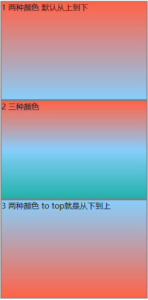

实例：   [22201linear-gradient01-01.html](22201linear-gradient01-01.html) 

**2.从左到右示例：**

```
        .box3{
            background-image: linear-gradient(to right, tomato,lightskyblue);
        }
```

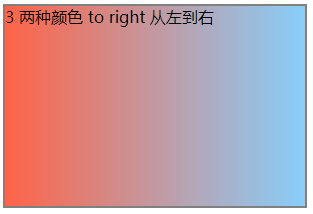

实例：  [22201linear-gradient01-02.html](22201linear-gradient01-02.html) 

**3.从左上角到右下角示例：**

```
        .box3{
            background-image: linear-gradient(to bottom right, gold,red);
        }
```

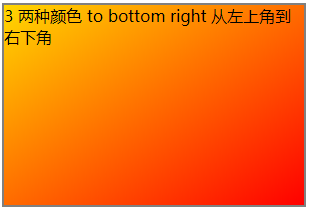

示例：  [22201linear-gradient01-03.html](22201linear-gradient01-03.html) 

## 1.2 使用角度（angle）

语法：

```
background-image: linear-gradient(angle, color-stop1, color-stop2);
```

angle 单位为 deg，例如：45deg。


示例：

```
    <style>
        div{
            width: 300px;
            height: 300px;
            border: 2px solid gray;
        }
        .box2{
            background-image: linear-gradient(0deg,tomato,lightskyblue);
            /* 0deg  */
        }
        .box3{
            background-image: linear-gradient(45deg, tomato,lightskyblue);
            /* 45deg */
        }
    </style>
</head>
<body>
    <div class="box2">2 0deg</div>
    <div class="box3">3 45deg</div>
</body>
```

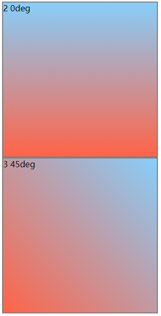

实例： [22201linear-gradient02-01.html](22201linear-gradient02-01.html) 

**==注意==**

* 不同浏览器或不同版本的渐变角度不一样，具体的请查阅。


## 1.3 百分比percentage

在范围内多少百分比为中心轴。

示例：

```
    <style>
        div{
            width: 300px;
            height: 300px;
            border: 2px solid gray;
        }
        .box1{
            background-image: linear-gradient(tomato,lightskyblue);
            /* 默认从上到下 */
        }
        .box2{
            background-image: linear-gradient(tomato 15%,lightskyblue 35%);
            /* 0deg  */
        }
        .box3{
            background-image: linear-gradient(45deg, tomato 20%,lightskyblue 40%);
            /* 45deg */
        }
        .box4{
            background-image: linear-gradient(#fff 50%,lightskyblue 50%);
            /* 0deg  */
        }
    </style>
</head>
<body>
    <div class="box1">1 两种颜色 默认从上到下</div>
    <div class="box2">2 红15% 蓝35%</div>
    <div class="box3">3 45deg 红20% 蓝40%</div>
    <div class="box4">4 红蓝各50%</div>
</body>
```

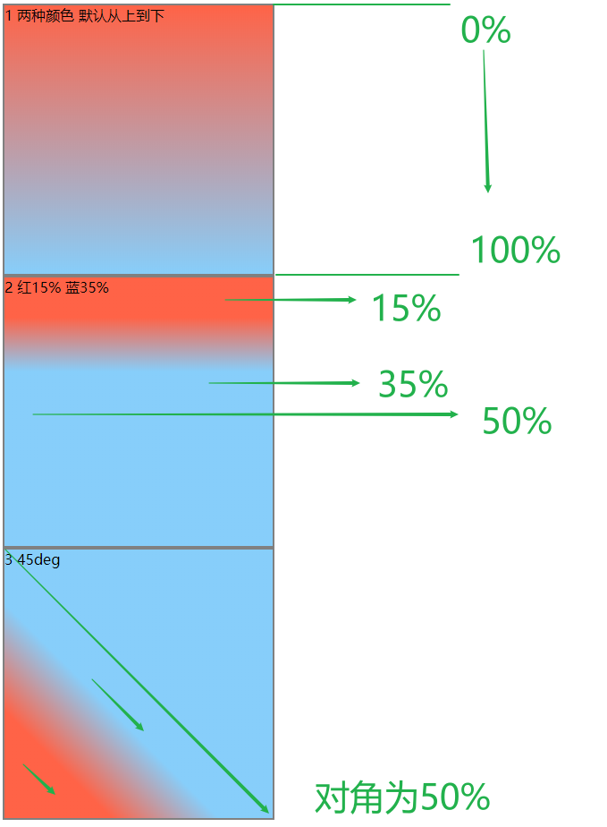

百分比图示

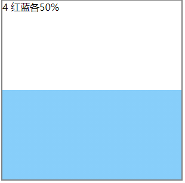

若两个百分比都一样，则无渐变效果。

实例： [22201linear-gradient03-01.html](22201linear-gradient03-01.html) 


## 1.4 支持透明度

CSS3 渐变也支持透明度（transparent），可用于创建减弱变淡的效果。

为了添加透明度，我们使用 rgba() 函数来定义颜色节点。rgba() 函数中的最后一个参数可以是从 0 到 1 的值，它定义了颜色的透明度：0 表示完全透明，1 表示完全不透明。

示例：

```
        .box2{
            background-image: linear-gradient(to right,rgba(255,0,0,0), rgba(255,0,0,1));
        }
```

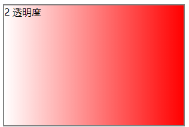

实例： [22201linear-gradient04-01.html](22201linear-gradient04-01.html) 


## 1.5 重复的线性渐变

repeating-linear-gradient() 函数用于重复线性渐变：

```
background-image: repeating-linear-gradient(tomato,lightskyblue 10%,lightseagreen 10%);
```

示例：

```
        .box2{
            background-image: repeating-linear-gradient(tomato,lightskyblue 10%,lightseagreen 10%);
            /* 三种颜色  */
        }
        .box3{
            background-image: repeating-linear-gradient(45deg, tomato,lightskyblue 10%,lightseagreen 10%);
            /* 三种颜色  */
        }
```

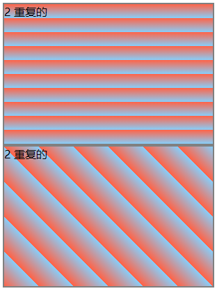

实例： [22201linear-gradient05.html](22201linear-gradient05.html) 


# 2. 径向渐变radial-gradient 

径向渐变由它的中心定义。

为了创建一个径向渐变，你也必须至少定义两种颜色节点。颜色节点即你想要呈现平稳过渡的颜色。同时，你也可以指定渐变的中心、形状（圆形或椭圆形）、大小。默认情况下，渐变的中心是 center（表示在中心点），渐变的形状是 ellipse（表示椭圆形），渐变的大小是 farthest-corner（表示到最远的角落）。

**语法**：

```
background: radial-gradient(center, shape size, start-color, ..., last-color);   
```

百分比值方法同上面的线性渐变一样

重复的方法同上面的一样


设置形状

shape 参数定义了形状。它可以是值 circle 或 ellipse。其中，circle 表示圆形，ellipse 表示椭圆形。默认值是 ellipse。


不同尺寸大小关键字的使用

size 参数定义了渐变的大小。它可以是以下四个值：

* closest-side
* farthest-side
* closest-corner
* farthest-corner

具体的网上查：https://www.runoob.com/try/try.php?filename=trycss3_gradient-radial_size

示例：

```
        div{
            color: #fff;
            width: 300px;
            height: 300px;
            border: 2px solid gray;
        }
        .box1{

            background-image: radial-gradient(tomato,royalblue);
        }
        .box2{
            background-image: radial-gradient(tomato 5%,royalblue 15%,lightseagreen 60%);
        }
        .box3{
            background-image: repeating-radial-gradient(tomato,royalblue 10%,lightseagreen 10%);
        }
        .box4{
            width: 300px;
            height: 200px;
            background-image: radial-gradient(circle, tomato, royalblue, lightseagreen);
        }
        .box5{
            width: 300px;
            height: 200px;
            background-image: radial-gradient(ellipse, tomato, royalblue, lightseagreen);
        }
```

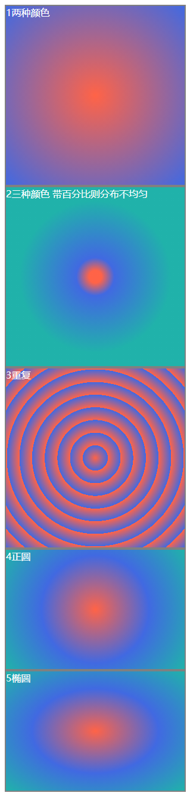

实例： [22202radial-gradient01.html](22202radial-gradient01.html) 


# 3. 渐变实例

**1.渐变进度条**

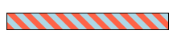

方法：

1.45度或to right top。

2.红25蓝25 蓝50红50 红75蓝75。

3.background-size1个数值为width的十分之一。

4.动画名 持续时间 重复次数 运动形式。

实例： [22203test01.html](22203test01.html) 

参考千锋： [22203test01-01.html](22203test01-01.html) 


**2.发廊**

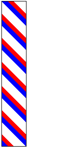

白蓝红比例为2:1:1，使用animation方法。

实例： [22203test02.html](22203test02.html) 


**3.鼠标划过渐变光斑**


方法：

1.父元素设overflow:hidden，两个子元素，一个图片，另一个一道光；

2.一道光-60度，渐变采用rgba；

实例： [22203test03.html](22203test03.html) 

参考千锋： [22203test03-01.html](22203test03-01.html) 
