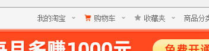
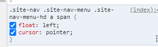
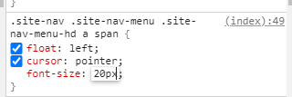

# 223 @font-face字体图标

视频序号155

目录
- [223 @font-face字体图标](#223-font-face字体图标)
- [1. @font-face 语法](#1-font-face-语法)


***

font-face 是 CSS3 中的一个模块，它主要是把自己定义的Web字体嵌入到你的网页中。

**好处**：

1. 可以非常方便的改变大小和颜色。
2. 放大后不会失真。
3. 减少请求次数和提高加载速度。
4. 简化网页布局。
5. 减少设计师和前端工程师的工作量。
6. 可使用计算机没有提供的字体。

**例：**

www.taobao.com

右键 -> 购物车 ->  检查 -> 查控制台






**添加字体大小：**




不止字体，购物车图标大小也会变化 ，颜色也可以改变。


# 1. @font-face 语法

```
<style>
        @font-face{
            font-family:iconfont;
            src:url(//at.alicdn.com/t/font_403341_n8tj33yn5peng66r.eot);
            src:url(//at.alicdn.com/t/font_403341_n8tj33yn5peng66r.eot?#iefix) format('embedded-opentype'),url(//at.alicdn.com/t/font_403341_n8tj33yn5peng66r.woff) format('woff'),url(//at.alicdn.com/t/font_403341_n8tj33yn5peng66r.ttf) format('truetype'),url(//at.alicdn.com/t/font_403341_n8tj33yn5peng66r.svg#iconfont) format('svg')
        }
</style>
```

像.woff等文件都是做兼容平台处理的, mac、linux等。

示例：

```
    <style>
        @font-face{
            font-family:hello;
            src:url(https://at.alicdn.com/t/font_1401963178_8135476.eot);
            src:url(https://at.alicdn.com/t/font_1401963178_8135476.eot?#iefix) format('embedded-opentype'),
            url(https://at.alicdn.com/t/font_1401963178_8135476.woff) format('woff'),
            url(https://at.alicdn.com/t/font_1401963178_8135476.ttf) format('truetype'),
            url(https://at.alicdn.com/t/font_1401963178_8135476.svg#iconfont) format('svg')
        }
        div{
            font-family: hello;
        }
        span{
            font-family: hello;
            font-size: 30px;
            color: tomato;
        }
        .gouwuche::after{
            content: "󰅈";
            color: lightseagreen;
        }
    </style>
</head>
<body>
    <div>󰅈</div>
    <!-- 󰅈在hello字体里是购物车的图标 -->
    <span>󰅈</span>
    <div class="gouwuche"></div>
    <span>㑈</span>
</body>
```


󰅈在hello字体里是购物车的图标。

能改变颜色大小等，伪类:before或:after等的content: "󰅈";也有效。

实例： [22301@font-face01.html](22301@font-face01.html) 
