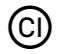
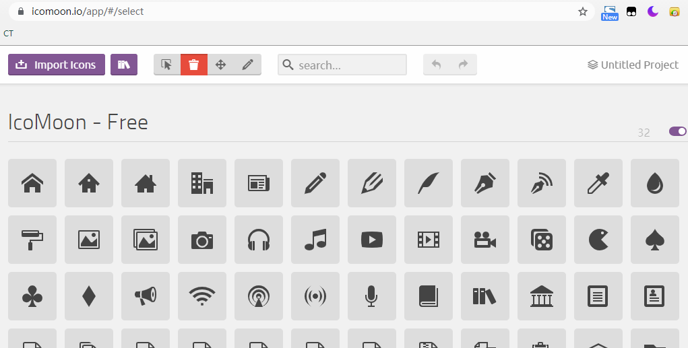

# 224 iconfont图标

视频序号156-157

目录
- [224 iconfont图标](#224-iconfont图标)
- [1. 阿里巴巴图标库](#1-阿里巴巴图标库)
- [2. 自定义字体图标](#2-自定义字体图标)
  - [2.1 icomoon](#21-icomoon)
- [3. 总结](#3-总结)


***


向 HTML 页面添加图标的最简单方法是使用图标库，比如 Font Awesome。

将指定的图标类的名称添加到任何行内 HTML 元素（如 <i> 或 <span>）。

图标库中的所有图标都是可缩放矢量，可以使用 CSS进行自定义（大小、颜色、阴影等）。

# 1. 阿里巴巴图标库

https://www.iconfont.cn 提供了大量免费的字体图标。

435948347@qq.com 新浪登陆。

使用方法：

1. 从阿里巴巴矢量图标库随便挑下载后解压 [download.zip](download.zip) 。
2. 解压后里面有html文件，打开可看说明。选后缀名为css、eot、svg、ttf、woff、woff2、js几个文件放到css文件夹里。具体说明可查看已下载的说明 html文件。
3. 可调大小，用 font-size。

 [demo_index.html](iconfont\demo_index.html) 有使用说明。

示例：

```
<body>
    <div class="iconfont iconCI"></div>
</body>
```



 [22401iconfont01.html](22401iconfont01.html) 

可改变颜色和大小：

```
    <style>
        .icon {
            width: 1em;
            height: 1em;
            font-size: 80px;
            vertical-align: -0.15em;
            fill: currentColor;
            overflow: hidden;
        }
    </style>
</head>
<body>
    <div class="iconfont iconCI"></div>
    <svg class="icon" aria-hidden="true">
        <use xlink:href="#iconCI"></use>
    </svg>
    <div class="iconfont iconfood-strawberry"></div>
    <svg class="icon" aria-hidden="true">
        <use xlink:href="#iconfood-strawberry"></use>
    </svg>
</body>
<script src="./js/iconfont.js"></script>
</html>
```

改变颜色和尺寸要按照说明书添加 js 。


实例：  [22401iconfont02.html](22401iconfont02.html) 


# 2. 自定义字体图标

## 2.1 icomoon

在线生成字体图标：https://icomoon.io/app 



1. 按下左上角的【Import Icons】按钮，选择SVG文件上传，然后在右下区域，里面设置一下，然后按下【Download】按钮下载并解压（压缩文件为 icomoon.zip）。

2. 选择 fonts 文件夹和 style.css 放到css文件夹里，在html文件里引入，然后弄代码：

   ```
   <div class="icon-yuan"></div>
   ```

   style.css里添加font-size调大小和调色

示例：

```
    <link rel="stylesheet" href="./2css/style.css">
</head>
<body>
    <div class="icon-yuan"></div>
</body>
```

在 css 文件夹里修改 style.css：添加颜色为 tomato

```
.icon-yuan:before {
  content: "\e900";
  color: tomato;
}
```


实例： [22402iconfont01.html](22402iconfont01.html)  [style.css](2css\style.css) 


# 3. 总结

参考网上各大网站，切换移动端里面有不少采用iconfont图标。