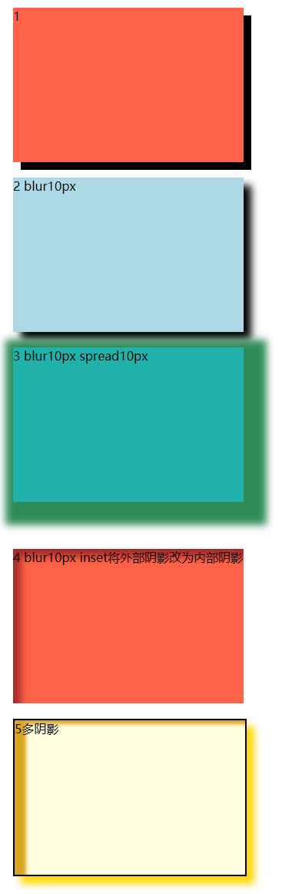
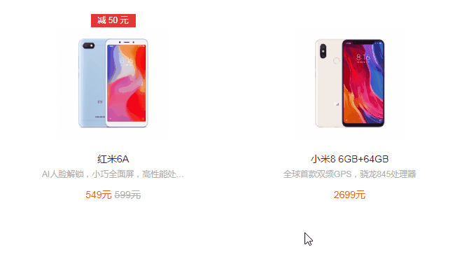

# 226 盒子阴影

视频序号159-160

目录


***

给框添加一个或多个阴影。

# 1. box-shadow

**语法**

```
box-shadow: h-shadow v-shadow blur spread color inset;
```

| 值         | 描述                                     |
| ---------- | ---------------------------------------- |
| *h-shadow* | 必需。水平阴影的位置。允许负值。         |
| *v-shadow* | 必需。垂直阴影的位置。允许负值。         |
| *blur*     | 可选。模糊距离。                         |
| *spread*   | 可选。阴影的尺寸。                       |
| *color*    | 可选。阴影的颜色。请参阅 CSS 颜色值。    |
| inset      | 可选。将外部阴影 (outset) 改为内部阴影。 |

可多阴影。

inset外部阴影改为内部阴影。

outset取消阴影。

**==注意==**

* 盒子阴影的默认样色是黑色。
* 默认就是外阴影，如果设置outset不起作用，可选的值只有inset表示内阴影。

示例：

```
        .box1{
            width: 300px;
            height: 200px;
            background: tomato;
            margin: 20px;
            box-shadow: 10px 10px;
        }
        .box2{
            width: 300px;
            height: 200px;
            background: lightblue;
            margin: 20px;
            box-shadow: 10px 10px 10px;
        }
        .box3{
            width: 300px;
            height: 200px;
            background: lightseagreen;
            margin: 20px;
            box-shadow: 10px 10px 10px 20px seagreen;
        }
        .box4{
            width: 300px;
            height: 200px;
            background: tomato;
            margin: 20px;
            box-shadow: 10px 10px 10px  brown inset;
        }
        .box5{
            width: 300px;
            height: 200px;
            border: 2px solid black;
            background: lightyellow;
            margin: 20px;
            box-shadow: 
            10px 10px 10px  gold,
            15px 5px 5px goldenrod inset;
        }
```



 [22601box-shadow01.html](22601box-shadow01.html) 


# 2. 实例

**1.小米官网效果（鼠标移入商品时凸起）**



 [22602test01.html](22602test01.html) 

