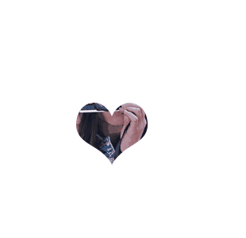

# 227 mask遮罩

视频序号161

目录


***

url repeat x y w h 多遮罩。

参考：https://www.17sucai.com/pins/demo-show?id=29701


代码示例：

```
    <style>
        .box1{
            width: 300px;
            height: 300px;
            border: 1px solid black;
            background: url(./img/girl.jpg);
            -webkit-mask: url(./img/love.png) no-repeat 100px 100px / 100px 100px;
            transition: 2s;
        }
    </style>
```

或

```
-webkit-mask: url(./img/car.png) no-repeat center center / 200px 200px;
```

**注**：

* mask还没标准化，所以还要添加浏览器前缀。

VSCODE 打开方式：

* 直接打开html无效果，从VSCODE用Open In Deaufult Browser打开也无效果。

* 只能从VSCODE用Open with Live Server打开才有效果。

**注**：默认是x、y都平铺。


**菜鸟教程 W3School教程里没有mask部分，需要自己百度翻阅。**

# 1. 实例

**1.示例**

```
    <style>
        .box1{
            width: 300px;
            height: 300px;
            background: url(./img/girl.jpg);
            -webkit-mask: url(./img/love.png);
            border: 1px solid black;
        }
        .box2{
            width: 300px;
            height: 300px;
            border: 1px solid black;
            background: url(./img/girl.jpg);
            -webkit-mask: url(./img/love.png) no-repeat;
        }
        .box3{
            width: 300px;
            height: 300px;
            border: 1px solid black;
            background: url(./img/girl.jpg);
            -webkit-mask: url(./img/love.png) no-repeat 100px 100px;
        }
        .box4{
            width: 300px;
            height: 300px;
            border: 1px solid black;
            background: url(./img/girl.jpg);
            -webkit-mask: url(./img/love.png) no-repeat 100px 100px / 200px 200px;
        }
    </style>
```


使用遮罩图片为：


 [22701mask01.html](22701mask01.html) 


**2.鼠标移入遮罩图形变化：**



 [22701mask02.html](22701mask02.html) 