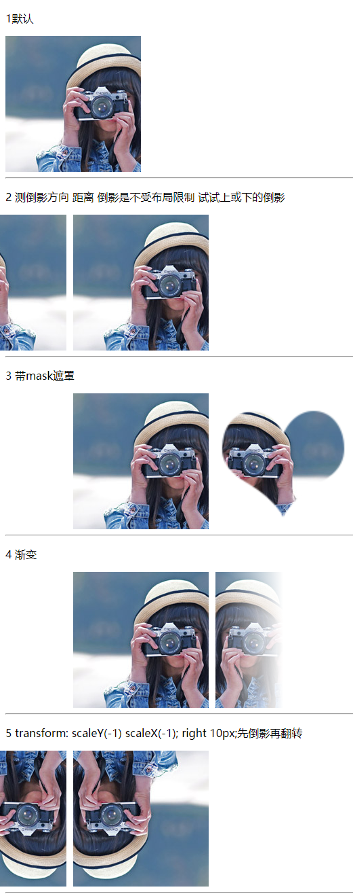

# 228 box-reflect倒影

视频序号162

目录


***

语法：

```
box-reflect：none |  direction   offset  mask-box-image
```

**取值**

none

* 无倒影

direction

* above：指定倒影在对象的上边
* below：指定倒影在对象的下边
* left：指定倒影在对象的左边
* right：指定倒影在对象的右边

offset

* length：用长度值来定义倒影与对象之间的间隔。可以为负值
* percentage：用百分比来定义倒影与对象之间的间隔。可以为负值

mask-box-image

* none：无遮罩图像
* url：使用绝对或相对地址指定遮罩图像。
* linear-gradient：使用线性渐变创建遮罩图像。
* radial-gradient：使用径向(放射性)渐变创建遮罩图像。
* repeating-linear-gradient：使用重复的线性渐变创建背遮罩像。
* repeating-radial-gradient：使用重复的径向(放射性)渐变创建遮罩图像。

**注**

* 渐变不支持颜色渐变，只对透明度渐变

示例：

```
    <style>
        div{
            width: 200px;
            height: 200px;;
        }
        .box1{
            background: url(./img/girl.jpg);
        }
        .box2{
            margin-left: 100px;
            background: url(./img/girl.jpg);
            /* -webkit-box-reflect:right 10px; */
            /* -webkit-box-reflect:above 10px; */
            /* -webkit-box-reflect:below 10px; */
            -webkit-box-reflect:left 10px;
        }
        .box3{
            margin-left: 100px;
            background: url(./img/girl.jpg);
            -webkit-box-reflect: right 10px url(./img/love.png) ;
        }
        .box4{
            margin-left: 100px;
            background: url(./img/girl.jpg);
            -webkit-box-reflect: right 10px 
            linear-gradient(to right ,rgba(255,255,255,0) 50%,rgba(255,255,255,1))
        }
        .box5{
            margin-left: 100px;
            background: url(./img/girl.jpg);
            transform: scaleY(-1) scaleX(-1);
            -webkit-box-reflect: right 10px;
        }
    </style>
```



实例： [22800box-reflect01.html](22800box-reflect01.html) 

扩展：利用scale为-1实现翻转。

