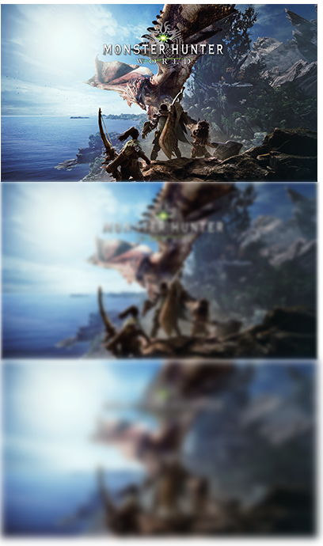
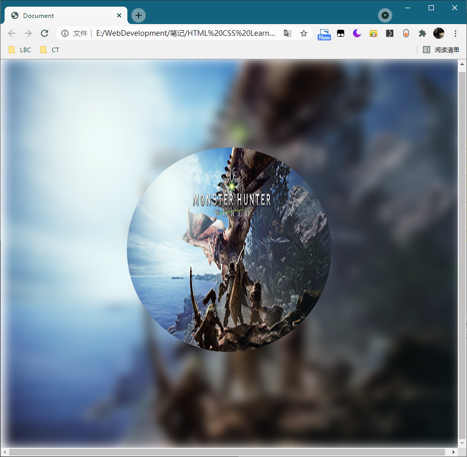

# 229 filter滤镜

视频序号163

目录
- [229 filter滤镜](#229-filter滤镜)
- [1. blur 模糊](#1-blur-模糊)
- [2.总结](#2总结)


***

filter 滤镜函数。

filter 属性定义元素（通常是 img）的视觉效果（如模糊和饱和度）。


**==注意==**

* 不同浏览器版本对 filter 的支持。

# 1. blur 模糊

示例1：

```
        .box1 {
            width: 400px;
            height: 225px;
            background: url(./img/mhw-little01.png) no-repeat;
        }

        .blur2px {
            filter: blur(2px);
        }
        .blur5px {
            filter: blur(5px);
        }
```



第一张原始图，第二张blur(2px)，第三张blur(5px)。

实例： [22901filter01.html](22901filter01.html) 

示例2：

```
        .img1 {
            background: url(./img/mhw-little01.png) no-repeat 0 0;
            background-size: 100% 100%;
            position: absolute;
        }
        .imgBackground {
            width: 100%;
            height: 100%;
            filter: blur(10px);
        }
        .imgCircle {
            width: 400px;
            height: 400px;
            border-radius: 50%;
            left: 50%;
            top: 50%;
            margin-left: -200px;
            margin-top: -200px;
        }
    </style>


<body>
    <div class="img1 imgBackground"></div>
    <div class="img1 imgCircle"></div>
```



实例： [22901filter02.html](22901filter02.html) 


# 2.总结

| 滤镜                                             | 描述                                                         |
| :----------------------------------------------- | :----------------------------------------------------------- |
| none                                             | 默认值。规定无效果。                                         |
| blur(px)                                         | 对图像应用模糊效果。较大的值将产生更多的模糊。如果为指定值，则使用 0。 |
| brightness(%)                                    | 调整图像的亮度。0％ 将使图像完全变黑。默认值是 100％，代表原始图像。值超过 100％ 将提供更明亮的结果。 |
| contrast(%)                                      | 调整图像的对比度。0％ 将使图像完全变黑。默认值是 100％，代表原始图像。超过 100％ 的值将提供更具对比度的结果。 |
| drop-shadow(h-shadow v-shadow blur spread color) | 对图像应用阴影效果。可能的值：h-shadow - 必需。指定水平阴影的像素值。负值会将阴影放置在图像的左侧。v-shadow - 必需。指定垂直阴影的像素值。负值会将阴影放置在图像上方。blur -可选。这是第三个值，单位必须用像素。为阴影添加模糊效果。值越大创建的模糊就越多（阴影会变得更大更亮）。不允许负值。如果未规定值，会使用 0（阴影的边缘很锐利）。spread - 可选。这是第四个值，单位必须用像素。正值将导致阴影扩展并增大，负值将导致阴影缩小。如果未规定值，会使用 0（阴影与元素的大小相同）。**注释：**Chrome、Safari 和 Opera，也许还有其他浏览器，不支持第 4 个长度；如果添加，则不会呈现。color - 可选。为阴影添加颜色。如果未规定，则颜色取决于浏览器（通常为黑色）。这个例子创建了红色的阴影，水平和垂直方向均为 8px，带有 10px 的模糊效果：filter: drop-shadow(8px 8px 10px red);**提示：**这个滤镜类似 box-shadow 属性。 |
| grayscale(%)                                     | 将图像转换为灰阶。0% (0) 是默认值，代表原始图像。100％ 将使图像完全变灰（用于黑白图像）。**注释：**不允许负值。 |
| hue-rotate(deg)                                  | 在图像上应用色相旋转。该值定义色环的度数。默认值为 0deg，代表原始图像。**注释：**最大值是 360deg。 |
| invert(%)                                        | 反转图像中的样本。0% (0) 是默认值，代表原始图像。100％将使图像完全反转。**注释：**不允许负值。 |
| opacity(%)                                       | 设置图像的不透明度级别。opacity-level 描述了透明度级别，其中：0% 为完全透明。100% (1) 是默认值，代表原始图像（不透明）。**注释：**不允许负值。**提示：**这个滤镜类似 opacity 属性。 |
| saturate(%)                                      | 设置图像的饱和度。0% (0) will make the image completely un-saturated.100% is default and represents the original image.Values over 100% provides super-saturated results.**注释：**不允许负值。 |
| sepia(%)                                         | 将图像转换为棕褐色。0% (0) 是默认值，代表原始图像。100％ 将使图像完全变为棕褐色。**注释：**不允许负值。 |
| url()                                            | url() 函数接受规定 SVG 滤镜的 XML 文件的位置，并且可以包含指向特定滤镜元素的锚点。实例：filter: url(svg-url#element-id) |
| initial                                          | 将此属性设置为其默认值。参阅 [initial](https://www.w3school.com.cn/cssref/css_initial.asp)。 |
| inherit                                          | 从其父元素继承此属性。参阅 [inherit](https://www.w3school.com.cn/cssref/css_inherit.asp)。 |

这章只是讲模糊效果，详细的自己搜索。

https://www.w3school.com.cn/cssref/pr_filter.asp