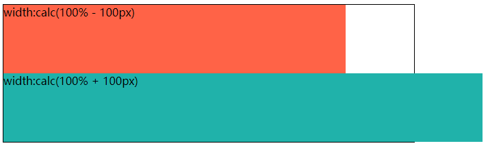

# 230 calc计算

视频序号163

目录


***

calc() 函数用于动态计算长度值。

- 需要注意的是，运算符前后都需要保留一个空格，例如：width: calc(100% - 10px)。
- 任何长度值都可以使用calc()函数进行计算。
- calc()函数支持 +, -, *, / 运算。
- calc()函数使用标准的数学运算优先级规则。

示例：

```
    <style>
        .parent{
            width: 600px;
            height: 200px;
            border: 1px solid black;
        }
        .box1{
            width: calc(100% - 100px);
            height: 100px;
            background: tomato;
        }
        .box2{
            width: calc(100% + 100px);
            height: 100px;
            background: lightseagreen;
        }
    </style>
</head>
<body>
    <div class="parent">
        <div class="box1">width:calc(100% - 100px)</div>
        <div class="box2">width:calc(100% + 100px)</div>
    </div>
</body>
```



 [23000calc01.html](23000calc01.html) 
