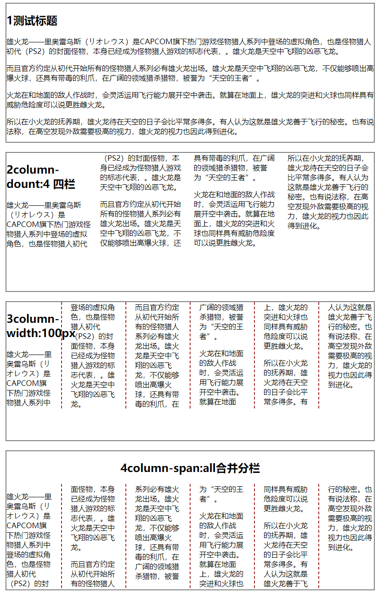

# 231 column分栏布局

视频序号164

目录


***

column-count : 分栏的个数
column-width : 分栏的宽度 
column-gap : 分栏的间距
column-rule : 分栏的边线
column-span : 合并分栏

**注**：

* column-width和column-count不要一起去设置。

示例：

```
        div{
            width: 800px;
            height: 300px;
            border: 2px solid gray;
            margin: 20px auto;
        }
        .box1{

        }
        .box2{
            column-count: 4;
            /* 分栏个数 */
        }
        .box3{
            column-width: 100px;
            /* 分栏宽度 */
            column-gap: 40px;
            /* 分栏间距 */
            column-rule:2px brown dashed;
        }
        .box4{
            column-width: 100px;
            column-gap: 40px;
            column-rule:2px brown dashed;
        }
        .box4 h2{column-span: all;text-align: center;}
```



 [23101column01.html](23101column01.html) 